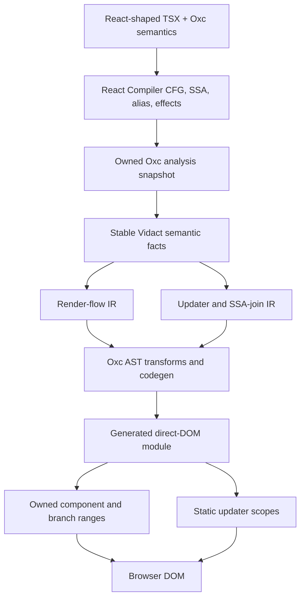
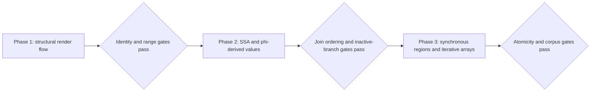
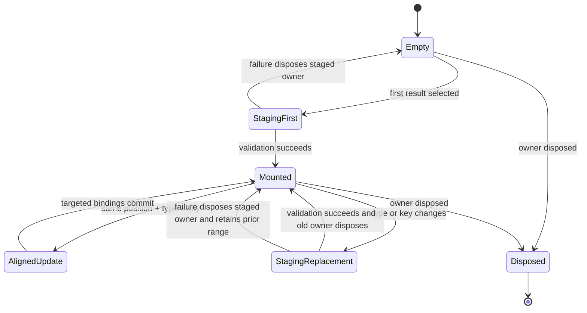

# Control Flow and Reactive Dataflow Phases - Plan

## Goal Capsule

- **Objective:** Vidact accepts React-shaped render control flow, branch-derived values, and synchronous JavaScript regions while preserving surgical DOM updates, React-compatible identity, array ownership, and a small runtime without a Virtual DOM.
- **Means:** Extend the patched React Compiler analysis seam with owned semantic facts, lower those facts into Vidact render/dataflow IR, and emit owned-range operations through Oxc AST code generation (KTD1-KTD8).
- **Authority:** The Product Contract in this plan governs behavior. Accepted decisions in `docs/architecture/` govern existing compiler/runtime boundaries. Planning Contract decisions govern implementation within those constraints.
- **Execution profile:** Deliver Improvement Phase 1, then Improvement Phase 2, then Improvement Phase 3. Each phase must pass its compatibility and browser gates before work starts on the next phase.
- **Stop conditions:** Stop and revise the plan if a phase requires a runtime element tree, component-body replay, arena-backed React Compiler types outside the adapter, or silent loss of React type/key/position identity.

---

## Product Contract

### Summary

This plan replaces control-flow diagnostics with three ordered implementation phases. Structural render selection lands first, SSA/phi-derived value flow lands second, and general synchronous JavaScript flow lands third.

### Problem Frame

Vidact already captures React Compiler's typed CFG terminals and proves direct DOM updates for a narrow component shape. The stable Vidact facts discard terminal operands and block instructions, surgical codegen still requires one top-level return, and the component result ABI still assumes one `Node`. As a result, ordinary early returns and ternary JSX reject even though the upstream analysis has already modeled their control flow.

The runtime has the right lower-level pieces—static updater scopes, comment-delimited ranges, staged values, keyed records, owner cleanup, and MutationObserver verification—but it does not yet preserve React identity across alternative render paths. Branch-dependent local values also need SSA join information that the current owned Oxc snapshot does not export. Loops and exception regions require one later structured lowering step so they do not distort the first two milestones.

### Key Decisions

- **Deliver the work in structural, derived-value, then general synchronous phases.** (session-settled: user-directed — chosen over combining the phases: each layer should establish its semantic and test foundation before the next expands the accepted language.) Governs R1-R3.
- **Preserve React identity across render alternatives.** (session-settled: user-directed — chosen over remounting every branch: same logical position, type, and key must retain component state and DOM identity.) Governs R6-R7.
- **Separate compiler errors from future lint policy.** (session-settled: user-directed — chosen over rejecting every opaque or ambient read: provable destructive render behavior fails compilation, while non-destructive hazards are documented as proposed lint rules.) Governs R14-R15.

### Requirements

**Phase ordering and analysis ownership**

- R1. Improvement Phase 1 MUST support structural render selection before branch-derived values or general synchronous regions are accepted.
- R2. Improvement Phase 2 MUST add SSA/phi-derived values only after Improvement Phase 1 passes its identity, ownership, and mutation-envelope gates.
- R3. Improvement Phase 3 MUST add loops, fallthrough, break/continue, and try/catch/finally only after Improvement Phase 2 establishes deterministic branch-join updater semantics.
- R4. React Compiler MUST remain responsible for CFG, SSA, alias, effect, and def-use analysis; Vidact MUST only export owned facts and add DOM-specific classification, IR, codegen, and runtime policy.

**Structural render behavior**

- R5. Improvement Phase 1 MUST accept render-selecting early returns, `if`/`else`, ternaries, `&&`, `||`, `??`, and terminal `switch` cases while preserving JavaScript value semantics.
- R6. A component result MUST be an owned multi-node range that can represent elements, fragments, several sibling nodes, scalars, empty output, bindings, arrays, and nested owned blocks without adding a wrapper element.
- R7. Alternatives at the same logical position MUST preserve native or component identity when type and key match; a changed type or key MUST dispose and remount that owned position.
- R8. A dynamic component type that cannot be aligned statically MUST use a small type/key-aware range dispatcher rather than a general reconciler or component-body replay.
- R9. Branch-varying host and component props in the supported prop subset MUST support value change and absence. Branch-varying event handlers MUST replace or detach the prior listener. A host prop without defined reset semantics and a reactive ref-identity change MUST fail precisely until its lifecycle is implemented.

**Reactive dataflow and synchronous JavaScript**

- R10. Improvement Phase 2 MUST lower branch-dependent scalar, object, and array values from React Compiler SSA/phi facts into deterministic static updaters without runtime dependency tracking.
- R11. An inactive branch dependency MAY trigger a guarded computation, but it MUST NOT mutate DOM, change the selected value, or recreate an owned subtree.
- R12. Improvement Phase 3 MUST preserve JavaScript evaluation order and completion behavior for synchronous `switch` fallthrough, loops, labels, break/continue, and local mutation.
- R13. Compiler-owned arrays created by props, expressions, maps, or imperative loops MUST retain owned-range semantics. Keyed results reconcile by key; unkeyed results use an explicit position-based mode and never serve as a fallback for invalid keys.

**Safety, diagnostics, and production posture**

- R14. Directly provable mutation of props or non-local render state MUST produce a source-located compilation error.
- R15. Non-destructive untracked reads, render side effects, and opaque hidden dependencies MUST remain documented under `docs/lint-rules/` for the future Vidact Oxlint plugin; the compiler MUST NOT claim those rules are currently enforced.
- R16. A failed branch, iterative render, or caught/uncaught synchronous region MUST not publish partial DOM, leak owners, attach stale refs, or corrupt the previously committed range. A source-slot write that triggered the failed computation remains committed; the next transaction MUST recompute from current source state rather than from a partially published render.
- R17. Every newly accepted syntax family MUST move through the compatibility manifest and a React-shaped Vitest Browser mini app compiled by the Vidact Vite plugin.
- R18. Browser acceptance MUST prove visible behavior, DOM node identity, disposal, and a MutationObserver envelope; generated-code assertions alone are insufficient.
- R19. Runtime helpers MUST remain feature-level ESM imports so unused control-flow phases tree-shake out. No phase may introduce a browser-side CFG interpreter or Virtual DOM representation.

### Acceptance Examples

- AE1. **Early return switches root output.** Given a stateful component that returns a loading button before a final paragraph, when state changes, then the component range replaces only the divergent branch and disposes the loading owner once. Covers R5-R8 and R16.
- AE2. **Equivalent component alternatives preserve state.** Given two alternatives that both produce `Counter` at the same position and key with different props, when the condition changes, then the same `Counter` instance and DOM nodes remain while its prop binding updates. Covers R7 and R9.
- AE3. **Changed key remounts.** Given alternatives with the same component type but different keys, when the key changes, then the old owner disposes and a new component state instance mounts. Covers R7-R8.
- AE4. **Logical operators retain JavaScript values.** Given `0 && <Child />`, `value || <Fallback />`, and `value ?? <Fallback />`, the rendered values follow JavaScript operator semantics rather than a shared Boolean coercion rule. Covers R5.
- AE5. **Phi-derived value updates surgically.** Given a value assigned from different props/state in two branches and rendered as text and an attribute, when the active input changes, then only those binding targets mutate; changing an inactive input produces no DOM mutation. Covers R10-R11.
- AE6. **Loop output preserves collection identity.** Given a loop that builds keyed JSX rows, when records update and reorder, then retained keys keep their owners and nodes. Given an unkeyed loop, updates follow documented index semantics. Covers R12-R13.
- AE7. **Synchronous exceptions are atomic.** Given an update whose `try` branch stages new DOM and then throws, when a matching `catch` handles it, then only the handled result commits. When no handler exists, the previous committed range remains intact. Covers R16.
- AE8. **Compiled arrays cross props.** Given a compiled parent that produces an owned JSX array and a child that renders it as `<div>{props.arrayOfJsx}</div>`, control-flow updates continue to target the live range without a second mount or foreign React-element reconciliation. Covers R13.

### Success Criteria

- The early-return compatibility fixture becomes accepted only after the compiled browser corpus proves the behavior and mutation boundary.
- Equivalent branch alternatives retain component state, refs, focusable DOM identity, and keyed descendants across repeated toggles.
- The stable Vidact IR contains enough owned facts to implement all three phases without exposing React Compiler HIR or reconstructing dependencies from source text.
- A production build that does not use a later-phase feature does not import its runtime helper.
- The support-gap audit marks only evidence-backed control-flow and derived-value rows as completed; deferred React features remain explicit.

### Scope Boundaries

#### In Scope

- Synchronous component render control flow and its owned DOM results.
- Component-range ABI changes required by root alternatives, fragments, and multi-root output.
- Branch-sensitive prop/event lifecycle required to preserve React identity.
- SSA/phi facts required for branch-derived values.
- Keyed and explicit unkeyed semantics for compiler-owned arrays constructed through the supported synchronous forms.
- Compiler diagnostics and future lint-rule documentation for render purity boundaries encountered by these phases.

#### Deferred to Follow-Up Work

- Effects, context, error boundaries, portals, imperative handles, and reactive ref identity.
- Suspense, promises, `lazy`, async functions, async iterators, transitions, scheduling priorities, and hydration.
- Arbitrary external `ReactElement` or `ReactElement[]` reconciliation.
- Original-TSX source maps, broad DOM correctness, package publication, and cross-browser release gates except where a phase directly exposes a blocking dependency.
- The Vidact Oxlint plugin itself; this plan only maintains one proposed Markdown document per future rule.

---

## Planning Contract

### Key Technical Decisions

- KTD1. **Use an owned render-flow snapshot boundary.** Extend the patched Oxc seam only with generic terminal operands, instruction/value facts, predecessor/phi facts, and effect classifications. Lower them immediately into Vidact-owned types. Keep all DOM identity and runtime policy outside Oxc. Governs R4, R10, and R14.
- KTD2. **Make every compiled component an owned range.** (session-settled: user-directed — chosen over stable-root-only and single-node-switching ABIs: root control flow and fragments require the same wrapper-free multi-node ownership contract.) Replace root-node WeakMap ownership with a mountable component result that owns markers, scope, refs, and disposal. Governs R6 and R16.
- KTD3. **Normalize render control flow before codegen.** Build a Vidact render decision graph from the stable CFG and Oxc AST spans, then align alternative JSX trees by logical position, type, and key. Preserve shared CFG structure as a DAG instead of enumerating every complete render path. Do not mutate each return independently or infer structure from generated source. Governs R5 and R7.
- KTD4. **Use aligned slots plus a narrow dispatcher.** (session-settled: user-directed — chosen over compile-time rejection and a general runtime reconciler: static alternatives should compile to persistent slots, while unresolved type/key changes need only a small owned-range switch.) The compiler passes type identity, a separately evaluated key, and an owned mount/update factory to the dispatcher; it never passes an arbitrary React element tree. Governs R7-R9 and R19.
- KTD5. **Schedule predicates and joins from static dependencies.** (session-settled: user-approved — chosen over component-body replay: React Compiler dependency facts should invalidate predicate, phi, prop, and DOM updaters directly.) Unknown calls may compile under the documented lint boundary, but provable destructive effects fail before codegen. Governs R10-R11 and R14-R15.
- KTD6. **Represent SSA versions separately from public source slots.** Phase 2 should preserve block-local values and phi operands until updater planning, then lower only live render dependencies into ordered source writes and guarded consumers. This avoids false cycles from sequential reassignment. Governs R10-R11.
- KTD7. **Preserve structured JavaScript with Oxc AST codegen.** Phase 3 uses React Compiler CFG to validate dependencies and completion edges, but clones and rewrites the corresponding Oxc AST regions so loops, labels, switch fallthrough, and `finally` order remain JavaScript rather than a runtime CFG interpreter. Governs R12 and R19.
- KTD8. **Separate reactive computation from DOM publication.** Compute predicates, derived values, and pending binding writes before mutating live DOM. Materialize structural results under a fresh owner, validate keys and values, and capture the inverse of each live write before publishing the prepared transaction. A computation failure discards pending scalar writes and disposes the staged owner; a commit failure rolls back already applied writes in reverse order before disposal. Publication rollback does not roll back source slots that were already written; later transactions recompute from those current values. Governs R13 and R16.
- KTD9. **Treat the compatibility and browser corpora as the acceptance boundary.** Rust tests prove analysis/IR/codegen shape; runtime tests prove ownership primitives; compiled mini apps prove actual React-shaped behavior, node identity, and MutationObserver envelopes. Governs R17-R18.

### High-Level Technical Design

#### Compiler and runtime data flow



#### Phase dependency



#### Owned range publication lifecycle



### Expected Output Structure

The exact split may adjust during implementation, but new Rust concerns should not accumulate in `surgical_codegen/mod.rs`.

```text
crates/vidact-compiler/src/
  render_flow/
    mod.rs
    graph.rs
    identity.rs
    lower.rs
  reactive_flow/
    mod.rs
    ssa.rs
    regions.rs
  surgical_codegen/
    mod.rs
    component.rs
    render.rs
tests/browser/corpus/apps/
  control-flow/
  derived-control-flow/
  synchronous-flow/
```

### Phased Delivery

1. **Improvement Phase 1:** U1-U5. Land owned semantic operands, the component-range ABI, render-flow normalization, identity alignment, the dispatcher, and compiled app coverage.
2. **Improvement Phase 2:** U6-U7. Export phi/predecessor facts and lower branch-dependent values into guarded, ordered updaters.
3. **Improvement Phase 3:** U8-U10. Lower general synchronous regions, compiler-owned iterative arrays, and try/catch/finally with staged failure atomicity.
4. **Contract closure:** U11. Reconcile compatibility, roadmap, architecture, lint-rule, and bundle-boundary documentation with evidence from the completed phases.

### System-Wide Impact

- **Compiler boundary:** The owned Oxc patch grows, but remains upstream-shaped and version-pinned. Upstream synchronization must rebase and verify every new enum and snapshot field.
- **Stable IR:** `ComponentFacts` and `ComponentIr` gain render-flow and SSA data. Existing straight-line components should lower through the new structures without behavior changes.
- **Runtime ABI:** Compiled components stop being identified by one root `Node`. JSX runtime types, mounting, adoption, refs, cleanup, fragments, and nested component ownership must move together.
- **DOM behavior:** Equivalent branches become more surgical than the current `when` helper. Divergent branches still use owned range replacement with staged cleanup.
- **Developer contract:** Some currently rejected fixtures become accepted. Some unsafe destructive patterns become stable compiler errors. Non-destructive hazards remain proposed lint rules.
- **Bundle posture:** Later-phase runtime helpers must be imported only by generated modules that need them, preserving `sideEffects: false` tree shaking.

### Risks and Mitigations

| Risk | Consequence | Mitigation |
| --- | --- | --- |
| React Compiler snapshot churn | Oxc upgrades break Vidact analysis integration | Keep snapshot types owned and generic, maintain focused git-go-patch commits, and add per-pass drift fixtures before consuming new fields. |
| Incorrect branch alignment | State or DOM is preserved when React would remount, or remounted when React would preserve | Define position/type/key identity in one IR module and test native nodes, components, fragments, keys, empties, and nested alternatives against compiled browser apps. |
| Component-range ABI migration leaks scopes | Nested components, refs, or bridges survive disposal | Move ownership and mount tests before codegen adoption; cover construction failure, double mount, detach, and nested cleanup. |
| Static dependency unions over-trigger work | Inactive branch sources cause extra computation | Guard phase-2 consumers by selected predecessor and require zero DOM mutations for inactive-source changes. Optimize subscriptions only after correctness is proven. |
| Event or prop deletion blocks alignment | Equivalent host/component branches cannot preserve identity safely | Implement replace/remove semantics for the branch-sensitive subset and reject unsupported refs or DOM props at their exact sites. |
| Structured-region errors partially publish | State, DOM, refs, and owners disagree after throw | Compute pending binding values before live writes, stage structural output, and validate keys before publishing the transaction; preserve the first error while still disposing all staged resources. |
| Iterative JSX becomes a hidden runtime tree | Array support recreates Virtual DOM costs | Emit compiler-owned record factories and range metadata; use keyed or explicit index reconciliation without materializing general element descriptors. |
| Runtime helper growth defeats bundle goals | Apps pay for unused phase features | Split helpers by capability, retain ESM named imports, and add representative generated-module size comparisons during contract closure. |

### Implementation-Time Notes

- The exact Oxc snapshot shape for phi operands and predecessor identity should be chosen while editing the patched HIR seam. The invariant is owned data with no arena lifetime, not a fixed Rust field layout in this plan.
- If React Compiler already rejects a destructive mutation with an adequate source span, Vidact should translate that result into its stable diagnostic catalog instead of duplicating the analysis.
- React identity parity should be tested against small source examples before expanding the alignment grammar. Any unresolved equivalence must fail closed or use the type/key dispatcher; it must not guess.
- Capture raw, minified, and Brotli-compressed reachable bytes for representative straight-line, conditional, and keyed-array builds before U2 changes the runtime ABI. Record every phase delta; a straight-line regression requires an explicit architecture decision, and React-equivalent builds remain a comparison rather than the only budget.
- These local phase numbers do not replace the broader phases in `docs/roadmap/react-feature-roadmap.md`.

---

## Implementation Units

> Execution note (2026-08-22): U1-U9 are complete. U10 has landed native
> `try`/`catch` plus transactional scalar/prop publication, but remains open on
> structural publication inverses and on two upstream Rust React Compiler
> `BuildHIR` gaps: `finally` and explicit `throw` inside `try`. U11 and final
> closure gates intentionally remain pending.

| Unit | Title | Primary files | Depends on |
| --- | --- | --- | --- |
| U1 | Carry render-flow operands into stable facts | Oxc patch, compiler analysis adapter and IR | None |
| U2 | Replace the single-node component ABI with owned ranges | Runtime compiled/direct DOM modules | None |
| U3 | Build render-flow normalization and identity alignment | Compiler render-flow and surgical codegen modules | U1, U2 |
| U4 | Add aligned prop/event updates and the narrow dispatcher | Runtime range/prop/event modules and codegen | U3 |
| U5 | Prove Improvement Phase 1 end to end | Compatibility fixtures and control-flow browser app | U1-U4 |
| U6 | Export and lower SSA phi/predecessor facts | Oxc patch and compiler reactive-flow IR | U5 |
| U7 | Emit branch-dependent derived updaters | Compiler codegen and derived-control-flow app | U6 |
| U8 | Lower structured synchronous regions | Compiler region analysis/codegen and synchronous-flow app | U7 |
| U9 | Lower iterative JSX arrays with explicit identity modes | Compiler array IR, runtime list helpers, browser app | U8 |
| U10 | Add synchronous exception and publication atomicity | Compiler regions, runtime ownership, failure tests | U8, U9 |
| U11 | Close compatibility, documentation, and size gates | Manifest, roadmap, architecture, lint rules, generated fixtures | U5, U7, U10 |

### U1. Carry render-flow operands into stable facts

- **Goal:** Preserve the generic CFG information that Improvement Phase 1 needs instead of dropping it at the Vidact adapter.
- **Requirements:** R4-R5, R14.
- **Dependencies:** None.
- **Files:** `patches/oxc/0001-feat-react-compiler-expose-owned-analysis-snapshots.patch`, `vendor/oxc/crates/oxc_react_compiler/src/analysis.rs`, `crates/vidact-compiler/src/analysis.rs`, `crates/vidact-compiler/src/oxc_react.rs`, `crates/vidact-compiler/src/ir.rs`, `crates/vidact-compiler/tests/react_compiler_control_flow.rs`, `crates/vidact-compiler/tests/oxc_react_adapter.rs`.
- **Approach:** Extend KTD1's stable boundary with terminal operands and the selective instruction/value/effect facts needed to trace a predicate or return value to original AST spans and semantic declarations. Keep the existing complete enum matching so upstream terminal or instruction additions fail compilation rather than falling through.
- **Execution note:** Extend characterization tests before changing `ControlFlowFacts`; existing return-span and false-positive behavior must remain stable.
- **Patterns to follow:** `lower_control_flow` in `crates/vidact-compiler/src/oxc_react.rs`, the owned integer/string/span types in the patched Oxc `analysis.rs`, and `docs/architecture/patched-oxc-submodule.md`.
- **Test scenarios:**
  - An early return exposes its predicate operand, return operand, producer instruction, and original span after lowering into Vidact facts.
  - Ternary, logical, nullish, and switch terminals preserve ordered successors and operands.
  - A nested callback branch, string lookalike, shadowed binding, or foreign hook does not appear in the outer component render flow.
  - A direct prop mutation, captured non-local assignment, and property deletion surface enough effect/target identity for a stable destructive-render diagnostic.
  - Pure property reads, local assignments, allocations, and pure array predicates do not become false destructive diagnostics.
- **Verification:** The adapter round-trips generic analysis facts through `ComponentIr`, preserves existing spans, and contains no DOM-specific concept in the Oxc patch.

### U2. Replace the single-node component ABI with owned ranges

- **Goal:** Give every compiled component one wrapper-free result ABI for single nodes, fragments, multiple siblings, scalars, empties, arrays, and structural blocks.
- **Requirements:** R6, R16, R19.
- **Dependencies:** None.
- **Files:** `packages/runtime/src/compiled.ts`, `packages/runtime/src/direct-dom.ts`, `packages/runtime/src/jsx-runtime.ts`, `packages/runtime/src/index.ts`, `packages/runtime/test/reactivity/component-ranges.browser.test.ts`, `packages/runtime/test/reactivity/compiled-dom.browser.test.ts`, `tests/browser/vidact.d.ts`, `examples/todomvc/src/vidact.d.ts`.
- **Approach:** Implement KTD2 as a single-mount component block with stable start/end markers and a component owner. Replace node-keyed scope adoption with block-level ownership. Make `mountCompiled`, nested component insertion, fragment insertion, pending refs, rollback, and disposal use the same range contract.
- **Execution note:** Build the runtime contract test-first before changing generated component returns.
- **Patterns to follow:** Existing `OwnedBlock`, `stageValue`, `rangeParent`, `disposeRange`, `constructCompiledComponent`, and single-mount keyed/conditional ownership in `packages/runtime/src/compiled.ts`.
- **Test scenarios:**
  - A component returning one element mounts and disposes through the new range without changing visible DOM.
  - A fragment or array with several root nodes mounts without an extra element and removes exactly its owned nodes on dispose.
  - `null`, `undefined`, booleans, text, and an empty fragment remain valid component results.
  - A nested component range adopts into a conditional or keyed owner and stops receiving prop updates after removal.
  - Construction, staging, or ref attachment failure disposes every collected scope and leaves the host unchanged.
  - Mounting the same component result twice fails deterministically.
- **Verification:** Existing TodoMVC, roster, multi-component, binding-range, ref, and disposal contracts can run through the range ABI without component reinvocation or wrapper nodes.

### U3. Build render-flow normalization and identity alignment

- **Goal:** Convert supported return and branch graphs into one DOM-specific render-flow IR before surgical code generation.
- **Requirements:** R5-R8.
- **Dependencies:** U1, U2.
- **Files:** `crates/vidact-compiler/src/render_flow/mod.rs`, `crates/vidact-compiler/src/render_flow/graph.rs`, `crates/vidact-compiler/src/render_flow/identity.rs`, `crates/vidact-compiler/src/render_flow/lower.rs`, `crates/vidact-compiler/src/ir.rs`, `crates/vidact-compiler/src/surgical_codegen/mod.rs`, `crates/vidact-compiler/src/surgical_codegen/component.rs`, `crates/vidact-compiler/src/surgical_codegen/render.rs`, `crates/vidact-compiler/tests/render_flow_ir.rs`, `crates/vidact-compiler/tests/surgical_codegen.rs`.
- **Approach:** Implement KTD3 by resolving CFG return leaves to Oxc JSX/value AST nodes, normalizing structural operators without Boolean coercion, and recursively aligning alternatives. Emit persistent slots for equal position/type/key and divergent range alternatives otherwise. Remove `validate_component_returns` only after all accepted paths enter one compiled component range.
- **Execution note:** Add IR-level golden cases before executable codegen so identity mistakes are visible without reading generated JavaScript.
- **Patterns to follow:** Span-keyed component classification, semantic `SymbolId` joins, `ControlFlowFacts`, and Oxc AST cloning/code generation already used by surgical codegen.
- **Test scenarios:**
  - Early return, nested `if`/`else`, ternary, `&&`, `||`, `??`, and terminal switch normalize into explicit alternatives with ordered predicates.
  - `0 && <Child />`, empty string logical values, and nullish fallback retain JavaScript value semantics.
  - Same native type at the same position aligns recursively; different native types become divergent range alternatives.
  - Same component type/key aligns to one child slot; a different key or type becomes a replacement boundary.
  - Fragments, empty branches, nested arrays, and keyed descendants retain their logical positions.
  - Deeply nested independent branches remain a shared decision graph and do not produce a Cartesian list of complete render paths.
  - Callback-local returns and expression branches unrelated to returned JSX do not become component alternatives.
- **Verification:** The IR can explain every accepted return path, and codegen has one component-result exit rather than separately wrapped returns.

### U4. Add aligned prop/event updates and the narrow dispatcher

- **Goal:** Execute KTD4 without remounting equivalent alternatives or introducing a general reconciler.
- **Requirements:** R7-R9, R16, R19.
- **Dependencies:** U3.
- **Files:** `packages/runtime/src/compiled.ts`, `packages/runtime/src/direct-dom.ts`, `packages/runtime/src/index.ts`, `packages/runtime/test/reactivity/component-ranges.browser.test.ts`, `packages/runtime/test/reactivity/compiled-dom.browser.test.ts`, `crates/vidact-compiler/src/surgical_codegen/render.rs`, `crates/vidact-compiler/tests/surgical_codegen.rs`.
- **Approach:** Add a feature-level range dispatcher that retains the active instance while type/key match and stages a replacement when either changes. Feed aligned branch props through existing compiled bindings, including `undefined` for absence. Add replace/remove ownership for dynamic event handlers. Reject branch-varying refs and DOM props whose reset semantics remain unsupported.
- **Patterns to follow:** Compiled prop bridges, transaction batching, staged value rollback, callback-ref cleanup, and keyed record replacement in the current runtime.
- **Test scenarios:**
  - Toggling between equal host elements preserves the exact element and changes only text, attributes, properties, and event handler cells.
  - Toggling between equal child components preserves its local state and root nodes while child props update in one batch.
  - Removing a prop feeds `undefined`, applies a child default when declared, and clears a supported host target.
  - Replacing or removing an event handler detaches the old behavior and never registers duplicate listeners.
  - A changed type or key stages, commits, and disposes exactly one old owner.
  - Replacement failure preserves the prior range, handler, refs, and scope subscriptions.
  - A branch-varying ref identity receives a precise diagnostic rather than unsafe runtime behavior.
- **Verification:** Equivalent alternatives produce no child-list mutation; divergent alternatives mutate only their owned range and pass disposal counts.

### U5. Prove Improvement Phase 1 end to end

- **Goal:** Move structural control-flow syntax from diagnostic-only coverage into the executable compatibility contract.
- **Requirements:** R1, R5-R9, R17-R18.
- **Dependencies:** U1-U4.
- **Files:** `crates/vidact-compiler/tests/fixtures/compatibility/manifest.json`, `crates/vidact-compiler/tests/fixtures/compatibility/accepted/early-return.tsx`, `crates/vidact-compiler/tests/fixtures/compatibility/accepted/structural-control-flow.tsx`, `crates/vidact-compiler/tests/compatibility_corpus.rs`, `crates/vidact-compiler/tests/surgical_codegen.rs`, `tests/browser/corpus/apps/control-flow/ControlFlowApp.tsx`, `tests/browser/corpus/apps/control-flow/ControlFlowApp.browser.test.ts`, `tests/browser/corpus/README.md`, `packages/test-support/src/mutations.ts`.
- **Approach:** Reclassify a fixture only when compiler, runtime, and compiled browser tests all exist. Use `@vidact/test-support` MutationObserver envelopes plus direct identity assertions for aligned and divergent paths.
- **Execution note:** Start each accepted case as a failing compiler or browser regression, then remove only the diagnostic that the new lowering replaces.
- **Patterns to follow:** Counter and roster compiled mini apps, the manifest exhaustiveness test, and the `test-surgical-dom-updates` skill.
- **Test scenarios:**
  - Covers AE1-AE4 with repeated forward/back toggles, not only one transition.
  - Equivalent child branches preserve child state, input value/focus where applicable, refs, and nested keyed row identity.
  - Different type/key branches remount and reset local state.
  - An inactive branch owner receives no later updates after disposal.
  - A no-op predicate write emits no MutationObserver record.
  - Unsupported switch fallthrough, branch effects, or reactive ref changes remain source-located rejections without false positives.
- **Verification:** Improvement Phase 1 passes the Rust compiler corpus, runtime range tests, and compiled Chromium mini app before U6 begins.

### U6. Export and lower SSA phi/predecessor facts

- **Goal:** Provide Improvement Phase 2 with explicit join semantics instead of reconstructing branch-dependent values from AST syntax.
- **Requirements:** R2, R4, R10-R11.
- **Dependencies:** U5.
- **Files:** `patches/oxc/0001-feat-react-compiler-expose-owned-analysis-snapshots.patch`, `vendor/oxc/crates/oxc_react_compiler/src/analysis.rs`, `crates/vidact-compiler/src/analysis.rs`, `crates/vidact-compiler/src/oxc_react.rs`, `crates/vidact-compiler/src/reactive_flow/mod.rs`, `crates/vidact-compiler/src/reactive_flow/ssa.rs`, `crates/vidact-compiler/src/ir.rs`, `crates/vidact-compiler/tests/react_compiler_data_flow.rs`, `crates/vidact-compiler/tests/oxc_react_adapter.rs`.
- **Approach:** Extend KTD1 with owned block predecessors and phi target/operand values after React Compiler SSA has stabilized them. Lower the graph into KTD6's Vidact SSA-value layer while retaining declaration identity, evaluation order, spans, and the mapping back to public state/prop/derived sources.
- **Execution note:** Capture golden upstream analysis snapshots before consuming phi data in codegen.
- **Patterns to follow:** Existing pre-pruning def-use capture, declaration ID joins, and updater topological ordering.
- **Test scenarios:**
  - A variable assigned in two branches exposes one phi target with the correct predecessor operands.
  - Nested conditionals and switch joins preserve predecessor identity and deterministic order.
  - Sequential reassignment creates SSA versions without a false updater cycle.
  - Shadowed variables and callback-local assignments do not join into the component value.
  - A value defined on only one path preserves JavaScript undefined/TDZ or rejection semantics instead of receiving an invented default.
  - Upstream removal or addition of a phi/effect variant breaks a conformance test rather than silently dropping it.
- **Verification:** Vidact can print/debug the stable join graph without importing React Compiler HIR types, and existing straight-line updater order remains unchanged.

### U7. Emit branch-dependent derived updaters

- **Goal:** Turn Improvement Phase 2 SSA joins into guarded static updaters and surgical binding writes.
- **Requirements:** R10-R11, R14-R18.
- **Dependencies:** U6.
- **Files:** `crates/vidact-compiler/src/reactive_flow/ssa.rs`, `crates/vidact-compiler/src/ir.rs`, `crates/vidact-compiler/src/surgical_codegen/render.rs`, `crates/vidact-compiler/tests/surgical_codegen.rs`, `crates/vidact-compiler/tests/fixtures/compatibility/accepted/branch-derived-values.tsx`, `crates/vidact-compiler/tests/fixtures/compatibility/manifest.json`, `tests/browser/corpus/apps/derived-control-flow/DerivedControlFlowApp.tsx`, `tests/browser/corpus/apps/derived-control-flow/DerivedControlFlowApp.browser.test.ts`.
- **Approach:** Build KTD5-KTD6 updater groups from predicate sources, predecessor-local producers, and phi consumers. Keep subscriptions static, guard inactive producers/consumers, preserve compiler evaluation order, and update downstream DOM only when the selected derived value changes.
- **Patterns to follow:** `topological_updater_order`, source masks, multi-scope batching, derived updater registration, and binding value equality checks.
- **Test scenarios:**
  - Covers AE5 for scalar text and attribute values.
  - Branch-derived objects and arrays publish the selected result without remounting an aligned consumer.
  - Nested phi joins update in deterministic source/evaluation order.
  - Changing an inactive branch source runs no DOM mutation and does not replace the selected object/array.
  - Changing the predicate and a branch source in one batch exposes one complete selected snapshot to children.
  - Local accumulator mutation compiles when isolated; direct prop mutation and captured non-local mutation fail with precise diagnostics.
  - Opaque pure helper calls compile without being mislabeled destructive, while their hidden-dependency limitation remains documented by `no-opaque-render-dependency`.
- **Verification:** Improvement Phase 2 passes Rust join/codegen tests and the compiled derived-flow app with exact node identity and mutation envelopes before U8 begins.

### U8. Lower structured synchronous regions

- **Goal:** Accept general synchronous decision and loop regions while preserving JavaScript completion and ordering semantics.
- **Requirements:** R3-R4, R12, R14, R19.
- **Dependencies:** U7.
- **Files:** `crates/vidact-compiler/src/reactive_flow/regions.rs`, `crates/vidact-compiler/src/ir.rs`, `crates/vidact-compiler/src/surgical_codegen/render.rs`, `crates/vidact-compiler/tests/react_compiler_control_flow.rs`, `crates/vidact-compiler/tests/surgical_codegen.rs`, `crates/vidact-compiler/tests/fixtures/compatibility/accepted/synchronous-control-flow.tsx`, `crates/vidact-compiler/tests/fixtures/compatibility/manifest.json`, `tests/browser/corpus/apps/synchronous-flow/SynchronousFlowApp.tsx`, `tests/browser/corpus/apps/synchronous-flow/SynchronousFlowApp.browser.test.ts`.
- **Approach:** Partition synchronous reactive regions from the stable CFG, validate their external reads/writes with React Compiler facts, then implement KTD7 by cloning and rewriting their structured Oxc AST. Keep updater entry/exit masks explicit. Do not serialize blocks into strings or interpret terminal enums in the browser.
- **Execution note:** Add completion-order characterization for each construct before broadening the accepted manifest.
- **Patterns to follow:** Oxc AST cloning with semantic IDs, state reference rewriting, compiler-ordered updater groups, and source-located unsupported diagnostics.
- **Test scenarios:**
  - `switch` fallthrough selects the same final value and side-effect-free local mutations as JavaScript.
  - `for`, `for...of`, `for...in`, `while`, and `do...while` compute rendered scalar/object values in source order.
  - `break`, `continue`, and labeled completion target the correct loop or switch.
  - Zero-iteration, empty collection, sparse array, and nested-loop cases publish correct values.
  - A local variable mutated inside the region is accepted; a prop, imported singleton, or captured non-local write fails compilation.
  - A callback or event-handler loop remains outside the component updater region and is not transformed as render flow.
- **Verification:** The generated code preserves structured JavaScript syntax through Oxc codegen and imports no runtime CFG interpreter.

### U9. Lower iterative JSX arrays with explicit identity modes

- **Goal:** Make arrays constructed by supported synchronous regions production-safe without converting them into arbitrary element trees.
- **Requirements:** R13, R16-R19.
- **Dependencies:** U8.
- **Files:** `crates/vidact-compiler/src/render_flow/lower.rs`, `crates/vidact-compiler/src/reactive_flow/regions.rs`, `crates/vidact-compiler/src/ir.rs`, `crates/vidact-compiler/src/surgical_codegen/render.rs`, `packages/runtime/src/compiled.ts`, `packages/runtime/src/keyed-list.ts`, `packages/runtime/test/arrays/keyed-arrays.browser.test.ts`, `packages/runtime/test/arrays/indexed-arrays.browser.test.ts`, `crates/vidact-compiler/tests/surgical_codegen.rs`, `tests/browser/corpus/apps/synchronous-flow/SynchronousFlowApp.tsx`, `tests/browser/corpus/apps/synchronous-flow/SynchronousFlowApp.browser.test.ts`.
- **Approach:** Recognize compiler-owned JSX factories accumulated by maps or loops. Lower valid keys to existing keyed record owners. Add an explicit indexed owner mode for unkeyed collections. Preserve the single-mount owned-block contract across props, and reject invalid or unstable keys before selecting index mode.
- **Patterns to follow:** Existing keyed item/index slots, range-owned records, duplicate-key prevalidation, recursive `RenderValue` normalization, and roster array-prop coverage.
- **Test scenarios:**
  - Covers AE6 and AE8 for append, prepend, delete, truncate, reorder, same-key immutable replacement, and array transport through props.
  - Keyed loop rows retain DOM, local child state, refs, and focus across reordering.
  - Unkeyed rows preserve position-based identity and document the observable state shift on prepend/reorder.
  - Empty and multi-node rows mount, move, and dispose through owned ranges.
  - Duplicate, object, symbol, random, computed-unsupported, or otherwise invalid keys fail before DOM or slot mutation.
  - A failed new row or retained-row update preserves the previous committed list according to KTD8.
  - Foreign `ReactElement[]` remains rejected while compiler-owned arrays and explicit DOM `Node[]` escape-hatch values keep their documented behavior.
- **Verification:** Iterative array results do not allocate or diff a general runtime element tree, and keyed/indexed MutationObserver envelopes match their documented identity modes.

### U10. Add synchronous exception and publication atomicity

- **Goal:** Preserve `try`/`catch`/`finally` semantics and keep range publication consistent when synchronous work fails.
- **Requirements:** R12, R14, R16-R18.
- **Dependencies:** U8, U9.
- **Files:** `crates/vidact-compiler/src/reactive_flow/regions.rs`, `crates/vidact-compiler/src/surgical_codegen/render.rs`, `packages/runtime/src/compiled.ts`, `packages/runtime/test/lifecycle/failure-atomicity.browser.test.ts`, `crates/vidact-compiler/tests/react_compiler_control_flow.rs`, `crates/vidact-compiler/tests/surgical_codegen.rs`, `crates/vidact-compiler/tests/fixtures/compatibility/accepted/synchronous-try.tsx`, `crates/vidact-compiler/tests/fixtures/compatibility/manifest.json`, `tests/browser/corpus/apps/synchronous-flow/SynchronousFlowApp.tsx`, `tests/browser/corpus/apps/synchronous-flow/SynchronousFlowApp.browser.test.ts`.
- **Approach:** Use KTD7 for structured exception code and KTD8 for DOM publication. Region-derived scalar, attribute, property, and structural values are prepared before any live write. A handled exception may select a catch result; `finally` executes once before commit. An uncaught computation error discards pending writes and structural staging. A DOM setter or insertion error rolls back already applied writes in reverse order. Both paths propagate through the current root error path while retaining the last committed range.
- **Patterns to follow:** `stageValue`, reverse owner cleanup, node-position rollback, keyed prevalidation, and construction-error preservation.
- **Test scenarios:**
  - Covers AE7 for handled and unhandled throws after partial staging.
  - Text, attribute, and property targets remain unchanged when a later computation in the same publication transaction throws.
  - A throwing custom-element property setter or failed insertion rolls back earlier text, attribute, listener, and structural writes without replacing the original error.
  - `finally` executes once on normal completion, return, break/continue where legal, caught throw, and uncaught throw.
  - Catch bindings remain local and do not collide with component state/prop sources.
  - Staged refs never attach when commit aborts; staged child scopes and event listeners dispose once.
  - Cleanup errors do not prevent remaining cleanup and do not replace the original staging error.
  - After an uncaught failed update, the source slot retains its new value; a later update derives from that value and can recover without stale nodes or subscriptions.
- **Verification:** Improvement Phase 3 passes structured-flow, iterative-array, and failure-atomicity coverage with the old DOM intact after every aborted publication.

### U11. Close compatibility, documentation, and size gates

- **Goal:** Make the final supported subset discoverable, evidence-backed, and measurable without overstating broader React compatibility.
- **Requirements:** R15, R17-R19 and all success criteria.
- **Dependencies:** U5, U7, U10.
- **Files:** `crates/vidact-compiler/tests/fixtures/compatibility/manifest.json`, `crates/vidact-compiler/tests/compatibility_corpus.rs`, `tests/browser/corpus/README.md`, `docs/architecture/react-analysis-boundary.md`, `docs/architecture/compiled-component-props-live-ranges-and-refs.md`, `docs/roadmap/current-support-gap-audit.md`, `docs/roadmap/react-feature-roadmap.md`, `docs/lint-rules/no-untracked-render-read.md`, `docs/lint-rules/no-render-side-effect.md`, `docs/lint-rules/no-opaque-render-dependency.md`, `.agents/skills/record-vidact-lint-rule/SKILL.md`, `README.md`.
- **Approach:** After each phase, mark only its proven rows complete and record the precise remaining boundary. Use the architecture-recording skill for accepted ABI/IR decisions and the lint-rule skill whenever a non-destructive unavoidable difference appears. Compare representative generated imports and bundled bytes for straight-line, phase-1, phase-2, and phase-3 fixtures; require feature-level helper tree shaking rather than a speculative universal byte threshold.
- **Patterns to follow:** Versioned compatibility manifest, architecture index, support-gap status vocabulary, patched-Oxc verification contract, and existing spike bundle measurement methodology.
- **Test scenarios:**
  - Every compatibility fixture is manifested once and every rejection carries its declared code and span.
  - Accepted control-flow fixtures compile through the same Vite path as user applications.
  - A straight-line component does not import phase-2/phase-3 helpers; each later fixture imports only the capabilities it exercises.
  - The documented accepted, rejected, and intentionally different cases agree with Rust and browser tests.
  - Proposed lint-rule docs remain one rule per Markdown file and never claim the future plugin is present.
- **Verification:** The compatibility manifest, browser corpus README, architecture decisions, roadmap checkboxes, lint docs, and root README describe one consistent supported subset with links to passing evidence.

---

## Verification Contract

| Gate | Scope | Required outcome |
| --- | --- | --- |
| `scripts/prepare-oxc.sh` and patch review | U1, U6 | A pristine pinned Oxc gitlink accepts the focused patch series, and the effective fork contains no Vidact DOM/runtime policy. |
| `cargo test -p vidact-compiler` | U1, U3-U11 | Analysis snapshots, stable IR, diagnostics, compatibility fixtures, and surgical codegen pass. |
| `cargo test --workspace` | All Rust units | No compiler crate or checked-in generated corpus regresses. |
| `pnpm --filter @vidact/runtime test` | U2, U4, U9-U10 | Component ranges, dispatch, props/events, arrays, refs, cleanup, and rollback pass in the browser runtime suite. |
| `pnpm --filter @vidact/browser-corpus test` | U5, U7-U11 | React-shaped mini apps compile through Vite and pass visible behavior, node identity, disposal, and MutationObserver assertions in Chromium. |
| `pnpm --filter @vidact/browser-corpus typecheck` | U2-U11 | The component-result and JSX types accept supported ranges and reject unsupported values. |
| `pnpm test:examples` and `pnpm build:examples` | Phase gates | TodoMVC remains functional and buildable after each ABI/IR phase. |
| `pnpm typecheck`, `pnpm lint`, `pnpm format`, `cargo fmt -p vidact-compiler --check` | Final gate | Rust, TypeScript, docs-adjacent source, and generated fixtures satisfy repository quality checks. |
| Representative bundle comparison | U11 | Straight-line output pays no later-phase helper cost, and no compiled fixture includes a runtime CFG interpreter or general reconciler. |

---

## Definition of Done

- Improvement Phase 1 is done when R5-R9 pass compiler, runtime, and compiled browser coverage and early returns are no longer classified as unsupported.
- Improvement Phase 2 is done when R10-R11 pass phi/join conformance plus inactive-branch zero-mutation coverage.
- Improvement Phase 3 is done when R12-R13 and R16 pass synchronous region, iterative array, and exception atomicity coverage.
- Provable destructive render behavior has stable source-located diagnostics, while every newly encountered non-destructive unavoidable difference is recorded through `record-vidact-lint-rule`.
- The component-range ABI has one ownership/disposal contract for root, nested, fragment, array, conditional, and keyed results.
- Same position/type/key alternatives preserve state and DOM; changed type/key alternatives remount and dispose exactly once.
- All accepted compatibility syntax has a compiled browser mini app and MutationObserver envelope where DOM behavior is observable.
- Runtime helpers remain feature-level ESM imports and unused later-phase capabilities tree-shake out.
- `docs/roadmap/current-support-gap-audit.md` and `docs/roadmap/react-feature-roadmap.md` mark completed work from test evidence and retain explicit remaining gaps.
- No abandoned experimental reconciler, component replay path, source-string transform, runtime CFG interpreter, dead helper, or temporary generated fixture remains in the final implementation diff.
