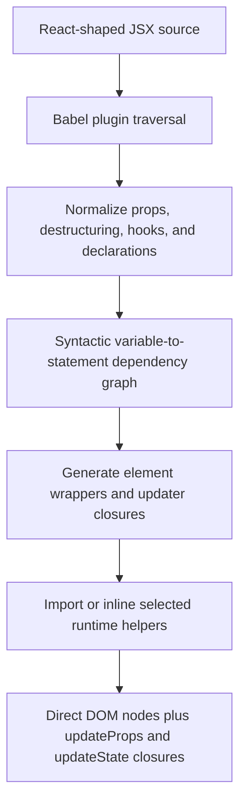
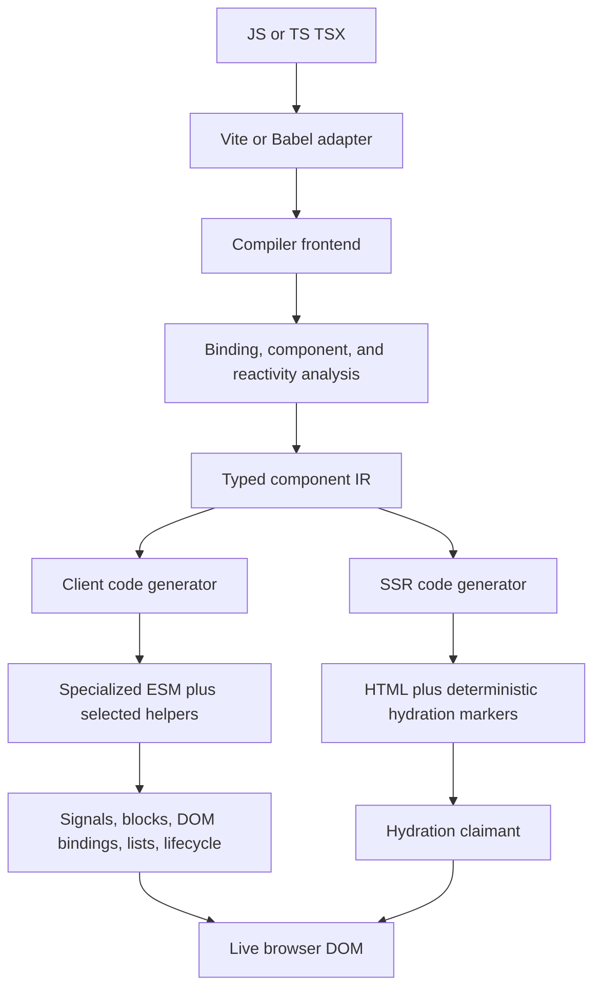
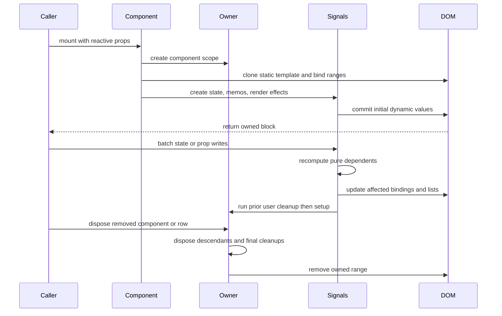
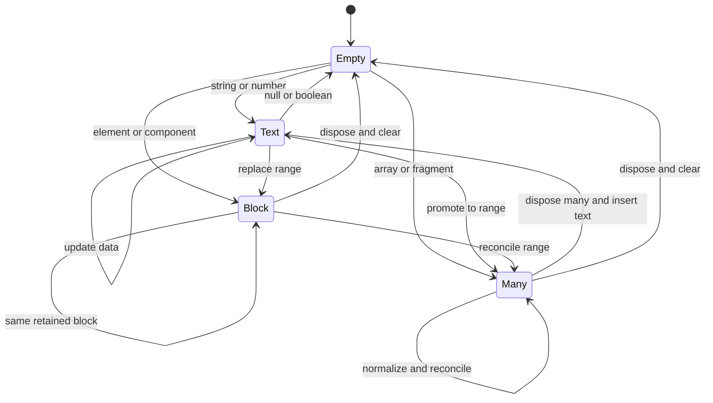
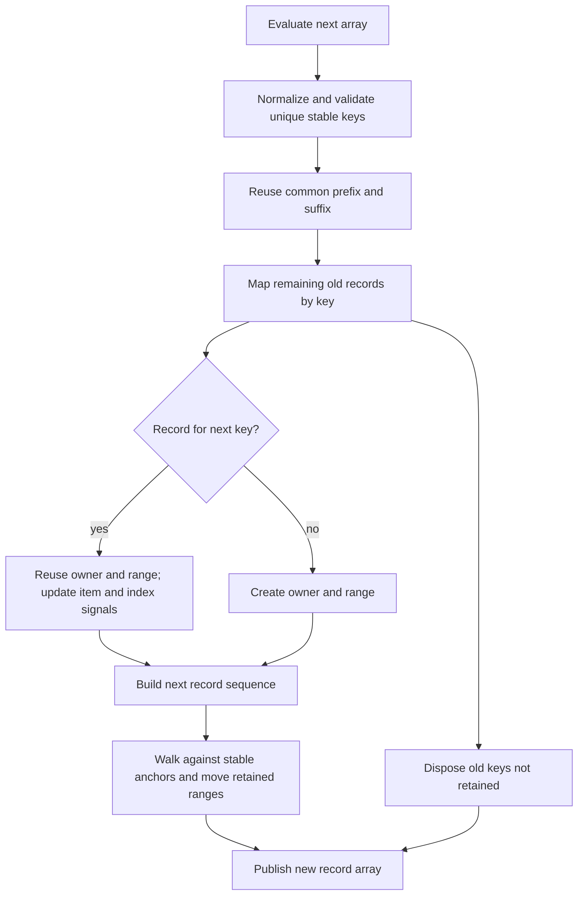

# Vidact Production Rebuild - Plan

## Goal Capsule

- **Objective:** Deliver a production-grade compiler that accepts a documented React-shaped TSX subset and emits direct vanilla DOM operations with no Virtual DOM.
- **Means:** Replace statement rewriting with a typed compiler IR, fine-grained signals, DOM ranges, and keyed or indexed list reconciliation (KTD1-KTD6).
- **Authority:** This plan defines the new system. The 2020 implementation is evidence, not a compatibility contract. The Product Contract wins over implementation convenience.
- **Execution profile:** Rebuild from scratch in ordered units. Preserve legacy code until the replacement passes compatibility, browser, size, and package gates.
- **Stop conditions:** Stop before declaring 1.0 if supported syntax can silently miscompile, list identity is unstable, disposal leaks remain, hydration mismatches are not diagnosed, or bundle budgets fail.
- **Tail ownership:** The implementation owner runs every Verification Contract gate and prepares release evidence. Publishing remains a separate, explicitly authorized action.

---

## Product Contract

### Summary

Vidact should remain a compiler-driven answer to the question posed in 2020: can developers author familiar React-shaped TSX while shipping specialized vanilla DOM operations instead of a Virtual DOM renderer? The answer is still yes, but only with an explicit language contract, a real lifecycle model, and first-class dynamic ranges and lists.

The rebuild will accept raw JavaScript or TypeScript JSX, compile each component into one-time DOM construction and fine-grained update bindings, and ship only the runtime helpers used by the application. It will support arrays of text, elements, fragments, and components. Keyed lists will preserve identity across insertion, deletion, and reordering. Unkeyed lists will have documented index semantics.

### Problem Frame

The 2020 proof of concept established the right broad architecture: analyze components at build time, generate direct DOM code, and keep the browser runtime small. Its implementation boundary was too permissive. It inferred reactivity from arbitrary JavaScript statements, treated any PascalCase function as a component, and represented dynamic output as an ad hoc node-or-array value. That made simple examples compelling but left control flow, list identity, cleanup, SSR, DOM namespaces, and package behavior without a sound model.

The later `origin/typescript-transformer` branch recognized that symbol identity and richer descriptors were needed. It moved analysis to the TypeScript type checker, but it remained an incomplete analyzer and depended on a custom TypeScript transformer distribution path. Type information alone does not solve lifecycle, dynamic ranges, scheduling, or DOM reconciliation.

The rebuild needs a smaller *total application footprint*, not merely a tiny incomplete helper directory. A production runtime will be larger than the 2020 runtime in isolation because it must own cleanup, lists, errors, namespaces, and hydration. The useful target is zero React runtime, feature-level tree shaking, no helper duplication per source module, and measured budgets for representative applications.

### Key Decisions

- **Compile React-shaped source to direct DOM.** (session-settled: user-directed — chosen over a React optimizer: the product idea is the complete React-shaped source-to-vanilla pipeline with no Virtual DOM.) Governs R1, R2, R3, R13.
- **Promise a specified subset, not universal React equivalence.** Arbitrary React packages and concurrent renderer semantics are outside the contract because they depend on React elements, React scheduling, or component re-execution. Governs R3, R4, R12.
- **Treat production readiness as correctness plus operability.** Stable packages, diagnostics, browser coverage, SSR/hydration, security behavior, performance evidence, and release policy are part of the product. Governs R9-R15.

### Requirements

**Compilation and language contract**

- R1. The compiler MUST turn supported TSX into direct DOM construction and targeted update operations without creating a Virtual DOM or runtime element tree for diffing.
- R2. Components MUST construct their DOM once per mount and update only bindings whose reactive inputs changed.
- R3. The project MUST publish a versioned React-shaped compatibility contract that separates supported syntax, diagnosed unsupported syntax, and intentionally different semantics.
- R4. The compiler MUST identify components and hooks from lexical bindings and imports, not identifier spelling or PascalCase alone.
- R5. Unsupported or ambiguous constructs MUST fail with source-located diagnostics instead of emitting code that can silently misrender.

**Reactivity and lifecycle**

- R6. State, derived values, props, effects, custom hooks, batching, errors, and disposal MUST use one ownership-aware fine-grained reactive model.
- R7. Effect cleanup MUST run before an effect reruns and when its owning component or list item is removed.

**Dynamic content and arrays**

- R8. Dynamic children MUST normalize strings, numbers including zero, nullish values, booleans, DOM blocks, fragments, nested arrays, and component results predictably.
- R9. Keyed arrays MUST preserve component state and DOM node identity through insertion, deletion, and reordering while disposing removed items exactly once.
- R10. Unkeyed arrays MUST use documented index semantics and update, append, or remove slots without pretending to preserve item identity.
- R11. List items and components MUST be able to own multi-node DOM ranges so fragments and nested lists do not need wrapper elements.

**DOM and platform behavior**

- R12. The supported DOM surface MUST include HTML, SVG, MathML, custom elements, attributes and properties, styles, classes, events, refs, controlled form values, prop spreads, fragments, conditionals, and an explicit unsafe-HTML API.
- R13. The system MUST support deterministic SSR and synchronous whole-root hydration without rebuilding a Virtual DOM. Hydration markers and serialized payloads MUST be versioned and injection-safe, and mismatches MUST produce actionable development diagnostics.
- R14. The default build MUST avoid runtime code generation and user-controlled HTML sinks. CSP-safe DOM construction MUST remain available when static template cloning is not allowed.

**Packaging and production operation**

- R15. Runtime helpers MUST ship as side-effect-declared ESM subpath exports with types, source maps, development and production conditions, and feature-level tree shaking.
- R16. Compiler dependencies MUST stay out of browser bundles, and helpers MUST not be copied into every transformed source module.
- R17. Vite and Babel integrations MUST share one compiler core and enforce transform ordering before any React JSX-runtime lowering.
- R18. The project MUST publish browser support, Node support, semantic versioning, diagnostics codes, release provenance, and a migration guide before 1.0.

### Success Criteria

- All accepted syntax has compiler fixtures plus real-browser behavior tests. The compiler has no known silent-miscompile class at release.
- Keyed list fuzzing covers insert, delete, prepend, append, swap, reverse, arbitrary reorder, duplicate-key failure, nested lists, fragments, and stateful rows.
- Moving a keyed row preserves the same DOM nodes, local state, focus, selection, and registered cleanup scope where the browser platform permits it.
- The minimal client runtime used by an interactive counter is at most 1.5 KiB minified and gzip-compressed. A common interactive runtime with signals, DOM bindings, lifecycle, and delegated events is at most 4 KiB. The full client runtime including lists and prop spread is at most 7 KiB. These are hard release ceilings unless benchmark evidence causes an explicit Product Contract revision; they are not silently relaxed during implementation.
- Representative compiled applications ship less JavaScript than the equivalent React application and do not regress beyond an agreed Solid or Svelte comparison envelope without a recorded reason.
- Compiler cold build and incremental transform time have budgets recorded from a benchmark corpus before 1.0. CI rejects statistically significant regressions outside the accepted envelope.
- Chromium, Firefox, and WebKit suites pass for the documented browser range. SSR output and hydration behavior pass on the supported Node range.
- A packed tarball passes export, type, provenance, and clean-project installation checks before release.

### Acceptance Examples

- AE1. **Keyed reorder:** Given three stateful rows keyed by stable IDs, when the first and last items swap, then each row keeps its DOM nodes and local state, retained ranges move without recreation, and no effect cleanup runs.
- AE2. **Keyed removal:** Given a keyed row with an effect cleanup, when its key disappears, then its DOM range is removed and its cleanup runs once before the update completes.
- AE3. **Unkeyed insertion:** Given three unkeyed rows, when a value is inserted at the front, then existing slots receive new item values by index and a new tail slot is created; the documented identity caveat is visible in development.
- AE4. **Mixed array normalization:** Given nested arrays containing text, zero, null, false, fragments, and components, when the binding updates, then zero is rendered, null and booleans render nothing, nesting is flattened, and component ranges remain valid.
- AE5. **Functional state update:** Given a state setter called twice with updater functions in one event, when the batch commits, then the second updater observes the first updater's result and the DOM commits once.
- AE6. **Effect lifecycle:** Given an effect with changing dependencies and a cleanup, when a dependency changes and the component later unmounts, then old cleanup precedes new setup and final cleanup runs on unmount.
- AE7. **Hydration:** Given server-rendered keyed list markup, when the client hydrates matching input, then it claims the existing nodes without recreating them; mismatched markers produce a source-linked development diagnostic.
- AE8. **Unsupported React feature:** Given a class component or a React API outside the contract, when the compiler runs, then compilation fails with a diagnostic and migration guidance instead of leaving React runtime calls in output.

### Scope Boundaries

**Included in the 1.0 contract**

- Function and arrow components written in JavaScript or TypeScript JSX.
- A React-shaped subset of `useState`, `useRef`, `useMemo`, `useCallback`, and `useEffect`, plus custom hooks built on Vidact primitives.
- Direct DOM client rendering, arrays, fragments, conditionals, context ownership, error boundaries, SSR, hydration, package adapters, diagnostics, and production verification.

**Deferred to Follow-Up Work**

- State-preserving hot-module replacement; the first Vite integration may remount the affected root.
- Resumability and event-handler code splitting. These require serializable closure and deployment contracts closer to Qwik than to the initial Vidact goal.
- Transitions, animation orchestration, Suspense-style async boundaries, portals, streaming SSR, and server components.
- Progressive or partial hydration and pre-hydration event replay. The 1.0 contract hydrates an explicitly mounted root synchronously.
- A Rust, Oxc, or SWC compiler frontend. The IR boundary keeps this possible after TypeScript/Babel build profiling proves a need.

**Outside this product's identity**

- A Virtual DOM fallback or React runtime embedded in production output.
- Drop-in execution of arbitrary npm packages that expect React elements, React context, React internals, or React's concurrent scheduler.
- React class components and exact Strict Mode or concurrent rendering behavior.

---

## Legacy Architecture Assessment

### Repository and history

The `master` branch is a compact March-April 2020 Babel plugin and runtime. The repository history shows rapid iteration from proof of concept to state, props, arrays, hooks, tests, and a browser REPL. The last `master` code change is from April 2020. The public repository has no tagged release and the manifest remains `0.0.0-alpha`.

The separate `origin/typescript-transformer` branch restarted the compiler in 2022 and added type-checker-based component and hook recognition in 2023. It contains descriptors and analyzers but does not emit a working renderer. It is useful design evidence, not a base to complete.

### How the 2020 system works



`src/plugin.ts` is the orchestrator. It stops normal program traversal, finds PascalCase function declarations, normalizes their bodies, builds a dependency map, lowers JSX, and inserts runtime imports. `src/astExplorer/visitJSXElement.ts` converts a JSX tree into element definitions. `src/astGenerator/elementDefinitions.ts` emits node creation, attribute work, text placeholders, component calls, and append operations.

`src/astTransformer/scanUpdatableValues.ts` and `src/utils/VariableStatementDependencyManager.ts` attempt to trace props and state through local variables to generated updater closures. `src/astGenerator/createUpdatableUpdater.ts` serializes that graph into arrays of closures and numeric dependency indices. `src/runtime/propUpdater.js` compares incoming values, collects affected closures, sorts them, executes them, and flushes child-prop transactions.

The component ABI is a nested wrapper object. A native helper returns a record containing `element`, `native`, and `updateProps`. A compiled component returns another record containing its root wrapper and a component prop updater. The demo therefore mounts through `appComponent.element.element` in `docs/src/index.js`.

Dynamic child content is initialized as a text placeholder. `src/runtime/setContent.js` replaces that placeholder with text, a DOM node, or an array of freshly normalized nodes. `src/runtime/append.js` appends the DOM node held by each wrapper. This path is the entire 2020 array model.

### Strengths worth preserving

| Strength | Why it remains valuable | Evidence |
|---|---|---|
| Compile-time specialization | Static JSX and known bindings can become direct DOM operations instead of a general renderer. | `src/plugin.ts`, `src/astGenerator/elementDefinitions.ts` |
| Fine-grained intent | The system tries to update statements and DOM bindings affected by a changed prop or state value. | `src/astTransformer/scanUpdatableValues.ts` |
| Compiler/runtime split | Generated code depends on a small browser runtime rather than Babel itself. | `src/utils/runtimeHelpers.ts`, `src/runtime/` |
| Feature-selected helpers | A module dependency set imports only helpers observed during transformation. | `src/utils/runtimeHelpers.ts` |
| Batched child prop updates | A `Map` consolidates several prop writes to one component instance before flushing. | `src/runtime/addPropTransaction.js`, `src/runtime/propUpdater.js` |
| One-time component construction | Local state naturally belongs to one component invocation instead of a render loop. | `src/astGenerator/createStateDefinition.ts` |
| Safe default text insertion | Dynamic primitives use text nodes and `textContent`, not raw HTML. | `src/runtime/createText.js`, `src/runtime/setContent.js` |
| Honest product positioning | The README calls the package alpha, lists missing behavior, and does not claim production readiness. | `README.md` |
| Fast learning loop | The REPL exposes input, generated output, and result, which is ideal for compiler development. | `docs/src/components/Repl.js` |
| Early tests and modularity | Explorer, transformer, generator, and runtime concerns are separated and several AST helpers have unit tests. | `src/astExplorer/`, `src/astTransformer/`, `src/astGenerator/` |

### Weaknesses and production risks

| Area | Finding | Consequence |
|---|---|---|
| Component detection | Any PascalCase function declaration is transformed; arrow functions, imports, return type, and JSX ownership are not part of detection. | False positives are possible while common component forms are missed. |
| Compiler soundness | Reactivity is inferred by rewriting arbitrary statements and recursively following identifier references. The graph has no explicit cycle handling or control-flow model. | Aliasing, computed access, mutation, closures, branches, loops, and complex destructuring can miscompile or execute in the wrong order. |
| JSX coverage | Root fragments, member-expression component names, JSX spread children, spread props, JSX created inside a dynamic expression, conditional returns, custom elements, and namespaces are absent or unsafe. | Valid TSX can remain untransformed, be dropped, or target the wrong DOM API. |
| Arrays | `setContent` recreates and replaces every array entry. It has no key map, item owner, update path, DOM range, or nested-array contract. | Reorders lose focus, selection, local state, refs, and effects. Updates are DOM-heavy and removed items cannot clean up. |
| Lifecycle | Components and list items have no owner or disposer. Effect return values are discarded. | Event listeners, timers, subscriptions, and nested reactive work can leak. |
| Hook semantics | Hook recognition is name-based. Effects run synchronously in a generated `finally`; dependencies use `===`; state setters store updater functions as values. | Behavior diverges from the familiar API in subtle, application-breaking ways. |
| Props | Child updates are partial object transactions and native `updateProps` replaces its previous-props record with the partial object. Deleted props are not enumerated. | Later comparisons can lose prior values and stale DOM properties can remain. |
| Events and DOM props | Event capture shares handler storage, event type normalization can drift, property/attribute selection uses a hand-maintained rule set, and styles do not cover every removal transition. | Edge cases across forms, SVG, custom elements, capture, and changing handlers are unreliable. |
| Component ABI | The nested `{ element, updateProps }` wrapper assumes a single root and exposes internal structure to callers. | Fragments, multi-node items, hydration, and stable public mounting APIs are difficult to add. |
| SSR and hydration | Runtime helpers access `document`, `Node`, and `Text` directly. There is no server emitter or marker protocol. | Server rendering is impossible without a separate architecture. |
| Bundle behavior | Release output is CommonJS, the package has only `main`, and inline mode copies helpers into each transformed module. | Tree shaking and subpath resolution are tool-dependent; inline mode can grow with module count. |
| Runtime completeness | `src/runtime/consolidateExecuters.js` lacks the named export re-exported by `src/runtime/index.js`. | Module-runtime builds that reach this helper can fail at bundling or import time. |
| Tests | Critical generator tests are `it.todo`; there are no compiler end-to-end, DOM runtime, browser, list, cleanup, SSR, hydration, package, or size tests. | Passing unit tests would not establish that a compiled application works. |
| Delivery | Travis, Webpack 4, Jest 25, TypeScript 3.7, and old Babel packages define the toolchain. There is no export map, declaration contract, release automation, or support policy. | The package is not consumable as a maintained production dependency. |

### Array failure analysis

The original array implementation is replacement, not reconciliation. On every update, it maps each value through a new text placeholder, replaces the old node or old array, and returns the new node array. The only identity comparison is the top-level `element === content` fast path.

This design cannot answer the questions a real list renderer must answer:

- Which new item corresponds to which old item?
- Does one item own one node or a range of nodes?
- How are nested arrays and empty ranges represented?
- How does a reused item receive new item and index values?
- Which effects, refs, and event registrations belong to a removed item?
- How are duplicate keys handled?
- How are node moves separated from item creation and disposal?
- How does hydration claim a list that already exists in the DOM?

The roadmap in `README.md` already identified the visible symptoms: avoid refreshing elements with the same key and avoid refreshing rearranged keyed elements. The deeper missing abstraction is an owned DOM range. Once every dynamic expression, fragment, component, and list row has stable range boundaries, arrays stop being a text-helper special case and become a normal composition primitive.

### Bundle footprint baseline

The eight files in `src/runtime/` total 7,249 source bytes. Concatenating them, removing only top-level import/export keywords, and gzip-compressing the result produces 2,206 bytes. This is a diagnostic source measurement, not a production bundle measurement: it is not minified, it includes the index module, it omits generated component code, and the runtime is incomplete.

The rebuild should not claim success by comparing a complete runtime to that number alone. It should measure at least three layers: helper runtime bytes, generated bytes, and total application bytes after a production bundler. It should also track parse and initialization time because replacing a Virtual DOM with more generated code can trade runtime library size for application code size.

### Assessment of the TypeScript-transformer branch

The later branch improves component detection by checking `React.FC`, `React.FunctionComponent`, and `JSX.Element` symbols. It begins a `ComponentDescriptor` and `DependentFunctionDescriptor` IR and supports function declarations plus typed arrow components. These are good lessons.

It should not be resumed as the production base. `src/analyzers/component/componentAstToDescriptor.ts` only logs state-analysis results. `src/concerns/dependentFunction/createDependentFunction.ts` is unfinished. No DOM runtime or renderer is emitted. The package relies on `ttypescript`, which adds a nonstandard transformer loading path. The rebuild should keep symbol-aware diagnostics optional while using a bundler-friendly compiler interface and a frontend-neutral internal IR.

---

## Planning Contract

### Key Technical Decisions

- KTD1. **Use fine-grained signals and owned computations, never a Virtual DOM.** (session-settled: user-directed — chosen over a React optimizer or Virtual DOM fallback: R1-R3 require the complete TSX-to-DOM system.) Runtime dependency tracking replaces the legacy recursive statement graph. The compiler still determines where computations and DOM bindings exist.
- KTD2. **Define a React-shaped language with an opt-in compatibility mode.** The native package exports Vidact hooks and JSX types. A `react-subset` compiler mode may consume supported named React imports from raw TSX, erase them, and reject unsupported React APIs. It cannot consume files already lowered to `react/jsx-runtime` calls.
- KTD3. **Lower through a typed, frontend-neutral component IR.** Babel supplies the first parser, scope graph, source locations, and emitter because it integrates with JavaScript and TypeScript build pipelines. The IR owns semantics so a future Oxc or SWC frontend does not require a runtime rewrite.
- KTD4. **Represent rendered output as owned DOM blocks and ranges.** A block has stable start and end positions, child owners, and a disposer. Single text and element bindings can use optimized representations, but every dynamic boundary can promote to a range.
- KTD5. **Make arrays an explicit compiler and runtime primitive.** Keyed lists reconcile instance records by key and move retained DOM ranges. Unkeyed lists reconcile slots by index. Generic dynamic arrays normalize recursively but do not invent item identity.
- KTD6. **Use a correctness-first O(n) keyed reconciliation core.** Common prefix and suffix paths plus a key map determine reuse, creation, disposal, and anchor-relative range moves. Start with the smallest implementation that produces correct identity and bounded work. Add a longest-increasing-subsequence move minimizer only if list benchmarks show a material end-to-end win while the full-runtime budget still passes; KTD12 forbids paying its code-size cost speculatively.
- KTD7. **Split DOM work into direct generated operations and opt-in generic helpers.** Static markup is hoisted. Known dynamic props compile to specialized writes. Prop spread, generic dynamic insertion, delegated events, and list reconciliation import helpers only when used.
- KTD8. **Offer template-clone and CSP-safe code generation.** Template cloning is the size-oriented default for compiler-owned static HTML. A DOM-API mode avoids `innerHTML` for deployments that enforce Trusted Types without a framework policy. Dynamic text never uses HTML parsing.
- KTD9. **Schedule in explicit phases.** State writes batch. Pure memos update before DOM render effects. DOM work commits synchronously within the batch. User effects run after the DOM commit and clean up before rerun or owner disposal. Equality follows `Object.is` unless a primitive declares another comparator.
- KTD10. **Ship ESM-first packages with explicit exports.** Browser runtime, server runtime, compiler, Babel adapter, and Vite adapter are separate entry points. Compiler packages may expose a CommonJS condition where tooling still needs it; browser code stays ESM and side-effect controlled.
- KTD11. **Treat differential compatibility as a test oracle, not the architecture.** Fixtures within the declared React subset render through React and Vidact and compare public DOM and event outcomes. Vidact-specific timing and unsupported features use their own asserted contract.
- KTD12. **Gate optimization with measurements.** Do not start with Rust, custom bytecode, global resumability, or hand-inlined helpers. Enforce bundle, transform-time, update-time, DOM-operation, and memory budgets before introducing complexity.

### High-Level Technical Design

#### Package and compilation topology



The compiler must finish semantic analysis before mutating the source AST. Every accepted component becomes a `ComponentIR` containing static templates, reactive cells, derived computations, DOM bindings, child component calls, control-flow blocks, list blocks, effects, source spans, and feature flags. Diagnostics operate on IR or source analysis, not partially rewritten code.

#### Component and update lifecycle



Component functions execute once per mount. A state binding compiles to a signal cell, and reads in dynamic regions subscribe to that cell. Top-level derived bindings that transitively read reactive values become memos or receive a compile-time diagnostic when their control flow cannot be represented safely. Custom hooks execute inside the current owner and can create signals, effects, cleanup, and context without hook-index bookkeeping.

#### Dynamic value state machine



The runtime normalizer recursively flattens arrays. It skips `null`, `undefined`, `true`, and `false`. It converts strings, numbers, and bigints to text while preserving zero. It accepts DOM nodes only through a documented escape hatch and treats owned blocks as the normal internal currency. Symbols, plain objects, promises outside an async primitive, and foreign React elements produce development diagnostics.

#### Keyed list reconciliation



Each keyed record stores a string or number key, item signal, index signal when referenced, block range, and owner disposer. String and number keys remain distinct. A reused record keeps its DOM and owner while receiving new item data. A moved record moves the existing range. A missing record disposes before removal. A new record mounts at the computed anchor. Missing, non-primitive, and duplicate keys are invalid and produce a source-linked error; production uses a compact error code rather than undefined behavior.

An unkeyed record stores the same block and owner but is matched by index. This is efficient for append-only or slot-oriented data and intentionally does not preserve identity when values shift. Development diagnostics should recommend keys when the compiler sees stateful rows or reorder-capable expressions.

### Compatibility Contract

| Surface | 1.0 behavior | Not promised |
|---|---|---|
| Components | Named or anonymous function and arrow components; single or multiple roots through fragments | Classes, React internals, concurrent re-execution |
| JSX | HTML, SVG, MathML, custom elements, fragments, components, expressions, spreads, conditional output | Already-lowered `react/jsx-runtime` calls |
| State | Value and functional setters, lazy initialization, batched writes, `Object.is` equality | React's render queue, transitions, Strict Mode replay |
| Effects | Dependency-array compatibility mode, cleanup on change and disposal, post-DOM execution | Exact React scheduling relative to paint in every browser |
| Memo and callback | Stable cached values under declared or tracked dependencies | React's permission to discard memoized values |
| Props and children | Reactive reads, destructuring lowering, defaults, rest/spread fallback, lazy children | Arbitrary manipulation of React element objects |
| Lists | JavaScript array pipelines ending in JSX, keyed and unkeyed modes, fragments and nested lists | Keys synthesized from unstable indices or random values |
| Third-party code | Framework-agnostic JavaScript and DOM libraries | React component libraries without source and compiler support |

### Output Structure

```text
package.json
pnpm-workspace.yaml
tsconfig.base.json
vitest.workspace.ts
playwright.config.ts
packages/
  compiler/
    src/
      analyze/
      diagnostics/
      ir/
      codegen/
      index.ts
    test/fixtures/
  runtime/
    src/
      reactive/
      dom/
      list/
      lifecycle/
      client.ts
      server.ts
    test/
  babel-plugin/
    src/index.ts
    test/
  vite/
    src/index.ts
    test/
  jsx-types/
    src/index.d.ts
  test-app/
    src/
    tests/
benchmarks/
  fixtures/
  results/
tests/
  package/
docs/
  architecture/
  compatibility/
  migration/
  reference/
```

### Bundle Strategy

- Hoist compiler-owned static markup once per module and clone it per component instance.
- Generate direct assignments for known dynamic DOM bindings. Import generic setters only for spreads or dynamic names.
- Import helpers from explicit ESM subpaths or a compiler-generated virtual runtime entry so bundlers include one shared copy.
- Keep development diagnostics behind export conditions and compile-time constants.
- Mark only proven modules as side-effect free. Event delegation bootstrap and development registration must have explicit entry points.
- Measure minimal, common, full, and representative-application bundles with the same minifier and gzip/Brotli settings.
- Count generated component code separately from runtime helpers to catch code-size transfer from runtime to compiler output.
- Keep compiler, Babel, TypeScript, test, and source-map dependencies in build-time packages only.

### System-Wide Impact

The rebuild changes authoring semantics, compiler integration, runtime behavior, package layout, server rendering, and release operations. Application developers need precise diagnostics and a migration matrix. Library authors need a stable public mounting and context contract without access to the internal DOM-block representation. Operations teams need CSP, hydration, browser, and error-code documentation. Maintainers need fixture, browser, size, performance, and package gates that run before every release.

| Boundary | Contract and failure propagation |
|---|---|
| Source to compiler | Every accepted file either emits complete Vidact code or fails with stable, source-located diagnostics. Partial React/Vidact output is forbidden. Adapter errors preserve compiler codes and source maps. |
| Compiler IR to client/server generators | Both generators consume the same immutable semantic IR and feature flags. An unsupported IR variant is a compiler defect and fails the build rather than falling back at runtime. |
| Component to runtime | Public mount returns an opaque root handle with `dispose`; component and list blocks remain private. Render failures route to the nearest owner error boundary, then the root error callback, and never leave the active owner or listener set corrupted. |
| Runtime to DOM | A batch either publishes a consistent computation result or reports a compact runtime error. Disposal is idempotent, descendant-first, and removes delegated registrations and owned ranges. |
| Server HTML to hydration | Package version, marker protocol, and serializer version must agree. Development reports the source binding; production stops at the configured recovery boundary instead of claiming unrelated neighboring nodes. |
| Packages to consumers | Only documented export-map paths are public. Runtime packages cannot import compiler packages. Development-only diagnostics and registries cannot leak into production conditions. |

No persistent application data is migrated by the framework itself. Rollback therefore means pinning the previous package and rebuilding the application; generated output is never mixed across compiler/runtime protocol versions. Preview releases must record compiler version, runtime version, marker protocol, benchmark corpus revision, and comparison-framework versions so failures are reproducible.

### Risks and Mitigations

| Risk | Impact | Mitigation |
|---|---|---|
| “React-compatible” expectations exceed the supported subset | Users assume unsupported React behavior and get subtle bugs. | Use React-shaped language, publish the matrix, reject unsupported imports and syntax, and differential-test accepted cases. |
| Compiler analysis silently misses a reactive read | DOM becomes stale with no runtime error. | Use signal tracking inside generated computations, restrict static derivation lowering, and error on ambiguous top-level reactive control flow. |
| List algorithm preserves keys but mishandles multi-node ranges | Nodes cross item boundaries or cleanup targets the wrong row. | Give every item explicit anchors and ownership; property-test operation sequences and run browser identity assertions. |
| Template cloning conflicts with strict CSP or Trusted Types | Production applications cannot instantiate static templates. | Ship and test a DOM-API codegen mode; document a Trusted Types integration for the template mode. |
| SSR markers increase HTML or hydration complexity | Bundle savings move into markup and startup work. | Benchmark marker density, omit unnecessary single-node boundaries, and make mismatch diagnostics development-only. |
| Fine-grained ownership leaks through errors or async work | Detached nodes and subscriptions accumulate. | Centralize owner creation and cleanup, use `try/finally` around owner transitions, and instrument disposer counts in tests. |
| Generated code becomes larger than a small general runtime | Total application bytes regress on component-heavy apps. | Track generated and total bytes across a corpus; add codegen peepholes only when measurements justify them. |
| Babel becomes a build-time bottleneck | Large applications reject the compiler despite runtime gains. | Keep the IR frontend-neutral, cache by content and options, support incremental Vite transforms, and profile before adding a native frontend. |
| SSR and client generators drift | Hydration mismatches occur only in production paths. | Generate both from the same IR and run paired snapshot plus real hydration tests for every rendering fixture. |
| Compiler and runtime versions drift in a consumer build | Generated calls or hydration markers no longer match the installed runtime. | Embed a protocol version, validate it in development and SSR hydration, declare exact compatible package ranges, and test deliberately mismatched packages. |
| Optimization benchmarks reward synthetic cases | A smaller helper or faster microbenchmark regresses real applications, memory, or interaction latency. | Freeze representative corpora, archive raw distributions and environment metadata, report generated plus runtime bytes, and require both micro and application-level evidence. |
| Preview failures cannot be diagnosed or rolled back | Early adopters face opaque production faults. | Publish stable error codes and a root error callback, retain previous package artifacts, document package pinning, and use preview/RC channels before `latest`. |

### Phased Delivery

1. Establish the compatibility contract, corpus, typed IR, and package skeleton.
2. Ship client-only static and scalar dynamic rendering with ownership-aware signals.
3. Add component props, hooks, cleanup, DOM surface completeness, and errors.
4. Add keyed and unkeyed arrays with property-based and browser identity proof.
5. Add SSR, hydration, CSP modes, adapters, production packaging, benchmarks, protocol-version checks, and release gates.
6. Publish preview and release-candidate versions for real applications. Advance only when there are no silent miscompiles or identity/cleanup defects, browser and package gates are green, and size budgets pass. Roll back by pinning the last known-good package; freeze 1.0 only after the support matrix and budgets survive that feedback.

---

## Implementation Units

### U1. Establish workspace and executable contracts

- **Goal:** Create the new package workspace, declared language contract, fixture corpus, and quality scripts without deleting the legacy implementation.
- **Requirements:** R3-R5, R15-R18.
- **Decisions:** KTD2, KTD3, KTD10-KTD12.
- **Dependencies:** None.
- **Files:** `package.json`, `pnpm-workspace.yaml`, `tsconfig.base.json`, `vitest.workspace.ts`, `playwright.config.ts`, `packages/test-app/`, `docs/compatibility/react-subset.md`, `docs/architecture/compiler-contract.md`, `tests/package/clean-install.test.ts`.
- **Approach:** Define package boundaries and a fixture manifest that labels each case accepted, rejected, or intentionally different. Pin the supported Node and browser policy. Add proposed build, lint, unit, browser, size, benchmark, and package-validation scripts.
- **Execution note:** Start with install and fixture-runner smoke tests because this unit is mostly packaging and contracts.
- **Patterns to follow:** Preserve the legacy REPL's input/output/result feedback loop as a future developer tool, but do not reuse its Webpack 4 build.
- **Test scenarios:**
  - A clean temporary project installs packed packages, imports every public entry point, and type-checks a minimal TSX component.
  - A fixture marked rejected fails with its expected diagnostic code and source span.
  - Browser and Node target configuration matches the published support document.
- **Verification:** The workspace builds from a clean install, fixtures are discoverable by category, and package boundaries prevent compiler dependencies from resolving through the runtime package.

### U2. Build the compiler frontend, analysis, and IR

- **Goal:** Parse JS/TS TSX, identify framework bindings, analyze components, and produce a complete immutable IR before code generation.
- **Requirements:** R1-R5, R17.
- **Decisions:** KTD2, KTD3, KTD11.
- **Dependencies:** U1.
- **Files:** `packages/compiler/src/index.ts`, `packages/compiler/src/analyze/`, `packages/compiler/src/diagnostics/`, `packages/compiler/src/ir/`, `packages/compiler/test/compiler-ir.test.ts`, `packages/compiler/test/diagnostics.test.ts`, `packages/compiler/test/fixtures/`.
- **Approach:** Use Babel scope bindings and source locations. Recognize components from configured entry points and JSX-bearing return paths. Recognize hooks from resolved imports. Model templates, bindings, components, control flow, lists, effects, features, and source spans as IR. Reject unsupported control flow before emission.
- **Patterns to follow:** Keep the separation suggested by `src/astExplorer/`, `src/astTransformer/`, and `src/astGenerator/`, while replacing mutation-first traversal with analyze-then-emit. Carry forward the descriptor lesson from the `origin/typescript-transformer` branch.
- **Test scenarios:**
  - Function declarations, arrow functions, default exports, aliased imports, and shadowed hook names produce the correct component or non-component classification.
  - HTML, SVG, MathML, custom elements, fragments, member-expression components, spreads, and nested JSX produce stable IR.
  - Hooks called through an unsupported alias, inside a conditional, or from a foreign package produce precise diagnostics.
  - JSX already lowered to a React runtime call fails with transform-order guidance.
  - Computed props, nested destructuring, defaults, rest, and dynamic expressions either produce modeled IR or an explicit diagnostic.
- **Verification:** IR snapshots contain no generated runtime syntax, every node carries a source span, and no accepted fixture depends on identifier spelling alone.

### U3. Implement signals, scheduling, ownership, and disposal

- **Goal:** Provide the correctness foundation for state, memos, render effects, user effects, batching, context, errors, and cleanup.
- **Requirements:** R2, R6, R7.
- **Decisions:** KTD1, KTD9.
- **Dependencies:** U1.
- **Files:** `packages/runtime/src/reactive/signal.ts`, `packages/runtime/src/reactive/computation.ts`, `packages/runtime/src/reactive/scheduler.ts`, `packages/runtime/src/lifecycle/owner.ts`, `packages/runtime/src/lifecycle/context.ts`, `packages/runtime/src/lifecycle/error-boundary.ts`, `packages/runtime/test/reactivity.test.ts`, `packages/runtime/test/lifecycle.test.ts`.
- **Approach:** Use explicit signal subscriber sets and an owner tree. Separate pure computations, DOM render effects, and post-commit user effects. Batch nested writes. Dispose descendants and cleanup callbacks in a deterministic order. Restore global owner and listener state through exception-safe boundaries.
- **Patterns to follow:** Borrow the proven signals-and-observers model documented by Solid, but keep the implementation and public API limited to Vidact's contract.
- **Test scenarios:**
  - Primitive and object signals use `Object.is`, including `NaN` and signed zero behavior.
  - Nested batches recompute a memo once and commit each render effect once.
  - Functional setters compose in call order and return the final state.
  - Dynamic dependencies unsubscribe from branches no longer read.
  - Effect cleanup runs before rerun and exactly once on owner disposal, including disposal after a thrown descendant effect.
  - Context resolves through nested owners and error boundaries catch descendant failures without corrupting the active owner.
- **Verification:** The reactive test suite passes without DOM globals, queue order is deterministic, and instrumentation reports no subscriber or owner retained after disposal fixtures.

### U4. Generate and run direct DOM bindings

- **Goal:** Emit one-time static DOM creation plus targeted updates for scalar content, attributes, properties, styles, classes, events, refs, conditionals, and fragments.
- **Requirements:** R1, R2, R5, R8, R11, R12, R14-R16.
- **Decisions:** KTD4, KTD7, KTD8, KTD10.
- **Dependencies:** U2, U3.
- **Files:** `packages/compiler/src/codegen/client/`, `packages/runtime/src/dom/block.ts`, `packages/runtime/src/dom/insert.ts`, `packages/runtime/src/dom/props.ts`, `packages/runtime/src/dom/events.ts`, `packages/runtime/src/dom/template.ts`, `packages/runtime/test/dom-bindings.test.ts`, `packages/test-app/tests/dom-bindings.spec.ts`.
- **Approach:** Hoist static templates, bind source-located dynamic parts, and emit direct operations for known names. Use owned ranges for conditionals and fragments. Delegate common bubbling events at the mount root and attach non-bubbling, capture, and custom events directly. Keep template and CSP-safe generators behaviorally equivalent.
- **Patterns to follow:** The legacy `src/runtime/createElement.js` demonstrates the needed prop categories. Replace its generic always-on diff with generated operations and explicit fallback helpers. Use the marker-based dynamic insertion lessons from `dom-expressions` without copying its whole runtime surface.
- **Test scenarios:**
  - Text updates preserve zero, escape markup, skip nullish and boolean values, and replace text with blocks and back.
  - HTML properties, boolean attributes, ARIA values, data attributes, SVG namespaced attributes, MathML, and custom-element properties update and clear correctly.
  - Style objects remove missing properties, custom CSS properties work, and transitions between string, object, and null values are correct.
  - Event handler replacement, removal, capture, non-bubbling events, shadow DOM retargeting, and root disposal behave correctly.
  - Refs receive mounted elements and are cleared or cleaned when their block is removed.
  - Template and CSP-safe modes produce equivalent DOM for every shared fixture.
- **Verification:** Generated output contains no React imports or element objects, browser tests pass across Chromium, Firefox, and WebKit, and unused generic helpers are absent from bundle reports.

### U5. Add component props and React-shaped hooks

- **Goal:** Compile components, reactive props and children, supported hooks, custom hooks, and component disposal onto the common runtime model.
- **Requirements:** R2-R7, R11-R13.
- **Decisions:** KTD1-KTD4, KTD9, KTD11.
- **Dependencies:** U2-U4.
- **Files:** `packages/compiler/src/analyze/reactivity.ts`, `packages/compiler/src/codegen/client/component.ts`, `packages/runtime/src/client.ts`, `packages/runtime/src/lifecycle/hooks.ts`, `packages/runtime/test/components.test.ts`, `packages/compiler/test/react-compat.test.ts`, `packages/test-app/tests/component-lifecycle.spec.ts`.
- **Approach:** Compile state bindings to signal cells and rewrite reactive reads only within modeled regions. Lower safe derived bindings to memos. Pass props through stable reactive cells and make children lazy. Implement dependency-array compatibility and automatic Vidact primitives on the same scheduler. Return an owned block from every component.
- **Patterns to follow:** Preserve the one-invocation state locality from `src/astGenerator/createStateDefinition.ts` and the child-prop batching intent from `src/runtime/addPropTransaction.js`. Replace wrapper nesting and numeric executor arrays with the block and signal contracts.
- **Test scenarios:**
  - Prop addition, update, deletion, destructuring defaults, rest, spreads, and lazy children update the correct bindings.
  - Value setters, functional setters, lazy initializers, refs, memos, callbacks, and effects match the documented compatibility cases.
  - Custom hooks create nested state, context, and cleanup under the calling component owner.
  - Multiple roots return one range without wrapper elements.
  - Removing a conditional child disposes nested components, events, and effects once.
  - Unsupported React imports and third-party React element values fail with migration diagnostics.
- **Verification:** Differential fixtures match React where the compatibility matrix promises parity, Vidact-specific lifecycle fixtures match KTD9, and component disposal leaves no live owners.

### U6. Implement first-class keyed and unkeyed arrays

- **Goal:** Render and update mixed, nested, stateful arrays while preserving the documented identity and lifecycle semantics.
- **Requirements:** R8-R11.
- **Decisions:** KTD4-KTD6, KTD12.
- **Dependencies:** U3-U5.
- **Files:** `packages/compiler/src/analyze/lists.ts`, `packages/compiler/src/codegen/client/list.ts`, `packages/runtime/src/list/keyed.ts`, `packages/runtime/src/list/indexed.ts`, `packages/runtime/src/list/normalize.ts`, `packages/runtime/test/list-reconciliation.test.ts`, `packages/runtime/test/list-properties.test.ts`, `packages/test-app/tests/lists.spec.ts`.
- **Approach:** Recognize JSX-producing array pipelines in child position and extract compile-only string or number keys. Store keyed record owners and ranges. Reuse by key, update item and index signals, dispose missing records, and move retained ranges against stable anchors. Use a separate indexed reconciler for unkeyed lists. Route opaque mixed arrays through the generic normalizer without claiming keyed identity. Establish the simple reference reconciler first; add move minimization only under KTD6's benchmark gate.
- **Execution note:** Implement the model-based property test before optimizing DOM moves; compare every operation sequence with a simple reference renderer.
- **Patterns to follow:** Use React's documented stable-key identity contract and Svelte's explicit keyed versus unkeyed distinction. Study Solid's `mapArray` owner reuse and `dom-expressions` array reconciliation as prior art, then test Vidact's multi-node range semantics independently.
- **Test scenarios:**
  - Covers AE1. Swaps, reversals, rotations, and arbitrary keyed reorders retain record owners and DOM identity.
  - Covers AE2. Key deletion removes the full range and runs nested cleanup once.
  - Covers AE3. Unkeyed prepend updates existing slot item signals and appends one slot under documented index semantics.
  - Covers AE4. Nested arrays flatten in order and preserve zero while skipping nullish and boolean entries.
  - Duplicate, missing, unstable, object, and colliding keys follow the documented diagnostic or runtime error contract.
  - Rows with fragments, nested lists, controlled inputs, focus, selection, refs, and local state survive keyed moves.
  - Empty-to-many, many-to-empty, scalar-to-array, and array-to-scalar transitions preserve neighboring DOM outside the range.
  - Random operation sequences produce the same visible DOM as the reference model and never double-dispose or orphan a node.
- **Verification:** Property tests pass their configured seed corpus, all three browsers preserve identity in the keyed scenarios, and benchmark instrumentation reports creations, removals, and moves consistent with the reference decisions.

### U7. Add SSR, hydration, and security modes

- **Goal:** Render deterministic server HTML and claim it on the client with the same IR, range model, ownership, and list semantics.
- **Requirements:** R8-R14.
- **Decisions:** KTD3-KTD5, KTD8-KTD10.
- **Dependencies:** U2-U6.
- **Files:** `packages/compiler/src/codegen/server/`, `packages/runtime/src/server.ts`, `packages/runtime/src/dom/hydrate.ts`, `packages/runtime/test/ssr.test.ts`, `packages/runtime/test/hydration.test.ts`, `packages/test-app/tests/hydration.spec.ts`, `packages/test-app/tests/csp.spec.ts`, `docs/reference/ssr-hydration.md`, `docs/reference/security.md`.
- **Approach:** Emit server and client code from shared templates and binding IDs. Serialize only deterministic hydration markers and initial state required to claim DOM. Hydration creates owners and subscriptions around existing nodes. Development verifies tag, range, and binding expectations; production uses compact errors or a documented recovery boundary. Keep unsafe HTML explicit and Trusted Types-aware.
- **Test scenarios:**
  - Covers AE7. Matching scalar, conditional, fragment, component, keyed list, and nested list markup hydrates without node replacement.
  - Text, attribute, range, list-key, and marker mismatches identify the source binding and do not corrupt neighboring DOM.
  - Hydrated state updates reuse claimed nodes and dispose server-originated list ranges correctly.
  - Escaped text, attributes, hydration markers, and serialized state resist injection fixtures; unsafe HTML requires the explicit API and respects Trusted Types configuration.
  - Compiler/runtime or marker-protocol version mismatches fail at the configured root recovery boundary without claiming neighboring DOM.
  - CSP-safe mode passes under a policy that forbids string assignment to HTML sinks.
  - Server rendering runs without `document`, `window`, `Node`, or `Text` globals.
- **Verification:** Paired server/client snapshots agree, real-browser hydration retains node identity, CSP tests pass, and server package imports do not load client DOM modules.

### U8. Ship adapters, benchmarks, documentation, and release gates

- **Goal:** Make the compiler practical to adopt and safe to release as a production dependency.
- **Requirements:** R3-R5, R15-R18.
- **Decisions:** KTD2, KTD3, KTD10-KTD12.
- **Dependencies:** U1-U7.
- **Files:** `packages/babel-plugin/src/index.ts`, `packages/babel-plugin/test/integration.test.ts`, `packages/vite/src/index.ts`, `packages/vite/test/integration.test.ts`, `packages/jsx-types/src/index.d.ts`, `benchmarks/`, `docs/migration/from-react.md`, `docs/reference/diagnostics.md`, `docs/reference/package-usage.md`, `.github/workflows/ci.yml`, `.github/workflows/release.yml`, `.changeset/`.
- **Approach:** Keep adapters thin and pass normalized options to the compiler core. Integrate source maps, incremental cache keys, and Vite development invalidation. Publish explicit package exports, declarations, provenance, and changesets. Compare runtime, generated, total bundle, startup, updates, list mutations, memory, and compile time against fixed fixture applications.
- **Execution note:** Validate packed artifacts in clean projects before any registry publish. Publishing requires explicit authorization.
- **Patterns to follow:** Recreate the useful REPL feedback loop with the new compiler after core gates pass. Use modern package export maps rather than the legacy `main` plus implicit `vidact/runtime` directory resolution.
- **Test scenarios:**
  - Babel and Vite transform the same source to semantically equivalent output and preserve source-map locations.
  - Vite development rebuilds only affected modules and remounts safely without retaining old owners.
  - A clean consumer imports client, server, compiler, and JSX types through documented subpaths; undocumented internals are not exported.
  - Development and production conditions include and remove diagnostics as expected.
  - Size fixtures enforce minimal, common, full, and representative-application budgets.
  - Benchmark fixtures cover creation, scalar update, keyed append, keyed swap, keyed reverse, removal, hydration, and disposal.
  - Release dry-run verifies types, license, README, source maps, provenance, protocol compatibility, and the intended file list.
  - A deliberately mismatched compiler/runtime pair fails with a stable diagnostic; a preview consumer can pin the prior package and rebuild without source changes.
- **Verification:** All adapters share one compiler snapshot corpus, CI passes on the support matrix, size and performance reports include raw distributions and environment metadata, and the packed release passes public API and type checks. Preview promotion has an owner, stop/go record, and known-good rollback version.

---

## Verification Contract

| Gate | Applies to | Done signal |
|---|---|---|
| `pnpm lint` | U1-U8 | Source, generated fixtures, and package metadata satisfy formatting and static rules. |
| `pnpm typecheck` | U1-U8 | Strict compiler, runtime, adapter, tests, and public declaration projects pass. |
| `pnpm test` | U2-U8 | Unit, compiler fixture, lifecycle, normalization, and property suites pass. |
| `pnpm test:browser` | U4-U8 | Chromium, Firefox, and WebKit pass DOM identity, forms, events, lists, cleanup, hydration, and CSP scenarios. |
| `pnpm test:compat` | U2, U5, U6 | Every promised React-subset fixture matches the declared public outcome; rejected fixtures produce expected diagnostics. |
| `pnpm test:package` | U1, U8 | Packed packages install in clean ESM and supported tooling consumers, exports resolve, and declarations match runtime entry points. |
| `pnpm size` | U4-U8 | Minimal, common, and full client bundles meet 1.5 KiB, 4 KiB, and 7 KiB minified-gzip ceilings; generated and total bytes are reported separately. |
| `pnpm benchmark` | U6-U8 | Results cover the fixed corpus and remain inside the accepted regression envelope with raw data archived. |
| `pnpm build` | U1-U8 | Reproducible client, server, compiler, adapter, type, and source-map artifacts are produced with no legacy dependency leakage. |

The current legacy checkout cannot run its historical `npm test` or `npm run build` because dependencies are not installed; `jest` is unavailable. This does not block planning, but the rebuild must establish a reproducible clean-install baseline before any behavior is ported.

---

## Definition of Done

- Every R-ID is implemented, explicitly deferred by a revised Product Contract, or rejected as a release blocker.
- Every implementation unit passes its listed scenarios and Verification Contract gates.
- Accepted syntax never silently falls through to React runtime calls or untransformed JSX.
- Keyed and unkeyed array semantics match the contract across scalar, fragment, component, nested, empty, and hydration transitions.
- Component and list owner cleanup is deterministic under normal removal, errors, replacement, and root disposal.
- Public DOM behavior passes the supported browser matrix, and SSR imports run without browser globals.
- Runtime and total application size reports meet the declared budgets. Benchmark evidence includes comparison versions and raw results.
- Export maps, types, source maps, license, provenance, support policy, compatibility matrix, diagnostics, migration, SSR, hydration, and security documentation ship in the packed artifacts or linked documentation site.
- Preview adoption has exercised at least one list-heavy application and one SSR application without an unresolved correctness or memory-leak issue.
- Abandoned experimental code, legacy compatibility shims not in the contract, debug logging, and dead package entry points are removed before 1.0.
- The original implementation remains recoverable in git history. Its deletion or archival in the working tree occurs only after the replacement passes all release gates.
- No package is published and no repository change is pushed without explicit authorization.

---

## Appendix

### Local evidence map

- `README.md` — original product claim, alpha warning, and roadmap including keyed array, cleanup, SVG, conditional return, context, SSR, and prop-spread gaps.
- `src/plugin.ts` — orchestration, PascalCase function detection, transform ordering, JSX lowering, and component return ABI.
- `src/astExplorer/visitJSXElement.ts` — JSX definition traversal and unsupported-child behavior.
- `src/astExplorer/getImpactfulIdentifiers.ts` — syntactic dependency discovery.
- `src/astTransformer/scanUpdatableValues.ts` — prop/state/local propagation and `useState` lowering.
- `src/astTransformer/normalizeUseEffect.ts` and `src/astTransformer/addHookDependencyCheck.ts` — effect scheduling and dependency comparison.
- `src/astGenerator/elementDefinitions.ts` — native/component creation, dynamic placeholders, props, and append generation.
- `src/astGenerator/createUpdatableUpdater.ts` — numeric updater table generation and execution ordering.
- `src/runtime/createElement.js` — DOM prop, style, event, and ref behavior.
- `src/runtime/setContent.js` — scalar and array replacement model.
- `src/runtime/propUpdater.js` — changed-prop execution and child transaction flush.
- `src/astGenerator/__tests__/createUpdatableUpdater.test.ts` and `src/astGenerator/__tests__/elementDefinitions.test.ts` — critical unimplemented tests.
- `docs/src/components/Repl.js` and `docs/src/utils/transformCode.js` — compiler demonstration and inline runtime mode.
- `package.json`, `tsconfig.release.json`, and `jest.config.js` — package, CommonJS release, and Node-only test posture.
- Branch `origin/typescript-transformer`, paths `src/analyzers/component/`, `src/concerns/dependentFunction/`, and `src/types.ts` — incomplete type-checker rewrite and descriptor direction.

### External research and prior art

- [Solid JSX documentation](https://docs.solidjs.com/concepts/understanding-jsx) and [fine-grained reactivity](https://docs.solidjs.com/advanced-concepts/fine-grained-reactivity) show a current no-Virtual-DOM JSX model with static templates, dynamic markers, signals, and targeted DOM updates.
- [Solid's current array primitives](https://github.com/solidjs/solid/blob/main/packages/solid/src/reactive/array.ts) show item-owner reuse, disposal, and distinct value-keyed versus index-keyed mapping.
- [`dom-expressions` client insertion](https://github.com/ryansolid/dom-expressions/blob/main/packages/dom-expressions/src/client.js) and [array reconciliation](https://github.com/ryansolid/dom-expressions/blob/main/packages/dom-expressions/src/reconcile.js) show recursive value normalization, hydration markers, event delegation, and node-identity reconciliation without a Virtual DOM.
- [Svelte keyed each blocks](https://svelte.dev/docs/svelte/each) define the key as unique item identity and distinguish inserting, moving, and deleting from unkeyed slot updates.
- [Svelte runes](https://svelte.dev/docs/svelte/what-are-runes) reinforce the value of compile-time keywords with strict positional rules and diagnostics rather than pretending they are arbitrary functions.
- [React list documentation](https://react.dev/learn/rendering-lists) defines stable sibling keys and explains the state and DOM identity lost by index or generated keys.
- [React effect documentation](https://react.dev/reference/react/useEffect) defines the compatibility expectations for `Object.is` dependency comparison and cleanup before rerun and on unmount.
- [Babel plugin documentation](https://babel.dev/docs/plugins), [Babel TypeScript transform documentation](https://babeljs.io/docs/babel-plugin-transform-typescript/), and [TypeScript's Babel guidance](https://www.typescriptlang.org/docs/handbook/babel-with-typescript.html) support a Babel transform plus separate TypeScript type-checking path.
- [Vite's plugin API](https://vite.dev/guide/api-plugin) provides the transform and resolved-configuration hooks for a thin development and production adapter.
- [Node package documentation](https://nodejs.org/api/packages.html) recommends explicit `exports` for new packages and documents conditional and subpath entry points.
- [Trusted Types guidance](https://developer.mozilla.org/en-US/docs/Web/HTTP/Reference/Headers/Content-Security-Policy/require-trusted-types-for) establishes that string writes to `innerHTML` can be rejected under CSP, which requires a tested CSP-safe generator or trusted policy integration.
- [Playwright browser documentation](https://playwright.dev/docs/browsers) supports one cross-browser suite across Chromium, Firefox, and WebKit.
- [Qwik resumability documentation](https://qwik.dev/docs/concepts/resumable/) demonstrates why resumability requires serializable listeners, component boundaries, and state. This is intentionally deferred rather than smuggled into the first production architecture.
- [Vidact issue 2](https://github.com/mohebifar/vidact/issues/2) records the zero-rendering bug fixed in 2020. [Vidact issue 4](https://github.com/mohebifar/vidact/issues/4) records early recognition that the project shared a “precision DOM” direction with Svelte.

### Research interpretation

External research is load-bearing for KTD1, KTD4-KTD10, the array contract, CSP mode, package exports, and cross-browser verification. The recommended system is closest to Solid's JSX compilation and fine-grained ownership, Svelte's explicit keyed-list semantics, and `dom-expressions` range insertion. It should not copy any one framework wholesale. Vidact's distinguishing constraint is raw React-shaped TSX input with strict compile-time compatibility diagnostics and no Virtual DOM fallback.
