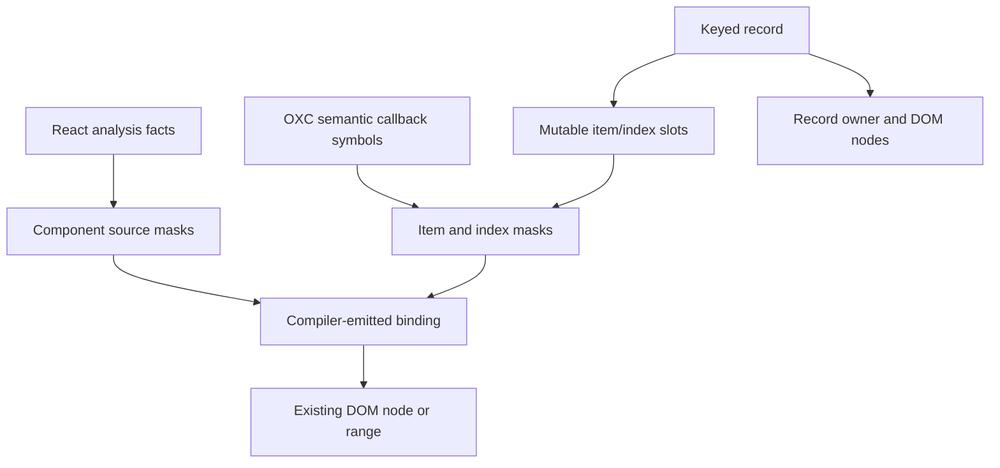

# Keyed Item Updaters and Owned Block Props

## Goal Capsule

- **Objective:** Preserve DOM identity when a keyed item keeps its key but receives a new object, and make compiled arrays safe to pass through props such as `
{props.arrayOfJsx}
`.
- **Means:** Give each keyed record a compiler-managed item scope with mutable item/index slots, subscribe generated bindings to both component and item scopes, and formalize structural render values as single-owner blocks.
- **Authority:** Stable keys determine record identity. OXC semantic symbols determine item reads. React Compiler analysis remains authoritative for component-level reactive sources, while Vidact owns DOM placement and ownership.
- **Stop conditions:** Do not silently accept arbitrary external React element arrays, runtime dependency discovery, duplicate keys, or mounting one owned block more than once.
- **Tail ownership:** Implement and verify locally. Do not push.

---

## Product Contract

### Summary

A keyed row must be created once for a key, then receive new item and index values through static updater slots. Expressions inside the row may depend on the current item, its index, component state, or a combination of them. Arrays produced by compiled keyed expressions may cross component prop boundaries without becoming a Virtual DOM value or losing their owner.

### Requirements

- R1. A same-key replacement object MUST preserve the row's DOM nodes and owner while updating item-dependent text and properties.
- R2. A reorder MUST preserve nodes and update index-dependent bindings without remounting retained keys.
- R3. Bindings that read both a row item and component state MUST update from either source without runtime dependency discovery.
- R4. A changed key MUST dispose and replace the old record; a removed key MUST dispose it exactly once.
- R5. Duplicate keys MUST fail before mutating the mounted DOM.
- R6. A compiled keyed array passed as a prop and rendered by a child MUST remain live and preserve keyed identity.
- R7. An owned structural block MUST reject a second mount, making ownership errors deterministic.
- R8. Arbitrary external `ReactElement[]` values remain outside the supported contract because Vidact cannot prove their DOM ownership or update behavior.

### Acceptance Examples

- AE1. Given `{id: 1, title: "old"}`, replacing it with `{id: 1, title: "new"}` keeps the same `li` and updates its text.
- AE2. Given rows keyed 1 and 2, swapping their order moves the existing nodes and updates an index label.
- AE3. Given a row class that reads both `editingId` and `todo.id`, changing either source updates the existing class.
- AE4. Given `rows={todos.map(...)}` passed to a static child, rendering `<ul>{rows}</ul>` mounts the owned block once and remains reactive.
- AE5. Given the same owned block passed into two child positions, the second mount throws a clear ownership error.

### Scope Boundaries

- Included: keyed `map` callbacks with identifier item/index parameters, mixed parent/item dependencies, prop transport of compiler-owned blocks, TodoMVC proof, compiler and browser tests.
- Deferred: destructured map parameters, nested item-dependent keyed maps, unkeyed reconciliation, components returned as opaque React elements, SSR/hydration.
- Excluded: a React element interpreter, Virtual DOM diffing, runtime signal dependency tracking.

---

## Planning Contract

### Key Technical Decisions

- KTD1. **Keyed records own mutable slots.** A record contains an item scope plus item/index `StateSlot`s. Same-key input calls the slots rather than the render callback. This is the modern form of Vidact's static updaters.
- KTD2. **Bindings may subscribe to two static domains.** The runtime registers one generated updater against its component dependency mask and, when present, its item dependency mask. There is no observer stack or runtime read tracking.
- KTD3. **OXC semantic symbols classify item reads.** The compiler records the `SymbolId`s of keyed callback parameters, rewrites their references to slot reads, and emits item masks independently from component masks.
- KTD4. **React analysis and DOM analysis remain separate.** React Compiler-derived facts identify component sources and reactive relationships. Vidact's JSX/OXC pass identifies keys, row-local values, DOM binding locations, and ownership.
- KTD5. **Structural values are owned blocks.** A compiled conditional or keyed list is a mountable block with one legal mount. Passing it through props transfers the value, not its ownership or lifecycle.

### High-Level Technical Design

The generated callback receives item and index slots plus the record scope. All references to original callback parameters become `.get()` calls. JSX bindings emit component dependencies, item dependencies, or both. Runtime subscription helpers attach the same update closure to each non-empty domain and remove every registration through the record owner.

### Sequencing

1. Establish runtime slots, multi-domain bindings, owned-block mount protection, and direct browser tests.
2. Extend Rust codegen dependency classification and callback rewriting.
3. Prove the generated path in Rust fixtures and TodoMVC, including an owned block passed through props.
4. Record the contract in architecture docs using the repo-local ADR skill.

---

## Implementation Units

### U1. Add keyed record updater scopes

- **Goal:** Reuse same-key records and update them through item/index slots.
- **Files:** `packages/runtime/src/compiled.ts`, `packages/runtime/src/index.ts`, `tests/browser/corpus/reactivity/compiled-dom.browser.test.ts`
- **Test scenarios:** Same-key replacement preserves `li`; reorder preserves rows and refreshes index; mixed component/item binding; duplicate keys leave DOM unchanged; second owned-block mount fails.
- **Verification:** Browser corpus tests and runtime typecheck pass.

### U2. Emit item-aware bindings from Rust

- **Goal:** Compile keyed callback symbols into slot reads and separate component/item dependency masks.
- **Files:** `crates/vidact-compiler/src/surgical_codegen/mod.rs`, `crates/vidact-compiler/src/surgical_codegen/ast.rs`, `crates/vidact-compiler/tests/surgical_codegen.rs`
- **Patterns:** Continue using OXC builders and codegen; identify values by semantic `SymbolId`, never identifier text alone.
- **Test scenarios:** Item-only text, mixed row/component class, callback event reads, optional index parameter, generated-name collision.
- **Verification:** Rust compiler tests and formatting pass.

### U3. Prove owned block props in TodoMVC

- **Goal:** Pass the compiled todo rows to a child component that renders them as a child block.
- **Files:** `examples/todomvc/src/TodoApp.tsx`, `examples/todomvc/src/TodoList.tsx`, `examples/todomvc/src/TodoApp.browser.test.ts`, `examples/todomvc/src/vidact.d.ts`
- **Test scenarios:** Toggle and edit replace todo objects without replacing retained `li` nodes; filters still reorder/remove correctly; child prop block remains live.
- **Verification:** TodoMVC browser test, typecheck, and production build pass.

### U4. Capture the architecture decision

- **Goal:** Add a reusable skill and use it to document the shipped compiler/runtime contract.
- **Files:** `.agents/skills/record-vidact-architecture/`, `docs/architecture/README.md`, `docs/architecture/keyed-record-updaters-and-owned-blocks.md`
- **Test scenarios:** Skill validator passes; ADR names context, decision, alternatives, invariants, compiler/runtime ABI, consequences, and verification.
- **Verification:** `quick_validate.py` succeeds and documentation links resolve.

---

## Verification Contract

| Gate | Command | Covers |
|---|---|---|
| Rust compiler | `cargo test --workspace` | U2 |
| Rust formatting | `cargo fmt -p vidact-compiler --check` | U2 |
| Browser corpus | `pnpm test:browser` | U1, U2 |
| TodoMVC browser | `pnpm test:examples` | U3 |
| TypeScript | `pnpm typecheck` | U1, U3 |
| Example build | `pnpm build:examples` | U3 |
| Skill validation | `quick_validate.py .agents/skills/record-vidact-architecture` | U4 |

---

## Definition of Done

- Same-key new objects and reorders preserve retained row nodes while every affected binding reflects current item/index/component values.
- Removed or changed keys dispose their record owners, and duplicate keys cannot partially mutate the DOM.
- TodoMVC renders a compiler-owned row block through a prop and its browser workflow passes.
- Generated code contains slot reads and distinct parent/item masks with no runtime dependency discovery.
- The owned-block contract and analysis boundary are documented, and the repo-local skill can create future ADRs consistently.
- All required verification gates pass; unrelated pre-existing working-tree changes remain untouched.
