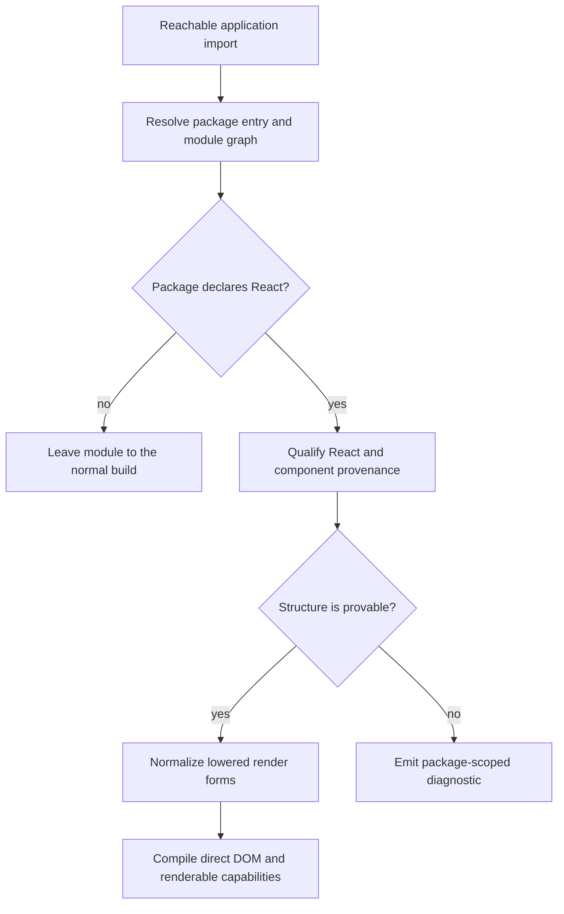
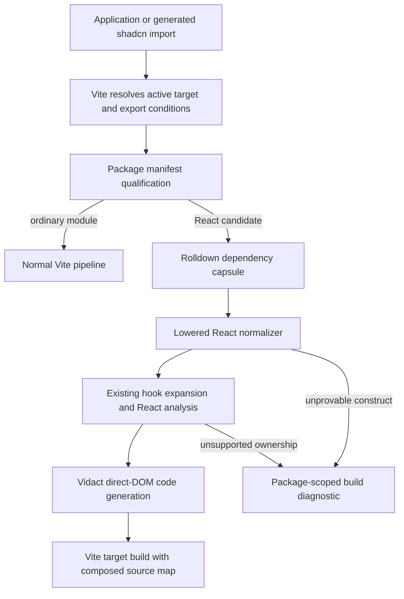
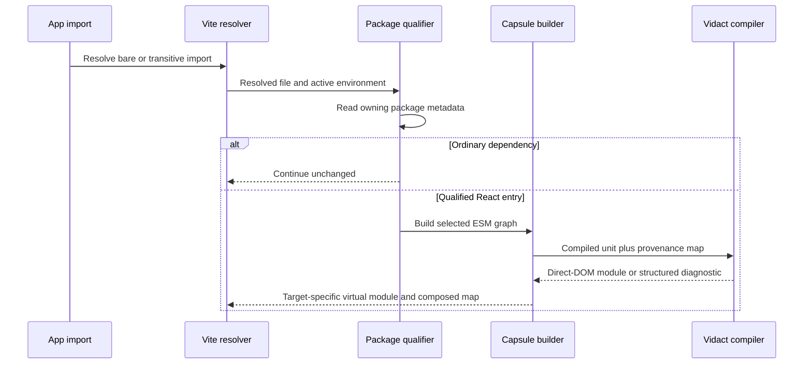
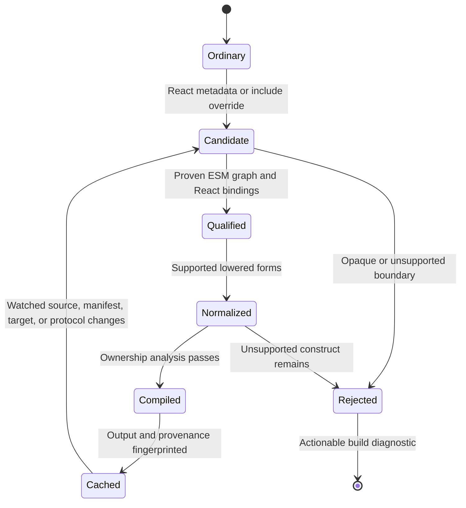
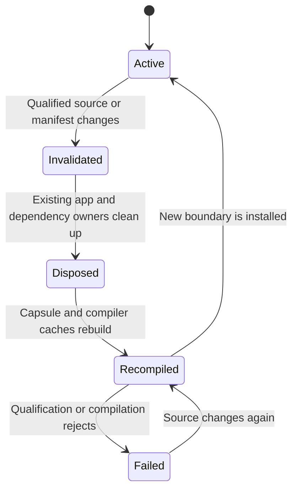

# Lowered React Dependency Compilation - Plan

## Goal Capsule

- **Objective:** A Vidact application can consume compatible published React dependencies without manual package allowlists, demonstrated by rebuilding the shop with Base UI-backed shadcn components while preserving its production behavior.
- **Means:** Resolve qualified package entries into source-mapped dependency capsules, normalize their lowered React forms, and carry element-valued composition across the package boundary as opaque site-compiled renderable capabilities rather than React element trees (KTD1-KTD5).
- **Product authority:** This plan amends the opaque-package boundary in `docs/plans/2026-08-23-0213-feat-react-parity-contract-plan.md`; its requirements supersede that plan's R9 and R15 wherever lowered package JavaScript remains analyzable.
- **Open blockers:** None. Planning may sequence compiler and shop work, but may not replace the Base UI release gate with synthetic fixtures alone.
- **Execution profile:** Deep code change. Characterize published package forms before changing compiler behavior, then prove the application through browser, server, production-build, and production-start gates.
- **Stop conditions:** Do not add a React renderer, dependency-specific adapter, silent partial compilation, manual Base UI include list, or generic runtime that interprets `type`/`props`/`children` trees to make a gate pass.
- **Tail ownership:** The autonomous shipping workflow owns commits, the pull request, and CI follow-through after every Definition of Done item passes.

---

## Product Contract

### Summary

Vidact will automatically qualify and compile compatible lowered React JavaScript from reachable dependencies. The existing shop will become the release application by adopting Base UI-backed shadcn components and a complete Lyra + Neutral restyle without losing its client, server, hydration, or commerce behavior.

### Problem Frame

Vidact currently excludes dependency modules unless callers opt them in and compiles `.tsx` by default. That boundary works for application source but prevents ordinary package consumption because most React libraries publish JavaScript whose JSX has already become `jsx`, `jsxs`, `jsxDEV`, or `createElement` calls.

Treating every package that declares React as compatible would trade an explicit limitation for silent miscompilation. Package metadata can identify candidates, but only preserved module imports, component boundaries, hook bindings, and render structure can prove that Vidact's construct-once ownership model remains sound.

The shop already exercises SSR, Suspense, hydration, HMR, search, filtering, cart mutations, and asynchronous checkout. Moving it to shadcn and Base UI makes dependency compilation answerable through a real application rather than a narrow transform fixture.

### Key Decisions

- **Support analyzable lowered package JavaScript.** (session-settled: user-directed — chosen over source-only dependency compilation: the shop must consume Base UI as it is published.) Governs R1-R10.
- **Qualify, normalize, then compile.** (session-settled: user-directed — chosen over compiling every React-declaring package or maintaining library-specific adapters: compatibility must be automatic without guessing.) Governs R1-R4, R10-R11.
- **Use the shop as the Base UI release boundary.** (session-settled: user-directed — chosen over a broad ecosystem claim or TanStack Start integration: the existing application supplies a concrete behavioral contract.) Governs R12-R20.
- **Apply the Lyra + Neutral preset as a full restyle.** (session-settled: user-directed — chosen over preserving the current Northstar styling or using Nova, Vega, or Maia: the migration should exercise shadcn as a design system.) Governs R12-R13, R19.
- **Carry element-valued composition as compiled capabilities.** (session-settled: user-approved — chosen over application call-site specialization and a React element-object runtime: the dependency capsule should remain generic while every mount operation stays site-compiled.) Escaping JSX may become an opaque capability containing authored props and generated construction code, but never a runtime element tree. Governs R7-R10, R16, R21.
- **Retain Vidact's compiled-only identity.** Compatible dependencies enter the same direct-DOM ownership model as application source; there is no package runtime fallback, recursive element interpretation, or structural reconciliation. Governs R8-R10, R16, R21.

### Actors

- A1. **Vidact application developer:** installs React-shaped packages and expects compatible dependencies to work without discovering compiler include rules.
- A2. **Vidact build pipeline:** resolves package modules for client, server, and hydration targets and either proves compatibility or stops with an actionable diagnostic.
- A3. **Shop user:** searches and filters products, manages cart quantities, and completes checkout through accessible shadcn controls.

### Requirements

**Dependency discovery and qualification**

- R1. The build pipeline MUST automatically consider reachable packages that declare `react` or `react-dom` in dependencies, peer dependencies, or optional peer dependencies without requiring a Base UI allowlist.
- R2. React package metadata MUST be a discovery signal only; each transformed module MUST retain provable React bindings, component ownership, and render structure.
- R3. Qualification MUST follow the package entry points and transitive modules selected by the active client, server, or hydration build rather than scanning unrelated `node_modules` contents.
- R4. Dependency optimization and caching MUST preserve analyzable module boundaries and invalidate when package resolution, package contents, compiler protocols, targets, or feature choices change.

**Lowered React input**

- R5. The compiler MUST accept supported JavaScript and TypeScript modules whether JSX syntax is preserved or lowered before Vidact sees the file.
- R6. The normalizer MUST recognize semantically resolved `jsx`, `jsxs`, `jsxDEV`, Fragment, and classic `createElement` forms even when their local import bindings are aliased.
- R7. Normalization MUST preserve children, keys, refs, spreads, component-valued props, source locations, and evaluation order required by the existing React-shaped contract.
- R8. Compatible components, re-exports, and custom hooks that cross package module boundaries MUST share one Vidact ownership and reactivity contract without component reruns.
- R9. Supported state, effect, ref, context, memo, external-store, portal, event, and DOM behavior inside dependency modules MUST lower to the same semantics promised for application source.
- R10. A module whose React provenance or ownership cannot be proven MUST fail before browser or server execution with the package identity, module boundary, source location when available, and incompatible construct.
- R11. Explicit include and exclude controls MUST remain available as qualification overrides, but overrides MUST NOT bypass semantic rejection or enable a fallback renderer.
- R21. JSX or lowered element values that cross a compiled component boundary MAY lower to a branded renderable capability containing enumerable authored props and site-generated construction code. The generated constructor MUST treat `children`, `key`, and `ref` as dedicated compiled inputs rather than ordinary DOM props, and the capability MUST preserve Base UI's function-valued and element-valued `render` behavior, prop and event composition, refs, keys, reactivity, ownership, SSR, hydration, and disposal without exposing a generic `type`/`props`/`children` tree or interpreter.

**Shop release application**

- R12. The shop MUST be initialized as a shadcn Base UI application using the Lyra style, Neutral base color, semantic theme variables, and generated component source owned by the example.
- R13. The shop MUST replace its current hand-built control styling with the shadcn components needed for search, category selection, product actions, quantity controls, loading states, and checkout status while keeping its existing information and commerce flows.
- R14. The migrated shop MUST render through the existing server target and hydrate through the existing client target without replacing correctly matched server DOM.
- R15. Search, category refetch and Suspense fallback, cart addition and removal, quantity totals, checkout success and failure, and terminal unmount MUST retain their current public behavior.
- R16. Production client and server output MUST NOT contain React, React DOM, a Virtual DOM, a runtime that interprets element trees, or a dependency-specific compatibility renderer. A branded capability whose construction body is site-generated direct-DOM code is permitted only under R21.
- R17. The shop MUST pass its type-check, browser and server tests, client and server builds, and production-start smoke gate through workspace or packed Vidact artifacts.
- R18. Development and production builds MUST compile compatible Base UI modules without a manual dependency compilation list.
- R19. Shadcn and Base UI keyboard behavior, focus handling, disabled states, labels, live status, and ARIA relationships used by the shop MUST remain effective after compilation, SSR, and hydration.
- R20. HMR MUST dispose and replace dependency-owned and application-owned resources according to the shop's existing reset policy without leaking listeners, effects, portals, or owners.

### Key Flows

- F1. **Dependency qualification and compilation**
  - **Trigger:** A1 imports a shadcn component whose implementation reaches Base UI.
  - **Actors:** A1, A2
  - **Steps:** The build resolves the selected package graph, recognizes React candidates, proves module semantics, normalizes lowered render forms, and compiles accepted components plus any R21 renderable boundary values under R1-R11 and R21.
  - **Outcome:** The application receives Vidact-owned compiled modules without a package-specific allowlist or React runtime.
- F2. **Server render and hydration**
  - **Trigger:** A shop request renders on the server and the browser starts the hydration target.
  - **Actors:** A2, A3
  - **Steps:** Server and hydration builds apply the same dependency contract, the server emits the styled shop, and hydration claims the existing DOM under R12-R19.
  - **Outcome:** Base UI-backed controls become interactive without remounting matched content.
- F3. **Shop interaction**
  - **Trigger:** A3 searches, changes category, adds an item, adjusts quantity, or checks out.
  - **Actors:** A3
  - **Steps:** Shadcn controls preserve the current state transitions, async fallback, totals, and status feedback under R13, R15, and R19.
  - **Outcome:** The Lyra + Neutral restyle changes presentation without regressing the shop's behavior or accessibility.
- F4. **Incompatible dependency boundary**
  - **Trigger:** A reachable React package module has lost provenance, an opaque foreign React element, or behavior that requires runtime interpretation or reconciliation.
  - **Actors:** A1, A2
  - **Steps:** Qualification stops at the unsupported boundary and reports the package and construct under R10-R11.
  - **Outcome:** The build fails with migration guidance instead of shipping mixed or guessed semantics.

### Acceptance Examples

- AE1. **Covers R1-R11, R16, R18.** Given a clean shop install with shadcn source importing Base UI's published ESM, when client and server builds run without `includeDependencies`, then reachable compatible modules compile and neither output contains React or a compatibility renderer.
- AE2. **Covers R5-R9, R16, R21.** Given a dependency module whose ESM imports aliased hooks and factories and whose public component accepts both callback and element-valued composition, when it is qualified, then both forms preserve package-owned prop merging and Vidact ownership while constructing direct DOM from generated capabilities.
- AE3. **Covers R2, R10-R11, R21.** Given a package that declares React but exposes a fully opaque bundle, an uncompiled React element, or behavior requiring tree interpretation, when the module becomes reachable, then the build rejects it at the package boundary even if an include override matches it.
- AE4. **Covers R12-R19.** Given server-rendered shop markup using the Lyra + Neutral shadcn components, when hydration starts, then existing nodes retain identity and search, category, cart, checkout, focus, keyboard, and live-status behavior becomes interactive.
- AE5. **Covers R13, R15, R20.** Given a hydrated shop during development, when a component or dependency module is hot-replaced, then the documented shop state reset occurs and all replaced owners and effects are disposed once.
- AE6. **Covers R10, R17.** Given an unsupported future Base UI release, when the shop build reaches the incompatible construct, then CI fails with package, module, and source guidance rather than passing until a browser runtime error.

### Success Criteria

- The shop uses generated shadcn components backed by Base UI and visibly conforms to the Lyra + Neutral preset.
- `pnpm --filter @vidact/example-shop typecheck`, `test`, and `build` pass without a dependency include list, and the production server passes a startup smoke gate.
- Production artifact inspection finds no React, React DOM, Virtual DOM, recursive element-interpreter, or library-specific adapter path; renderable capabilities contain generated constructors rather than runtime element descriptions.
- Browser coverage proves existing shop flows, matched-node hydration identity, accessible interaction, HMR disposal, and surgical mutation envelopes where state changes.
- The compatibility corpus covers accepted lowered factories, hook aliases, callback render props, and compiled element-valued render props plus rejected opaque, minified-with-lost-provenance, foreign-element, class, and renderer-dependent cases.
- A future compatible Base UI patch can pass through the generic qualification contract without adding package-specific transforms.

### Scope Boundaries

**Deferred for later**

- Additional React component libraries after the generic contract passes the Base UI shop gate.
- CommonJS or UMD bundles whose React provenance is obscured by bundling, plus arbitrary fully minified packages that erase component or hook identity.
- TanStack Router and TanStack Start, including their routing, streaming, server-function, and deployment contracts.

**Outside Vidact's identity**

- A React element interpreter, Virtual DOM, Fiber renderer, runtime component replay, or blanket React fallback.
- Runtime traversal or reconstruction of generic `type`/`props`/`children` element records; R21 capabilities may expose authored props to compiled package code but construction remains generated at the originating JSX site.
- Permanent Base UI-specific compiler branches or a compatibility-adapter registry maintained per library version.
- Silent partial compilation that mixes Vidact-owned components with opaque React-rendered subtrees.

### Dependencies and Assumptions

- Base UI continues to expose an analyzable ESM path selected by the shop's supported Vite builds; a release that removes the required provenance is expected to fail R10.
- Shadcn continues to support Base UI and to make the selected preset reproducible through generated source and semantic theme tokens.
- The existing Vidact server, hydration, Suspense, lifecycle, DOM, and HMR contracts remain authoritative and are extended to dependency modules rather than replaced.
- The build graph controls every value admitted to the R21 renderable ABI. A value imported from uncompiled or provenance-losing code remains unsupported even when it resembles a React element at runtime.
- Package versions used by the release application are pinned for repeatable evidence while the generic compatibility rules remain version-independent.

<!-- ce-section: work-relationships -->
### How This Work Fits Together

This plan owns lowered React dependency qualification and the Base UI-backed shop migration. The surrounding breakdown is contextual and may change as later work is planned.

- **Shares:** `docs/plans/2026-08-23-0213-feat-react-parity-contract-plan.md` remains the broader React surface authority, while this plan amends its precompiled-package boundary.
- **Enables:** Certification of additional React libraries can reuse this qualification contract after the shop gate passes, but each library remains separate scope.
- **Enables and does not complete:** TanStack Router SPA support depends on compatible cross-module hooks and components plus router-specific behavior.
  - **Depends on additional work:** TanStack Start also requires framework integration for SSR, streaming, server functions, routing, and build orchestration.

### Sources and Research

- `packages/vite-plugin/src/index.ts` — current explicit dependency include boundary and default extension policy.
- `crates/vidact-compiler/src/react_bindings.rs` — semantic React import and aliased hook recognition.
- `crates/vidact-compiler/src/custom_hooks.rs` — current module-local and name-sensitive custom-hook boundary.
- `packages/runtime/src/compiled.ts` — existing branded `OwnedBlock` and structural-mount contract that the renderable capability extends.
- `packages/runtime/src/spread.ts` and `packages/runtime/src/component-spread.ts` — current reactive prop-bag behavior: DOM spreads reject `ref`, `key`, and `children`, while component spreads reject `key` and `children` and carry `ref` across the component boundary.
- `docs/architecture/compiled-only-client-runtime.md` — construct-once client execution identity and prohibition on runtime replay.
- `docs/architecture/react-analysis-boundary.md` — React Compiler analysis boundary and Vidact-owned updater IR.
- `examples/shop/README.md` and `examples/shop/src/` — existing server, hydration, HMR, Suspense, and commerce behavior.
- [Shadcn Base UI default](https://ui.shadcn.com/docs/changelog/2026-07-base-ui-default) — current component-library default and progressive migration guidance.
- [Shadcn preset styles](https://ui.shadcn.com/docs/changelog/2025-12-shadcn-create) — Lyra and the other supported visual styles.
- [Shadcn theming](https://ui.shadcn.com/docs/theming) — semantic theme variables and Neutral base-color contract.
- [Base UI overview](https://base-ui.com/react/overview/about) — package purpose, browser support, React version support, and accessibility positioning.
- [React Compiler library guidance](https://react.dev/reference/react-compiler/compiling-libraries) — upstream expectation that library compilation runs before conflicting build optimizations.
- [Babel JSX transform](https://babeljs.io/docs/babel-plugin-transform-react-jsx/) — canonical automatic and classic lowered JSX shapes.
- [Vite dependency pre-bundling](https://vite.dev/guide/dep-pre-bundling) — development dependency discovery, optimizer exclusion, and cache invalidation constraints.
- [Shadcn Vite installation](https://ui.shadcn.com/docs/installation/vite) — Tailwind, alias, registry, and generated-component setup for an existing Vite project.
- [Published `@base-ui/react` package](https://www.npmjs.com/package/@base-ui/react) — release input pinned by the shop; planning inspected the ESM graph and package metadata at version 1.7.0.

---

## Planning Contract

Product Contract preservation: updated only for the user-approved R21 renderable-capability decision and its consequences for R7-R10 and R16; the shop scope and behavior remain unchanged.

### Key Technical Decisions

- KTD1. **Compile one source-mapped capsule per resolved React package entry.** (session-settled: user-directed — chosen over compiling every React-declaring file independently or maintaining library-specific adapters: compatibility must remain automatic while cross-module hooks stay visible.) The Vite integration will bundle only the selected ESM entry and its qualified React-bearing transitive modules before Vidact analysis. Non-React utilities remain ordinary external imports. Governs R1-R4, R8, R10-R11.
- KTD2. **Normalize lowered React calls in Rust before React Compiler analysis.** (session-settled: user-directed — chosen over requiring preserved JSX source: the shop must consume Base UI as published.) Binding resolution will identify automatic-runtime factories, development-runtime factories, Fragment, and classic `createElement` forms by import symbol rather than local spelling. The normalizer will reconstruct Vidact's existing render AST while preserving evaluation order and source spans. Governs R5-R7, R10.
- KTD3. **Treat React package metadata as a resolver hint and the capsule AST as the compatibility proof.** The plugin will inspect the owning package manifest after Vite resolves an import. `react` or `react-dom` declarations opt an entry into qualification, but compilation proceeds only when the bundled entry retains component, hook, and render provenance. Governs R1-R3, R10-R11.
- KTD4. **Use bundling as the cross-module hook and re-export boundary.** Rolldown will flatten the qualified entry before the existing local custom-hook expansion runs. The capsule build will apply the active mode defines before tree shaking and will preserve framework directives plus selected export conditions. This reuses ESM resolution, scope hygiene, and dead-branch removal instead of adding a runtime hook ABI or a second module linker. Governs R3-R4, R8-R9.
- KTD5. **Defunctionalize compiled element values into opaque renderable capabilities.** (session-settled: user-approved — chosen over call-site specialization, callback-only semantics, and a React element-object runtime: Base UI's capsule must stay generic and its own merge logic must remain authoritative.) Extend the existing branded structural value with an enumerable authored-props view and a site-generated `construct(overrides)` operation. The props view exposes evaluated JavaScript values to package code, while code generation carries its reactive source mask out of band and lowers the final override expression to a derived compiled binding whose evaluator reruns the package's own merge code. The constructor owns the compiled handling of `children`, `key`, and `ref`; they never fall through to the generic DOM prop publisher. Lower supported `isValidElement`, `cloneElement`, single-renderable `Children.toArray`, and element-valued `render` operations onto that ABI. A capability exposes no React `$$typeof`; a provenance-proven lazy-sentinel comparison therefore folds false, while an actual `React.lazy` value remains unsupported. Runtime code may brand-check and invoke generated construction, but may not inspect a generic element type or recursively interpret props and children. Governs R7-R10, R16, R21.
- KTD6. **Keep application-source and dependency-source selection separate.** Application files retain the current extension filter. Qualified package capsules accept `.js`, `.mjs`, `.jsx`, `.ts`, and `.tsx` modules. `includeDependencies` can admit packages without React metadata and `exclude` can deny candidates, but neither option can override semantic rejection. Governs R5, R10-R11, R18.
- KTD7. **Compose capsule, compiler, and TypeScript source maps in the Vite plugin.** Diagnostics will translate a compiler span through the capsule map to the original package file and attach package name, version, resolved entry, target, and incompatible construct. Cache inputs and watched files will include every source and manifest that contributed to the capsule plus the versioned renderable ABI protocol. Governs R4, R7, R10, R20-R21.
- KTD8. **Generate the shop's UI source from shadcn and keep it application-owned.** (session-settled: user-directed — chosen over preserving Northstar styling or using Nova, Vega, or Maia: the migration should exercise Lyra + Neutral as a design system.) The shop will commit `components.json`, semantic theme variables, and only the generated components its flows use. Tailwind remains a build-time styling tool. Governs R12-R13, R19.
- KTD9. **Use the production shop artifacts as the release proof.** Build inspection will reject residual React imports, React DOM renderer code, generic element-tree interpretation, structural reconciliation, and dependency-specific adapters. It will permit only the branded R21 capability and generated constructors whose children and element types remain compiled code. Browser tests will pair behavioral assertions with node identity and mutation envelopes where interaction changes existing UI. Governs R14-R21.

### High-Level Technical Design

The plugin creates a dependency capsule only for a resolved entry whose package metadata makes it a candidate. The capsule keeps original module provenance in its source map while presenting one analyzable program to the compiler.

Client, hydration, and server environments resolve and cache capsules independently because their conditions and Vidact targets can select different entry graphs.

Qualification fails closed. An explicit include changes only the first transition; it never promotes a rejected module to compiled output.

HMR invalidates the capsule before replacing component owners. The replacement continues to use the shop's documented state-reset policy.

### Assumptions

- The implementation can use Rolldown as an explicit build dependency or through a stable Vite 8 API without importing a private Vite module.
- One capsule per resolved package subpath is sufficient for the shop. Shared capsule deduplication is an optimization unless measurements show duplicate entry work breaks the build-time gate.
- The existing `OwnedBlock` boundary can be extended without changing construct-once ownership: a renderable capability is mounted once under the receiving owner, while reactive authored props retain their originating compiled scope. U3 must falsify this assumption before capsule work expands.
- The current server component and client-boundary split in the shop is the baseline to preserve. This work does not redesign framework manifests or hydration ownership.
- The pinned release inputs are `@base-ui/react` 1.7.0 and shadcn CLI 4.19.0. Package updates may be taken only when the compatibility corpus and shop gates remain reproducible.

### Sequencing

1. Establish package qualification and lowered-syntax characterization before changing compiler output.
2. Add capsule compilation and diagnostic composition before installing Base UI in the shop.
3. Turn the published Base UI entry into an executable compatibility gate before restyling the application.
4. Migrate the shop, then extend its existing browser, server, HMR, artifact, and production-start evidence.
5. Record the architecture after the implementation proves the final boundary.

### System-Wide Impact

- **Compiler API:** JavaScript and MJS inputs become first-class compile inputs. Component analysis remains Rust-owned and the compiler protocol gains explicit facts for renderable creation, validation, cloning, and opaque-value rejection.
- **Vite behavior:** Development optimization and SSR externalization must not bypass qualified entries. App source filtering remains backward compatible.
- **Caching and HMR:** A capsule owns multiple source files and manifests. All contributors become watch and cache inputs, and owner disposal precedes replacement.
- **Runtime surface:** The existing branded structural value gains an optional authored-props view and generated constructor. Reactive prop bags gain owned ref attach/detach transitions. No runtime path may walk a generic element tree, choose construction from a stored element type, or rerun a component body.
- **Examples and packages:** The shop gains public dependencies and generated source. Package verification must prove a clean install resolves peer dependencies and still produces React-free artifacts.

### Risks and Mitigations

| Risk | Impact | Mitigation |
|---|---|---|
| A renderable capability becomes a React element object under another name | Vidact accumulates an interpreter and loses its compiled-only identity | Limit its public shape to a brand, enumerable authored props, and site-generated construction; keep source tracking internal and artifact-test the absence of stored element types, children trees, recursive interpretation, and structural reconciliation |
| Base UI's merge chain cannot publish reactive prop changes without rerunning its component body | Element-valued render initially mounts correctly but later state, events, classes, or refs become stale | Make the pinned Button render-prop falsification test U3's first vertical slice and stop if updater IR cannot re-execute the merge chain into one retained node |
| Vite dependency optimization or SSR externalization bypasses the transform | Development works differently from production or the server imports React | Exercise client, hydration, server, dev, and production environments; derive optimizer exclusions and `ssr.noExternal` entries from the same qualifier when virtual resolution alone is insufficient |
| Capsule bundling erases useful locations | R10 errors point at generated code | Keep module IDs and sources content in the capsule map, compose maps after compiler and OXC transforms, and test mapped package diagnostics |
| Flattening a large entry increases cold build time or duplicates subpath code | The shop becomes slow to start or builds oversized output | Cache by entry graph and target, prefer narrow package subpaths, measure cold and warm transforms, and leave cross-entry deduplication as a bounded follow-up if release gates pass |
| Dependency hooks rely on React rerenders for an observable behavior | Controls appear to compile but state or effects become stale | Require browser interaction, mutation, cleanup, focus, and hydration tests for every Base UI-backed control used by the shop |
| Generated shadcn source drifts from the selected preset | The example becomes hard to reproduce or no longer tests current Base UI integration | Commit `components.json`, pin dependency versions, retain registry-style source ownership, and document intentional Vidact adaptations beside generated files |

### Alternative Approaches Considered

- **Transform each dependency module independently:** preserves module boundaries but leaves imported custom hooks opaque to the current analyzer. A compiled hook ABI would add a second reactive protocol before the release app proves it is needed.
- **Scan and compile every package that declares React:** makes discovery easy but cannot distinguish compatible source from opaque bundles and would compile unused modules.
- **Add Base UI-specific rewrites:** may reach the demo faster but creates a versioned adapter registry that the Product Contract excludes.
- **Ask libraries to publish original TSX:** avoids lowered-call normalization but does not work with the published package the shop must consume.
- **Run React for unsupported subtrees:** would make more libraries render but violates the compiled-only architecture and the production artifact gate.
- **Desugar element-valued `render` to an application callback:** retains the capsule boundary but skips the package's element-branch merge semantics or requires package-specific merge knowledge. Base UI event ordering and class/style composition provide the rejection fixture.
- **Specialize dependency components at application call sites:** can prune statically known branches but changes the capsule into per-use variants and still needs a generic representation for forwarded or conditional values. Keep it as a future size optimization only if benchmarks justify it.

---

## Implementation Units

### U1. Qualify resolved React dependency entries

- **Goal:** Identify candidate package entries automatically and keep ordinary application and dependency modules on their existing paths.
- **Requirements:** R1-R4, R10-R11; F1, F4; AE3.
- **Dependencies:** None.
- **Files:** `packages/vite-plugin/src/index.ts`, `packages/vite-plugin/src/dependency-qualification.ts`, `packages/vite-plugin/test/dependency-qualification.test.ts`, `packages/vite-plugin/test/fixtures/dependencies/`, `packages/vite-plugin/package.json`.
- **Approach:**
  1. Resolve package identity from the real module path, including pnpm layouts, scoped packages, subpath exports, and linked workspaces.
  2. Cache validated package metadata and classify `dependencies`, `peerDependencies`, `peerDependenciesMeta`, and optional dependencies according to KTD3 and KTD6.
  3. Expose the classification to Vite resolution, optimizer configuration, SSR externalization, and later capsule construction without compiling unused files.
  4. Retain `includeDependencies` and `exclude` as discovery overrides only.
- **Execution note:** Start with filesystem fixture packages that characterize npm, pnpm, scoped, subpath, and symlink layouts before changing the transform hook.
- **Patterns to follow:** `packages/vite-plugin/src/index.ts` for Vite environment routing and `packages/vite-plugin/test/compiler-client.test.ts` for direct hook testing.
- **Test scenarios:**
  - A reachable package with a React peer dependency becomes a candidate in client and SSR environments.
  - A package with React only in ordinary dependencies or optional peer metadata becomes a candidate.
  - A non-React package and an unused React-declaring package remain outside compilation.
  - A scoped package subpath and a pnpm real path resolve to the same package identity.
  - An include override admits a package without React metadata, while an exclusion wins before capsule work begins.
  - Covers F4 / AE3. A malformed or unreadable owning manifest produces a package-scoped qualification error instead of silently compiling.
- **Verification:** Resolver tests prove deterministic candidate identity and no Base UI-specific name checks exist.

### U2. Normalize lowered React render forms

- **Goal:** Reconstruct the compiler's accepted render AST from published automatic, development, and classic React factory calls.
- **Requirements:** R5-R7, R10; F1; AE2-AE3.
- **Dependencies:** None.
- **Files:** `crates/vidact-compiler/src/lowered_react.rs`, `crates/vidact-compiler/src/lib.rs`, `crates/vidact-compiler/src/ast_utils.rs`, `crates/vidact-compiler/src/react_bindings.rs`, `crates/vidact-compiler/src/oxc_react.rs`, `crates/vidact-compiler/src/surgical_codegen/mod.rs`, `crates/vidact-compiler/src/server_codegen.rs`, `crates/vidact-compiler/tests/lowered_react.rs`, `crates/vidact-compiler/tests/fixtures/lowered-react/`.
- **Approach:**
  1. Run one symbol-aware normalization pass before semantic analysis in client, hydration, server, and analyze-only paths.
  2. Recognize aliased named imports and namespace members from `react`, `react/jsx-runtime`, and `react/jsx-dev-runtime`.
  3. Rebuild elements, fragments, children, spreads, key, ref, and source spans without reordering expressions.
  4. Remove consumed factory imports and reject factory lookalikes or provenance that bundling erased.
- **Execution note:** Add accepted and rejected characterization fixtures first. Minify fixture identifiers while retaining ESM imports to prove that spelling is irrelevant and provenance is decisive.
- **Patterns to follow:** `crates/vidact-compiler/src/react_bindings.rs` for `SymbolId` resolution and `crates/vidact-compiler/tests/compatibility_corpus.rs` for fail-closed fixture contracts.
- **Test scenarios:**
  - Covers AE2. Aliased `jsx`, `jsxs`, and hooks compile from `.mjs` and update the same DOM nodes as equivalent TSX.
  - `jsxDEV` preserves children, key, and the original diagnostic location.
  - Classic named, namespace, and default React `createElement` forms compile for intrinsic, component, Fragment, spread, ref, and dynamic construct-once type inputs.
  - Computed factory access, shadowed factory names, and foreign functions named `jsx` or `createElement` remain ordinary JavaScript.
  - A minified ESM fixture with renamed locals compiles, while a bundle with removed React provenance fails with `UnsupportedSyntax` at the factory call.
  - Server and hydration targets normalize the same source but retain their target-specific code generation.
- **Verification:** The compatibility corpus contains every accepted factory family and an explicit lost-provenance rejection, with stable codes and spans.

### U3. Add the compiled renderable-capability ABI

- **Goal:** Preserve Base UI's callback and element-valued composition semantics across a generic dependency capsule without introducing element-tree interpretation, reconciliation, or component reruns.
- **Requirements:** R7-R10, R16, R19, R21; F1, F4; AE2-AE3.
- **Dependencies:** U2.
- **Files:** `crates/vidact-compiler/src/lowered_react.rs`, `crates/vidact-compiler/src/react_bindings.rs`, `crates/vidact-compiler/src/surgical_codegen/mod.rs`, `crates/vidact-compiler/src/surgical_codegen/render.rs`, `crates/vidact-compiler/tests/lowered_react.rs`, `crates/vidact-compiler/tests/surgical_codegen.rs`, `crates/vidact-compiler/tests/fixtures/compatibility/manifest.json`, `crates/vidact-compiler/tests/fixtures/compatibility/accepted/`, `crates/vidact-compiler/tests/fixtures/compatibility/rejected/`, `packages/runtime/src/compiled.ts`, `packages/runtime/src/direct-dom.ts`, `packages/runtime/src/spread.ts`, `packages/runtime/test/reactivity/compiled-dom.browser.test.ts`, `packages/runtime/test/reactivity/direct-dom.browser.test.ts`.
- **Approach:**
  1. Normalize supported `forwardRef` and `memo` wrappers into component forms already understood by component-span and code-generation logic.
  2. Extend the existing branded structural value into a renderable capability whose enumerable `props` expose current authored JavaScript values and whose `construct(overrides)` body is generated at the JSX or lowered-factory site. Carry the props view's reactive source mask as compiler/runtime-internal metadata rather than an enumerable React-shaped field. The generated body accepts a compiled `children` override, keeps `key` as identity metadata, and routes `ref` through the existing commit-aware ref machinery.
  3. Lower supported `isValidElement` to a capability brand check, `cloneElement` to capability construction with package-computed overrides, single-renderable `Children.toArray` to the bounded value form, and dynamic intrinsic creation to the existing direct `h` path. Fold a provenance-proven comparison between a capability's absent `$$typeof` and React's lazy sentinel to false; reject actual lazy or foreign element values instead of materializing React element metadata.
  4. Preserve Base UI's ordinary `mergeProps` execution rather than duplicating its event, class, style, or ref composition in Vidact. At the lowered `cloneElement` boundary, emit a derived compiled prop-bag binding that reruns the exact package merge expression whenever any contributing source mask changes. Partition each evaluated result into compiled `children`, identity-only `key`, commit-aware `ref`, and ordinary reactive DOM props; feed only the last group into the retained-node prop publisher with transactional attach/detach cleanup.
  5. Carry reactive reads with their originating compiled scope, mount generated construction under the receiving owner, and use the same constructor contract for client, server, and hydration targets.
  6. Reject lost-provenance values, foreign React elements, escaping generic element inspection, stored element-type dispatch, arbitrary `Children` traversal, custom memo comparators requiring rerenders, class components, and any operation that would require a runtime tree interpreter.
- **Execution note:** Begin with a proof-first Base UI Button falsification slice. Compile the published capsule once, then compare callback and element-valued `render` forms against React for merge order, class/style composition, refs, reactive attributes, ownership, SSR, hydration, and retained node identity. Stop if correctness requires materializing children as data, choosing construction from a stored element type, or rerunning the component body.
- **Patterns to follow:** `packages/runtime/src/compiled.ts` for branded `OwnedBlock`, generated mounting, scope-carrying bindings, and pending-ref commit semantics; `packages/runtime/src/spread.ts` for retained-node prop diffing; `packages/runtime/src/direct-dom.ts` for dynamic type and hydration dispatch; `crates/vidact-compiler/src/ast_utils.rs` for component-form normalization.
- **Test scenarios:**
  - A lowered `forwardRef` component receives object and callback refs with attach-before-layout, ref replacement, and cleanup-on-disposal behavior.
  - A `memo` wrapper with no custom comparator compiles as an ownership-preserving component hint.
  - A construct-once dynamic string tag produces the correct namespace-aware DOM node and hydrates without replacement.
  - A dependency event handler reading the underlying native event receives the same event object used by Vidact handlers.
  - Callback-valued `render` receives Base UI's computed props and state and mounts its direct-DOM result under the dependency owner.
  - Element-valued `render` preserves the authored props record; Base UI's own merge chain composes both event handlers in reference order, merges class and style values, overrides children and the ref as published, retains key as identity metadata, and constructs one retained node without leaking special props to the DOM.
  - The props record exposes ordinary values to Base UI's `typeof`, concatenation, style merge, spread, and `for...in` operations; changing any contributing binding reruns the exact merge expression once and publishes one derived bag without rerunning Button.
  - Base UI's lazy-sentinel workaround is folded away for a compiled capability, while a real `React.lazy` or foreign element value fails qualification and no `$$typeof` field appears in output.
  - Updating an authored reactive URL and Base UI's disabled state causes only the expected attribute and event mutations; the rendered node keeps identity and the dependency component body does not rerun.
  - Server output and hydration use target-compiled constructors, retain representative nodes, and attach refs only at the existing commit boundary.
  - A real React element from uncompiled code, an unbranded opaque object, escaping `render.type` inspection, arbitrary child traversal, a custom memo comparator, and a class wrapper fail before execution with stable spans.
  - Artifact inspection proves no recursive type/props/children interpreter, structural reconciliation loop, or dependency-specific renderable branch exists.
- **Verification:** The generic compatibility fixture and pinned Base UI Button pass the same renderable ABI tests, while runtime public-surface and size tests prove the addition is generated construction rather than an element renderer.

### U4. Build and cache source-mapped dependency capsules

- **Goal:** Flatten each qualified entry into one analyzable compiler input and return a target-specific virtual module with original package diagnostics.
- **Requirements:** R3-R4, R7-R11, R18, R20-R21; F1, F4; AE1-AE3, AE5-AE6.
- **Dependencies:** U1-U3.
- **Files:** `packages/vite-plugin/src/dependency-capsule.ts`, `packages/vite-plugin/src/index.ts`, `packages/vite-plugin/src/compiler-client.ts`, `packages/vite-plugin/test/dependency-capsule.test.ts`, `packages/vite-plugin/test/compiler-client.test.ts`, `packages/vite-plugin/test/fixtures/dependencies/`, `packages/vite-plugin/package.json`, `pnpm-lock.yaml`.
- **Approach:**
  1. Use the active Vite resolution conditions to bundle the selected package subpath and inline only qualified React-bearing dependencies.
  2. Apply the active development or production defines before tree shaking so environment-only React branches have the same reachability as the outer Vite build.
  3. Keep React and React DOM specifiers external until the normalizer consumes supported compile-time imports or the Vite facade resolves supported runtime imports.
  4. Feed the flattened ESM to the compiler, compose the capsule, compiler, and OXC maps, and translate structured failures back to package sources.
  5. Fingerprint entry resolution, bundled sources, manifests, environment, target, features, defines, compiler/runtime protocols, and the renderable ABI version.
  6. Register capsule contributors as watch files and dispose the old owner graph before HMR publishes replacement output.
- **Execution note:** Prove one synthetic multi-package hook graph through dev and production Vite builds, then immediately run the pinned Base UI Button capsule before expanding the capsule implementation.
- **Patterns to follow:** `packages/vite-plugin/src/index.ts` for per-environment caches, `compilationCacheKey` for protocol inputs, and `examples/shop/vite.dev.config.ts` for isolated client and SSR plugin instances.
- **Test scenarios:**
  - A package entry that re-exports a component using a hook from another React-bearing package compiles as one capsule without a runtime hook call.
  - Utility modules with no component do not produce a false "no components" error when they are internal to a capsule.
  - Client, hydration, and server environments select and cache distinct conditional exports.
  - Development and production defines prune different package branches without changing qualification of shared code.
  - A source or package manifest edit invalidates the capsule and changes the cache key; an unrelated package edit does not.
  - Covers AE3 / AE6. An unsupported transitive module reports package name, version, original module, mapped span, target, and construct.
  - Covers AE5. HMR invalidation disposes effects, refs, portals, subscriptions, and owners once before installing the rebuilt capsule.
  - Development optimization and SSR externalization cannot replace the capsule with Vite's ordinary pre-bundle or an external Node import.
- **Verification:** Vite plugin tests exercise build and development resolution, source mapping, cache invalidation, and HMR without a hard-coded package allowlist.

### U5. Certify the pinned Base UI dependency graph

- **Goal:** Turn the actual published Base UI entries needed by the shop into the generic compatibility gate.
- **Requirements:** R1-R11, R16, R18-R21; F1, F4; AE1-AE3, AE5-AE6.
- **Dependencies:** U4.
- **Files:** `examples/shop/package.json`, `pnpm-lock.yaml`, `packages/vite-plugin/test/base-ui.integration.test.ts`, `packages/vite-plugin/test/fixtures/base-ui-app/`, `crates/vidact-compiler/tests/fixtures/compatibility/manifest.json`, `crates/vidact-compiler/tests/fixtures/compatibility/accepted/`, `crates/vidact-compiler/tests/fixtures/compatibility/rejected/`.
- **Approach:**
  1. Pin Base UI and its required React peer packages in the shop while keeping Vite's React and React DOM facades authoritative at build time.
  2. Compile the narrow subpath entries used by generated Button, Input, and Toggle Group source before migrating the full shop UI.
  3. Convert every new published construct encountered into a generic accepted or rejected fixture before changing the compiler.
  4. Inspect generated client and server chunks for forbidden renderer paths under KTD9.
- **Execution note:** Treat the package as an integration test, not a source to patch. A failing construct must be addressed generically or rejected with an actionable boundary.
- **Patterns to follow:** `crates/vidact-compiler/tests/compatibility_corpus.rs` for manifest completeness and `scripts/verify-packages.mjs` for clean artifact verification.
- **Test scenarios:**
  - Covers AE1. Base UI Button, Input, and Toggle Group ESM compile from a clean install without `includeDependencies`.
  - Base UI state, refs, context, layout/passive effects, external-store subscriptions, and merged event handlers reached by those entries attach to one Vidact owner graph.
  - Base UI Button's callback and element-valued `render` forms execute the package's published merge logic from the same generic capsule and match the React reference for events, class, style, ref, and retained-node updates.
  - Aliased automatic-runtime factories and namespace hooks in the published files are accepted independent of local identifier names.
  - Covers AE6. A fixture that simulates lost provenance, a foreign React element, or a newly reachable operation outside the bounded renderable ABI fails during the build with original package guidance.
  - Client and server integration outputs contain neither a real React package import nor a Base UI-specific compatibility branch.
- **Verification:** The pinned package passes generic compiler/plugin tests before any shop component depends on it.

### U6. Generate and apply the Lyra + Neutral shadcn system

- **Goal:** Replace the shop's hand-built controls and Northstar presentation with application-owned shadcn source backed by Base UI.
- **Requirements:** R12-R15, R18-R19; A3; F2-F3; AE4.
- **Dependencies:** U5.
- **Files:** `examples/shop/components.json`, `examples/shop/package.json`, `examples/shop/tsconfig.json`, `examples/shop/vite.client.config.ts`, `examples/shop/vite.dev.config.ts`, `examples/shop/vite.test.config.ts`, `examples/shop/src/lib/utils.ts`, `examples/shop/src/components/ui/button.tsx`, `examples/shop/src/components/ui/input.tsx`, `examples/shop/src/components/ui/toggle-group.tsx`, `examples/shop/src/components/ui/card.tsx`, `examples/shop/src/components/ui/badge.tsx`, `examples/shop/src/components/ui/alert.tsx`, `examples/shop/src/components/ui/skeleton.tsx`, `examples/shop/src/ShopApp.tsx`, `examples/shop/src/CatalogPanel.tsx`, `examples/shop/src/ProductGrid.tsx`, `examples/shop/src/CartPanel.tsx`, `examples/shop/src/style.css`, `pnpm-lock.yaml`.
- **Approach:**
  1. Initialize the existing Vite example with the Lyra style, Neutral tokens, Base UI library choice, Tailwind 4, and a repo-local alias.
  2. Generate only the UI components used by search, category selection, product cards and actions, quantity controls, loading, checkout, and status feedback.
  3. Preserve the shop's server/client component boundary and commerce state while replacing its layout, typography, spacing, colors, and responsive behavior.
  4. Keep generated files recognizable as shadcn-owned source and isolate Vidact-specific adaptations to proven compatibility constraints.
- **Execution note:** Prefer a build and one mounted Button smoke proof immediately after registry setup because this unit is dependency and styling heavy.
- **Patterns to follow:** `examples/docs/vite.config.ts` and `examples/docs/src/style.css` for Tailwind 4 Vite integration; current shop components for public labels and flow behavior.
- **Test scenarios:**
  - The generated Base UI components type-check with the shop's React-shaped JSX configuration and repo alias.
  - The desktop and narrow layouts retain a usable catalog, cart, story, and checkout hierarchy with Neutral semantic tokens.
  - Search has an associated accessible name; category toggles expose selected state; quantity and checkout controls expose labels and disabled state.
  - The loading and checkout status components preserve busy and live-region semantics.
  - Covers AE4. Server markup contains the Lyra + Neutral shell and the hydration target claims it rather than replacing the root.
- **Verification:** Generated source, configuration, and package versions reproduce the selected preset, and the shop has no remaining Northstar control-style dependency.

### U7. Prove shop behavior, surgical updates, hydration, and production startup

- **Goal:** Make the migrated shop the release-level evidence for dependency compilation across browser, server, HMR, build artifacts, and the production server.
- **Requirements:** R14-R20; A2-A3; F2-F3; AE1, AE4-AE6.
- **Dependencies:** U6.
- **Files:** `examples/shop/src/ShopApp.browser.test.ts`, `examples/shop/src/shop.server.test.ts`, `examples/shop/src/shop.dev.server.test.ts`, `examples/shop/scripts/verify-production-bundle.mjs`, `examples/shop/scripts/smoke-start.mjs`, `examples/shop/package.json`, `examples/shop/README.md`, `tests/browser/corpus/apps/base-ui-dependency/BaseUiDependencyApp.tsx`, `tests/browser/corpus/apps/base-ui-dependency/BaseUiDependencyApp.browser.test.ts`, `tests/browser/corpus/vite.config.ts`.
- **Approach:**
  1. Update selectors to accessible roles, names, and states while preserving every existing commerce assertion.
  2. Add node-identity and `MutationObserver` envelopes around search, category, cart quantity, checkout, and hydration transitions.
  3. Exercise keyboard selection, focus retention, disabled activation, live status, and cleanup for Base UI-backed controls.
  4. Add deterministic production bundle inspection and a bounded start-and-fetch smoke harness.
  5. Retain the development HMR reset contract and assert dependency-owned resources do not leak.
- **Execution note:** Use the surgical DOM testing contract for every interaction whose acceptance depends on in-place updates rather than visible text alone.
- **Patterns to follow:** `examples/shop/src/ShopApp.browser.test.ts` for the complete commerce flow, `examples/shop/src/shop.dev.server.test.ts` for HMR, and `tests/browser/corpus/framework-hydration/` for matched-node identity.
- **Test scenarios:**
  - Covers F3 / AE4. Search filters products in place, category selection suspends only the result region, and keyboard focus stays on the active control.
  - Adding, incrementing, decrementing, and removing cart lines update only owned text, attributes, and keyed ranges; retained product and shell nodes keep identity.
  - Checkout disables during submission, reports success or failure through the live region, and restores the expected cart state.
  - Covers F2 / AE4. Hydration retains the server root, representative control nodes, values, and focus while installing Base UI behavior.
  - Covers AE5. A dependency or generated-component HMR update resets documented local state and returns listener, effect, portal, subscription, and owner counts to baseline.
  - Covers AE1 / AE6. Production inspection passes for generated renderable constructors and fails a seeded artifact containing React, a React DOM renderer, a generic element-tree interpreter, structural reconciliation, or a compatibility-adapter marker.
  - The production smoke harness starts the built server on an isolated port, fetches health and the shop document, validates assets, and terminates the child process on success or failure.
- **Verification:** Type-check, browser and server tests, client and server builds, artifact inspection, HMR coverage, and production-start smoke all pass from workspace artifacts.

### U8. Record the dependency-compilation architecture and public boundary

- **Goal:** Make the proven package qualification, capsule, normalization, and diagnostic contracts durable for future library work.
- **Requirements:** R1-R11, R16, R18, R20-R21; F1, F4.
- **Dependencies:** U7.
- **Files:** `docs/architecture/lowered-react-dependency-capsules.md`, `docs/architecture/README.md`, `packages/vite-plugin/README.md`, `README.md`, `docs/roadmap/react-parity-gap-audit.md`, `docs/roadmap/react-feature-roadmap.md`.
- **Approach:**
  1. Record the accepted package-entry, lowered-input, and renderable-capability boundaries; ownership invariants; optimizer/SSR integration; cache inputs; diagnostics; and explicit non-goals.
  2. Document automatic behavior and the remaining include/exclude overrides without presenting Base UI as a special case.
  3. Update the React parity audit to distinguish analyzable published ESM from opaque or provenance-losing bundles.
  4. Name Base UI as release evidence and TanStack Start as deferred follow-up.
- **Patterns to follow:** `docs/architecture/react-analysis-boundary.md`, `docs/architecture/versioned-compiler-targets-and-feature-gates.md`, and the architecture index conventions.
- **Test scenarios:** Test expectation: none -- this unit documents contracts already proved by U1-U7.
- **Verification:** Architecture and public docs agree with the shipped options, diagnostics, compatibility boundary, and React-free artifact evidence.

---

## Verification Contract

| Gate | Applies to | Required outcome |
|---|---|---|
| `cargo fmt -p vidact-compiler --check` | U2-U3 | Rust changes match repository formatting |
| `cargo test -p vidact-compiler` | U2-U5 | Lowered factories, wrappers, compatibility fixtures, and surgical code generation pass |
| `pnpm --filter @vidact/compiler typecheck && pnpm --filter @vidact/compiler test` | U2-U5 | Node compiler types and native protocol remain valid |
| `pnpm --filter @vidact/vite typecheck && pnpm --filter @vidact/vite test` | U1, U4-U5 | Qualification, capsules, Vite environments, source maps, cache, and diagnostics pass |
| `pnpm --filter @vidact/runtime typecheck && pnpm --filter @vidact/runtime test` | U3-U5 | Renderable construction, direct DOM, reactive prop bags, refs, lifecycle, context, effects, stores, events, and cleanup do not regress |
| `pnpm --filter @vidact/browser-corpus test` | U3, U7 | Base UI dependency interactions prove node identity and surgical mutation envelopes |
| `pnpm --filter @vidact/example-shop typecheck` | U5-U7 | Generated shadcn and Base UI types work with Vidact JSX types |
| `pnpm --filter @vidact/example-shop test` | U6-U7 | Browser, server, hydration, commerce, accessibility, and HMR behavior pass |
| `pnpm --filter @vidact/example-shop build` | U4-U7 | Client and server production builds compile dependencies without an include list |
| `pnpm --filter @vidact/example-shop verify:bundle` | U5, U7 | Production chunks contain no React renderer, element interpreter, or package adapter |
| `pnpm --filter @vidact/example-shop test:start` | U7 | The built production server starts, serves health and HTML, resolves assets, and exits cleanly |
| `pnpm typecheck && pnpm lint && pnpm format && pnpm format:rust` | U1-U8 | Workspace types and static checks pass |
| `pnpm test` | U1-U8 | Full Rust, runtime, tooling, browser, example, and package suites pass from built artifacts |
| `pnpm size && pnpm benchmark` | U3-U7 | Runtime budgets remain green and dependency compilation does not regress checked benchmarks |

Behavioral review must inspect the shop in a real browser at desktop and narrow viewport widths. It must cover keyboard-only category selection and checkout, visible focus, loading and error states, server-markup retention, and terminal cleanup. Compiler success alone is not sufficient evidence.

---

## Definition of Done

- Every R1-R21 requirement is implemented or is represented by a failing release gate; no requirement is silently deferred.
- U1 is complete when package discovery is automatic, target-aware, layout-safe, and independent of package names.
- U2 is complete when automatic, development, and classic lowered forms pass accepted and rejected provenance fixtures across targets.
- U3 is complete when Base UI's callback and element-valued render paths compile through the generic renderable ABI, preserve merge/ref/reactivity semantics, and add no runtime element-tree interpretation or rerender API.
- U4 is complete when qualified subpaths compile as watched, cached, source-mapped capsules in development, client, hydration, and server environments.
- U5 is complete when pinned Base UI entries pass as published and every encountered construct has a generic compatibility classification.
- U6 is complete when the shop owns reproducible Lyra + Neutral shadcn source and its original commerce behavior remains represented.
- U7 is complete when browser, server, hydration, HMR, artifact, and production-start evidence passes without a dependency include list.
- U8 is complete when architecture, plugin, shop, and roadmap documentation describe the same shipped boundary.
- Production client and server artifacts contain no React, React DOM renderer, Virtual DOM, recursive element-tree interpreter, structural reconciliation, runtime component replay, or Base UI-specific compatibility adapter. A renderable capability's public shape contains only a brand, authored-props view, and site-generated construction operation; any source-tracking metadata remains internal and cannot encode element type or child structure.
- Diagnostics for unsupported dependencies identify package, version, entry, original module, mapped location, target, and incompatible construct before execution.
- Cache and HMR tests prove that changed contributors invalidate once, stale owners dispose once, and unrelated package changes do not rebuild the capsule.
- The final diff contains no abandoned bundler experiments, generated temporary artifacts, copied package sources, dead compatibility helpers, or unrelated cleanup.
- All Verification Contract gates pass on the final branch, and CI reaches a decided green state before the autonomous run reports completion.
