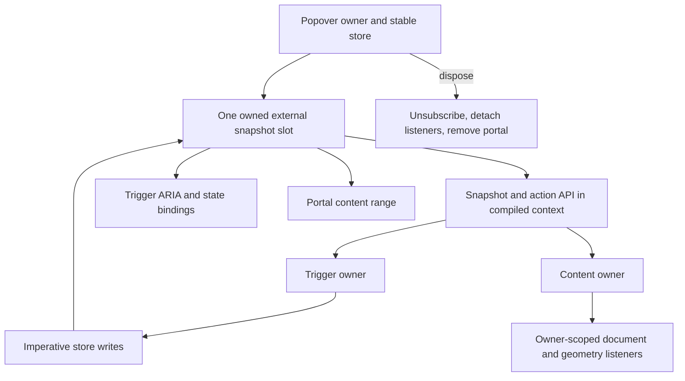

# Native Popover Store - Plan

## Goal Capsule

- **Objective:** A Vidact documentation application can use the copied shadcn Popover without retaining the Base UI Popover runtime graph or patching Base UI.
- **Means:** Replace the copied Popover wrapper with a local primitive backed by Vidact's existing owned external-store lowering, then certify its interaction and DOM identity (KTD1-KTD4).
- **Product authority:** The user's request and the accepted compatibility boundaries in `docs/architecture/shadcn-base-ui-compatibility-corpus.md` govern this plan.
- **Open blockers:** None. The exact internal helper names and smallest compatible public prop types may be refined during implementation without changing the contract.
- **Execution profile:** Standard code change. Start with store and browser characterization, then integrate the component and update the compatibility corpus.
- **Stop conditions:** Do not patch `node_modules`, add React interop, infer hooks from arbitrary class methods, retain a Base UI Popover runtime path, or mark Popover supported without browser identity and disposal evidence.
- **Tail ownership:** The autonomous shipping workflow owns review, commits, the pull request, and CI follow-through.

---

## Product Contract

### Summary

Build one vertical Vidact-native migration of a Store-blocked copied shadcn component. Popover keeps the local shadcn composition and styling surface while its state, subscriptions, portal, and interaction behavior become locally owned.

### Problem Frame

The copied `examples/docs/src/components/ui/popover.tsx` file is only a wrapper around `@base-ui/react/popover`. Its first compilation failure comes from Base UI hiding a React hook behind Store instance methods. Teaching the compiler that arbitrary instance methods are hooks would lose semantic provenance and invite class-instance compatibility into Vidact's construct-once model.

Shadcn's copy/paste model permits the application to replace that wrapper locally. Vidact already lowers direct `useSyncExternalStore` calls to an owner-scoped external source that rechecks after subscribing, batches notifications, and unsubscribes during owner disposal. A local Popover is therefore a bounded proof of the owner-aware store seam and Popover behavior. Each later behavioral family, especially modal and focus-managed components, must earn separate browser certification before its migration pattern is considered proven.

### Key Decisions

- **Keep the production graph React-free.** (session-settled: user-directed — chosen over a React compatibility renderer: the original docs request requires Vidact output with no React interop.) Governs R1, R6, R7.
- **Keep dependency installations untouched.** (session-settled: user-approved — chosen over patching or forking Base UI: copied shadcn component files are the application-owned customization boundary.) Governs R1, R2.
- **Do not infer hooks from arbitrary Store methods.** (session-settled: user-approved — chosen over general class-instance hook compatibility: method receivers do not provide a sound owner or hook provenance contract.) Governs R3, R6.

### Requirements

**Local ownership and API**

- R1. Popover must not import or retain `@base-ui/react/popover`, React DOM rendering, or a compatibility adapter.
- R2. The copied module must continue to export `Popover`, `PopoverTrigger`, `PopoverContent`, `PopoverHeader`, `PopoverTitle`, and `PopoverDescription` with the existing shadcn composition and data-slot styling conventions.
- R3. Reactive Popover reads must enter Vidact through a direct owner-aware subscription or another existing compiler-recognized primitive, never through an arbitrary hook-bearing instance method.

**Behavior and lifecycle**

- R4. Uncontrolled and controlled open state must support trigger toggling, change callbacks, outside-pointer dismissal, and Escape dismissal. Controlledness is fixed by the initial presence of `open`: controlled interactions emit one request and wait for the parent value, while uncontrolled interactions commit to the local store. Trigger-toggle and Escape closure restore trigger focus; outside-pointer closure preserves the clicked focusable target and falls back to the trigger only when focus remains inside removed content or on `body`; an unrelated controlled close or owner disposal never steals focus.
- R5. Open content must support `side` values `top | right | bottom | left`, `align` values `start | center | end`, and numeric `sideOffset` and `alignOffset` inputs. It must expose the state/data attributes consumed by the copied shadcn styles. Collision avoidance and viewport flipping are not part of this proof.
- R6. The Popover root, store, root subscription, context, and trigger owner must be constructed once per root mount and disposed exactly once. Content, its document and geometry listeners, and its portal range are constructed once per open interval and disposed exactly once on close or root disposal, without late writes or retained DOM. Close teardown is immediate; exit-animation retention is deferred.

**Certification**

- R7. Popover must production-compile in the independent 61-component audit with no retained React runtime path.
- R8. Browser coverage must prove interaction, controlled updates, surgical owner identity, dismissal, focus restoration, and unmount cleanup.
- R9. The compatibility matrix and architecture record must distinguish this browser-certified local implementation from build-only modules and from upstream Base UI compatibility.

### Acceptance Examples

- AE1. Covers R4 and R6. Given a closed uncontrolled Popover, when its trigger is clicked twice, then the same trigger node and root subscription remain mounted, one content owner is created for the open interval, and its portal range is fully removed on close.
- AE2. Covers R4. Given an open Popover, Escape closes it once and restores trigger focus; an outside pointer action closes it once while preserving the clicked focusable target, with trigger fallback only when focus has nowhere valid to remain.
- AE3. Covers R4 and R8. Given a controlled Popover, an interaction emits exactly one request without changing visibility; a rejected request leaves the existing content state intact, while an accepted parent publication updates the existing root snapshot without constructing a second subscription or remounting unrelated DOM.
- AE4. Covers R6 and R8. Given an open Popover whose application owner is disposed, when the store later publishes or document events fire, then no DOM returns and no disposed owner receives a write.

### Scope Boundaries

#### In scope

- One local Popover implementation, a framework-neutral local store utility, and the component-local owner-aware subscription it requires.
- The common shadcn Root, Trigger, Content, Header, Title, and Description composition used by the docs/Fumadocs rebuild.
- Portal, positioning, dismissal, focus, accessibility relationships, and owner/disposal proof needed to certify that component.

#### Deferred to Follow-Up Work

- Migrating Alert Dialog, Combobox, Dialog, Drawer, Navigation Menu, Select, Sheet, and Toast to the proven local pattern.
- General selected-external-store compiler optimization, reactive store replacement, collision-aware floating positioning, focus trapping, and modal inerting beyond what the copied Popover contract requires.
- Base UI `fastComponentRef`, render-time hook-object mutation, and external renderer package compatibility.

### Success Criteria

- The audit moves Popover from compiler error to React-free production compilation without changing the Base UI dependency installation.
- Browser evidence shows the expected Popover behavior with retained trigger identity and bounded mutations.
- Owner disposal removes every Popover subscription, document listener, and portal node.

---

## Planning Contract

### Key Technical Decisions

- KTD1. **Use a local copied-component boundary.** (session-settled: user-approved — chosen over patching or forking Base UI: the application owns shadcn component source and can replace only the blocked primitive.) The public shadcn exports remain local while the Base UI Popover graph disappears. Covers R1-R2.
- KTD2. **Subscribe once in the Popover root.** The root calls `useSyncExternalStore` directly with methods from its locally created stable store. Compiled context carries the current snapshot and imperative action API; Trigger and Content derive ordinary values from that snapshot and do not create consumer subscriptions. Covers R3, R6.
- KTD3. **Keep all resources under explicit owners.** The root store holds the latest callback and close origin. Controlled prop publications update the store without calling `onOpenChange`; interactions request once and mutate visibility only when uncontrolled. Root resources live for the root mount, while portal content and its document and geometry effects live for one open interval. Covers R4-R6.
- KTD4. **Certify one behavioral family at a time.** The Popover proof must pass interaction, identity, mutation-envelope, disposal, production-audit, and React-runtime checks before this owner-aware store seam is reused. It does not certify modal, focus-managed, collection, or toast behavior; each family needs its own browser proof. Covers R7-R9.

### High-Level Technical Design

The store remains an ordinary imperative observer with stable `subscribe` and `getSnapshot` capabilities. The root owns one compiler external-source slot and unsubscribe resource. Each publication updates that root snapshot, and context consumers derive bindings through Vidact's normal source graph without replay or consumer-local external-store calls.

### Public API Boundary

| Export | Supported in this proof | Explicitly unsupported |
|---|---|---|
| `Popover` | `open`, `defaultOpen`, `onOpenChange`, `children` | hover opening, modal mode, imperative action/handle APIs, controlledness changes after mount |
| `PopoverTrigger` | native button children, `disabled`, `ref`, `className`, and ordinary button props | Base UI `render` callbacks or arbitrary element descriptors |
| `PopoverContent` | `ref`, `className`, ordinary div props, `side`, `align`, `sideOffset`, `alignOffset`, `aria-label` | render callbacks, payload props, configurable focus policies, collision middleware, transition-completion callbacks |
| `PopoverHeader`, `PopoverTitle`, `PopoverDescription` | native div/heading/paragraph props and refs | Base UI-only renderer or handle contracts |

### Accessibility Contract

| Surface | Required behavior |
|---|---|
| Trigger | Native button with `aria-haspopup="dialog"`, reactive `aria-expanded`, and mounted-only `aria-controls` |
| Content | Focusable `role="dialog"`; initial focus moves to the first tabbable descendant with the content node as fallback; normal non-modal Tab traversal continues outside the Popover |
| Naming | Mounted Title and Description IDs populate `aria-labelledby` and `aria-describedby`; absent elements leave no dangling relationship; Content requires `aria-label` when no Title is rendered |

### Assumptions

- The first shipped proof targets Popover rather than migrating every Store-blocked primitive in one pull request.
- The current copied shadcn Popover surface is the compatibility target; uncommon Base UI-only props may be omitted when they are neither exported intentionally nor used by the docs proof, provided TypeScript makes the narrower contract explicit.
- The existing Vidact portal, context, ref, layout-effect, and external-store primitives can express the required ownership model. Execution may expose a compiler defect in one of those existing primitives; any fix must remain general and receive its own regression test.
- Basic anchored placement for the copied `side` and `align` contract is sufficient for this proof. Collision avoidance and viewport flipping remain follow-up work.

### Sequencing

U1 establishes the framework-neutral store seam. U2 places the only direct owner-aware subscription in Popover root and builds the primitive around it. U3 adds browser certification and production-corpus evidence. U4 updates durable compatibility documentation after the evidence is green.

---

## Implementation Units

### U1. Framework-neutral local store

- **Goal:** Provide a small framework-neutral observer store with stable methods for the Popover root's direct subscription.
- **Requirements:** R3, R6
- **Dependencies:** None
- **Files:**
  - `examples/docs/src/lib/owned-store.ts`
- **Approach:**
  1. Keep state mutation, snapshot reads, and listener notification in a framework-neutral store object with stable method identities.
  2. Export no hook or primitive-bearing helper across the module boundary; the direct primitive call stays private to `popover.tsx`.
  3. Preserve recursive publication and `Object.is` equality behavior without adding a global subscription registry.
- **Execution note:** Exercise the store through the same component-local subscription shape that ships in Popover.
- **Patterns to follow:** `docs/architecture/owned-external-store-snapshots.md`, `tests/browser/corpus/apps/external-store/ExternalStoreApp.browser.test.ts`, and `packages/runtime/src/compiled/core.ts` external-store ownership.
- **Test scenarios:**
  - Mount Popover with Trigger and Content consuming one root snapshot; publish a change affecting one binding and verify unrelated DOM does not mutate.
  - Dispose the root, publish again, and verify the subscriber count stays zero and no DOM write occurs.
  - Publish recursively from a listener and verify each final snapshot is observed without duplicate retained listeners.
- **Verification:** The utility contains no framework primitive; the root's component-local subscription compiles without a React runtime path, belongs to the root owner, and drives surgical bindings.

### U2. Local shadcn Popover primitive

- **Goal:** Replace the Base UI wrapper with a locally owned Popover that preserves the copied shadcn composition and styles.
- **Requirements:** R1-R6
- **Dependencies:** U1
- **Files:**
  - `examples/docs/src/components/ui/popover.tsx`
  - `examples/docs/src/lib/owned-store.ts`
- **Approach:**
  1. Create one stable root store, subscribe to it directly in Popover root, keep the callback live, synchronize controlled publications without emitting requests, and publish the current snapshot plus actions through compiled context.
  2. Implement Trigger as a native button owner of toggle requests, reactive ARIA bindings, and the focus-restoration target.
  3. Implement Content as an open-interval owner through the existing portal path with owner-scoped outside-pointer, Escape, initial-focus, and anchored-position effects. Carry close origin so teardown restores or preserves focus according to R4.
  4. Keep Header native and implement Title and Description as native semantic elements connected to the content accessibility attributes.
  5. Preserve `data-slot`, open/closed, side, align, offset, `className`, and ordinary intrinsic prop forwarding without generic element descriptors.
- **Patterns to follow:** Existing compiled context/provider lowering, portal ownership, `examples/docs/src/components/ui/collapsible.tsx` composition conventions, and the class list currently owned by `popover.tsx`.
- **Test scenarios:**
  - Render uncontrolled closed, uncontrolled default-open, and controlled forms and verify initial ARIA, accessible naming, and content state.
  - Toggle from the trigger and verify callback payload, content visibility, state attributes, and trigger identity.
  - Close with Escape and trigger-toggle and verify trigger restoration; close by pointer on another control and verify that control keeps focus.
  - Reject and accept controlled interaction requests and verify visibility changes only after an accepted parent publication and the latest callback runs once.
  - Render title and description and verify the content's accessibility relationships reference the mounted elements.
  - Exercise all four sides, all three alignments, and numeric offsets against deterministic trigger geometry.
  - Unmount while open and verify portal content, listeners, refs, and subscriptions are removed once.
- **Verification:** No Base UI Popover import remains, the module production-compiles React-free, and all behavior enters the existing Vidact owner graph.

### U3. Browser and corpus certification

- **Goal:** Prove Popover behavior, surgical updates, and independent production compilation before promoting its compatibility status.
- **Requirements:** R7-R8
- **Dependencies:** U1, U2
- **Files:**
  - `examples/docs/src/PopoverProof.tsx`
  - `examples/docs/src/PopoverProof.browser.test.ts`
  - `examples/docs/src/shadcn-corpus.ts`
  - `examples/docs/src/shadcn-compatibility.ts`
  - `examples/docs/src/App.tsx`
- **Approach:**
  1. Add a representative proof surface without making the docs shell responsible for low-level lifecycle assertions.
  2. Capture mutations around open, controlled publication, and close flows; retain trigger, page-shell, and unrelated sibling identities.
  3. Promote Popover only after the independent component audit and production bundle verifier report no React path.
- **Execution note:** Treat any functional success with trigger remounting, unrelated DOM churn, or retained portal nodes as a failing proof.
- **Patterns to follow:** `examples/docs/src/ShadcnExpansionProof.browser.test.ts`, `examples/docs/src/App.browser.test.ts`, and `examples/docs/scripts/audit-shadcn-compatibility.mjs`.
- **Test scenarios:**
  - Covers AE1. Open and close an uncontrolled Popover while retaining the exact trigger and unrelated shell nodes within a bounded mutation envelope.
  - Covers AE2. Close through Escape, trigger toggle, and outside pointer actions; assert callback order and reason-aware focus behavior.
  - Covers AE3. Exercise rejected and accepted controlled requests, then publish controlled state and callback changes without remounting or optimistic visibility.
  - Covers AE4. Dispose while open, then dispatch store and document events and verify no portal range or late mutation returns.
  - Build Popover independently and verify its emitted chunk contains no React import, React element tag, renderer call, or compatibility adapter.
- **Verification:** Popover moves from the blocked map into the browser-certified matrix, the audit count increases by one, and the full docs bundle remains React-free.

### U4. Durable compatibility contract

- **Goal:** Record the proven local-store migration boundary and the exact claims that remain deferred.
- **Requirements:** R9
- **Dependencies:** U3
- **Files:**
  - `docs/architecture/shadcn-base-ui-compatibility-corpus.md`
  - `docs/architecture/owned-external-store-snapshots.md`
  - `docs/architecture/README.md`
  - `examples/docs/README.md`
- **Approach:** Update counts and certification language, describe direct full-snapshot selection and owner cleanup, state that Popover is a local shadcn implementation rather than proof that upstream Base UI Store methods compile, and retain the prohibition on generic class-instance hook inference.
- **Test expectation:** None -- this unit records behavior already proved by U1-U3.
- **Verification:** Documentation matches the audited matrix and contains no broader Base UI compatibility claim than the evidence supports.

---

## System-Wide Impact

- **Ownership:** The root owns one external-source slot and unsubscribe resource. Trigger and Content consume the root snapshot without consumer-local subscriptions; no store-global Vidact owner is introduced.
- **Reactivity:** Each store publication enters the root's compiled source slot once and fans out through ordinary context-derived dependencies, preserving compiler ordering.
- **DOM:** Content uses the existing portal range. Trigger and unrelated owners must not be replaced during open-state changes.
- **Disposal:** Closing disposes one content interval and its listeners, refs, and portal nodes. Root disposal additionally removes the sole store subscription before late work can publish.
- **Compatibility:** The result certifies the copied Popover implementation only. It does not certify Base UI Store methods, `fastComponentRef`, or arbitrary external-store wrappers.

---

## Risks & Dependencies

- **Reactive external-store arguments:** Passing context-derived store methods or selector closures into `useSyncExternalStore` would trigger unsupported resubscription semantics. KTD2 keeps the only primitive call in the root, where both methods come from the locally created stable store.
- **Provider construction order:** Trigger and content must construct beneath the stable context provider. Existing provider-owned child normalization is the required pattern.
- **Portal event boundaries:** Outside-pointer handling must distinguish trigger/content interactions from genuine outside actions and must remove document listeners on every close and disposal path.
- **Focus timing:** Close origin must survive until content removal so Escape and trigger-toggle closure restore the trigger, outside-pointer closure preserves its focus target, and unrelated controlled closes or disposal do not steal focus.
- **Scope inflation:** Full floating collision handling or modal focus trapping could turn the proof into a Base UI reimplementation. Those capabilities stay deferred unless an existing copied Popover contract test requires them.

---

## Verification Contract

| Gate | Applies to | Done signal |
|---|---|---|
| `cargo test -p vidact-compiler` | U1-U3 when compiler changes occur | Compiler regression suite passes |
| `pnpm --dir packages/runtime test` | U1-U3 when runtime changes occur | Runtime browser, retained-UI, and server suites pass |
| `pnpm --filter @vidact/example-docs test` | U1-U3 | Store and Popover browser proofs pass with only intentionally retained expected failures |
| `pnpm --filter @vidact/example-docs build` | U2-U4 | Docs production build succeeds and bundle verifier finds no React path |
| `pnpm --filter @vidact/example-docs audit:shadcn` | U2-U4 | Popover reports production-compiled and the corpus has zero retained React paths |
| `pnpm --dir packages/vite-plugin test` | Any dependency-capsule change | Vite integration suite passes |
| `git diff --check` | All units | No whitespace or patch-integrity errors |

---

## Definition of Done

- U1's framework-neutral store is consumed by one component-local root subscription using Vidact's existing owned external-store contract and has lifecycle proof through Popover.
- U2 removes the Base UI Popover runtime graph while preserving the copied shadcn public composition, styling attributes, and required interactions.
- U3 proves AE1-AE4 with DOM identity and mutation-envelope assertions and promotes Popover in the audited matrix.
- U4 records the local implementation boundary without claiming generic Base UI Store compatibility.
- Production output contains no React renderer, React element descriptor, or compatibility adapter.
- All applicable Verification Contract gates pass.
- Abandoned experiments, unused helpers, stale compatibility entries, and temporary audit output are absent from the final diff.
