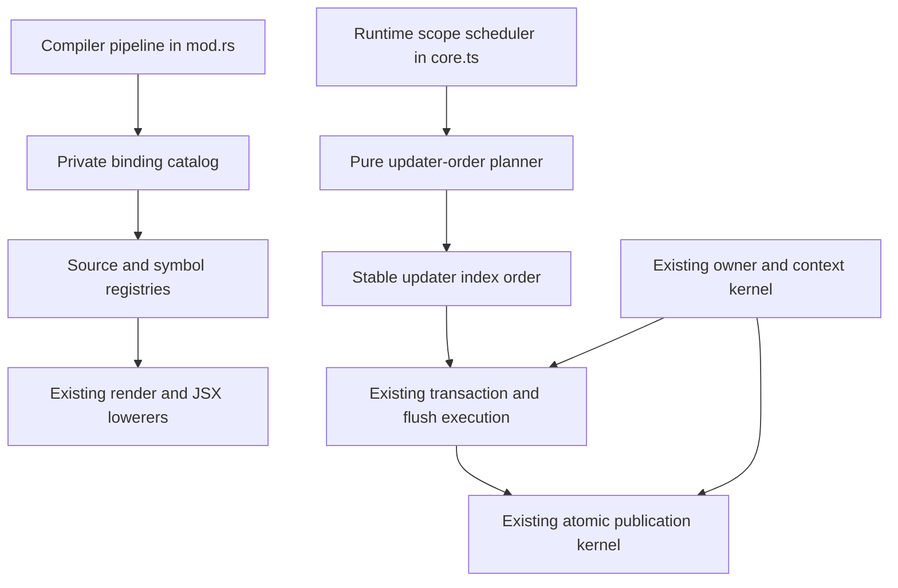

# Cohesive Compiler and Runtime Boundaries - Plan

## Goal Capsule

- **Objective:** Let maintainers change compiler lowering and runtime scheduling with a smaller reasoning surface while preserving every observable compiled-program behavior.
- **Means:** Extract the compiler's component binding catalog and the runtime's pure updater-order planner into internal modules (KTD1, KTD2).
- **Authority:** Compiler output fixtures, runtime browser behavior, the public package export map, and the recorded architecture contracts define compatibility.
- **Stop conditions:** Stop an extraction if it requires a new public abstraction, duplicates execution state, changes generated output beyond formatting, or raises the runtime size budget.
- **Execution profile:** Land one candidate at a time as a behavior-preserving refactor with characterization evidence first.
- **Tail ownership:** Implement and verify locally. Do not push.

---

## Product Contract

### Summary

Two large implementation files contain several valid but distinct responsibilities. This plan creates two narrow internal seams that improve change isolation without redesigning the compiler pipeline or runtime lifecycle.

### Problem Frame

`crates/vidact-compiler/src/surgical_codegen/mod.rs` coordinates the full surgical compilation pipeline and also owns detailed binding discovery and hook lowering. `packages/runtime/src/compiled/core.ts` combines updater scheduling with logical ownership, retained resources, DOM staging, and atomic publication. Their size alone is not a defect, but unrelated changes repeatedly require readers to hold too many local invariants at once.

### Requirements

**Boundary quality**

- R1. Each extraction MUST have one cohesive responsibility and a practical maintenance benefit.
- R2. The refactor MUST keep ownership, context, disposal, error routing, transaction draining, and publication rollback behavior unchanged.
- R3. Compiler output and diagnostic source spans MUST remain behaviorally equivalent for every supported feature gate.
- R4. The compiler module MUST remain package-private, the runtime module MUST remain absent from the package export map, and neither extraction may change the compiler API, runtime exports, or compiled tuple ABI.

**Proof and cost**

- R5. Existing compiler and browser suites MUST pass without weakening assertions or snapshots.
- R6. Missing direct proof for updater ordering and component binding classification MUST be added before moving the corresponding logic.
- R7. The minified and compressed runtime MUST remain within the existing size budget, with any measurable increase treated as a failed extraction.
- R8. The work MUST land incrementally so either extraction can be reverted without reverting the other.

### Scope Boundaries

- **Included:** internal module extraction, direct characterization tests, import rewiring, and architecture documentation updates needed to make the new boundaries discoverable.
- **Deferred:** splitting DOM materialization, refs, effects, retained resources, portals, and hydration into separate modules. Those areas cross the same ownership and publication state and need a separate design problem.
- **Excluded:** a generic scheduler framework, a new runtime object graph, public API changes, compiler IR redesign, generated-code ABI changes, or broad file-size targets.

---

## Planning Contract

### Current Responsibility Map

#### Compiler surgical code generation

| Region | Responsibility | Shared state and invariants |
|---|---|---|
| `compile_surgical_module_with_ir_and_options` | Parse, normalize, rebuild semantic data, analyze, lower IR, transform, generate code, and compose source maps. | Every AST-changing normalization that invalidates semantic IDs is followed by semantic rebuilding. Diagnostics are remapped through canonical source-map layers. |
| `transform_program` and `PostTransformReactUsage` | Guard generated names, transform components, reject unsupported residual React calls, prune imports, detect DOM capabilities, and inject runtime imports. | Feature gates decide both accepted syntax and reachable runtime entrypoints. Generated aliases must not collide with source bindings. |
| `transform_component` | Allocate source IDs, collect symbol registries, lower render structure, rewrite hooks and state references, emit updater registrations, and produce the compiled root. | OXC `SymbolId` values are authoritative. Synthetic IDs append after analyzed IDs. Narrow scopes are legal only when every source ID is below 32. `render_start` separates one-time construction from reactive render output. |
| Binding and hook helpers | Recognize and lower state, reducer, transition, deferred, action, optimistic, form-status, memo, context, external-store, effect-event, ID, and prop bindings. | Each recognized binding must update the same source and symbol registries used by dependency analysis and later reference rewriting. Feature-gate errors retain source spans. |
| `JsxBindingTransformer` and renderable helpers | Lower reactive attributes, events, spreads, child slots, component props, actions, raw HTML, and renderable capabilities. | Evaluation order, one-time construction, parent versus item dependency masks, namespace, and single-owner structural values must remain stable. |
| Dependency and updater helpers | Find parent/item reads and immediate writes, calculate masks, snapshot effects, and emit derived updater statements. | Writer-to-reader ordering comes from static source masks. Keyed item dependencies remain separate from component dependencies. |
| Existing child modules | `ast.rs`, `derived.rs`, `iterative.rs`, `namespace.rs`, `raw_html.rs`, and `render.rs` already isolate AST construction, SSA derivation, iterative JSX, namespace annotation, raw HTML proof, and render-shape lowering. | Each child stays private and consumes only the parent contracts it needs. New boundaries should follow this precedent. |

#### Compiled runtime core

| Region | Responsibility | Shared state and invariants |
|---|---|---|
| Feature, async, boundary, and portal APIs | Retained UI, profiling, Suspense, errors, and portal construction. | All resources attach to the active logical owner and root identity rather than DOM ancestry. |
| Scope scheduler | Register/remove updaters, accumulate source masks, batch writes, derive deterministic updater order, and detect non-stabilizing cycles. | Updaters added during a flush wait for the next publication. Removal invalidates cached order. Strongly connected updaters retain registration order; dependencies run before consumers. |
| State and compiled hook primitives | State, reducer, memo, context, external store, async, prop, event, conditional, list, and root primitives. | Setters publish through the owning scope; every resource and cleanup belongs to the construction owner. |
| Effect, ref, mount, and hydration paths | Stage compiled values, attach refs, schedule effect phases, claim server nodes, and mount roots. | Insertion work precedes refs, refs precede layout resources, and cleanup follows logical ownership. Hydration must preserve claimed node identity or recover at the whole-root boundary. |
| Ownership and retained-resource kernel | Create/dispose owners, carry context/root/error/profile state, and disconnect/reconnect retained resources. | Disposal is idempotent, cascades through cleanup ownership, and preserves the primary failure while attempting all cleanup. |
| Materialization and publication kernel | Stage DOM changes, collect inverse/dispose/finalize operations, commit by priority, roll back failures, and route errors. | No staged DOM change becomes visible until scope computation completes. Commit failure rolls back applied operations in reverse order. Finalizers run only after commits, and transaction depth gates flush draining. |

### Shared Runtime State That Remains in `core.ts`

`activeOwner`, `activeContextFrame`, `activeRootIdentity`, `activeConstructionOwner`, `activeErrorOwner`, `failedOwner`, `transactionDepth`, `drainingFlushes`, `activePublication`, the scheduled flush set, and owner-indexed weak maps form one execution kernel. Moving only part of this state behind callbacks would obscure ordering and create a second protocol. The plan therefore leaves scheduling execution, ownership, and publication together. Only the pure dependency-order calculation moves.

### Key Technical Decisions

- KTD1. **Extract a compiler component binding catalog.** Add a private `surgical_codegen/bindings.rs` module that owns binding data types, hook recognition, source/symbol classification, and declarator lowering. `transform_component` remains the orchestrator and consumes one catalog instead of coordinating parallel maps and sets. This removes one feature-growth hotspot and makes a new compiled hook change one cohesive module. Governs R1, R3, R4, R6.
- KTD2. **Extract only pure updater dependency ordering from the runtime.** Add an unexported `compiled/updater-order.ts` module for reader indexing, graph construction, strongly connected components, and stable topological order. Scope registration, mask accumulation, batching, flush execution, ownership, error routing, and publication stay in `core.ts`. This makes the graph algorithm independently testable without inventing a scheduler abstraction. Governs R1, R2, R4, R6.
- KTD3. **Preserve behavior by moving logic before reshaping it.** Each candidate starts with direct characterization, then a mechanical move, then only the smallest API cleanup required by module privacy. Generated output and public declarations remain unchanged. Governs R3-R6, R8.
- KTD4. **Treat bundle size as a compatibility gate.** Internal modules are bundled through current entrypoints and introduce no side effects or new exports. The existing size measurement is a required before-and-after check. Governs R4, R7.

### High-Level Technical Design

### Sequencing

1. Characterize and extract the updater-order planner because it is pure and has the smallest rollback surface.
2. Characterize the compiler binding catalog across narrow/wide sources and feature-gated hooks, then extract it without changing render or JSX lowering.
3. Run full compatibility and size gates, and update the architecture index if the implemented file boundaries differ from this plan.

### Risks and Mitigations

| Risk | Mitigation |
|---|---|
| A binding catalog becomes a generic compiler context that hides mutation. | Keep it specific to source/symbol classification and declarator lowering; pass render, JSX, and program orchestration data explicitly. |
| A runtime helper accidentally imports DOM or execution globals. | Keep `updater-order.ts` pure and pass updater metadata plus source-mask visitation as inputs. |
| Moving Rust visitors changes lifetimes or semantic ID handling. | Move existing types and functions mechanically, preserve `SymbolId`-based lookup, and compare generated fixtures before cleanup. |
| Tree shaking or chunk structure increases the published runtime. | Add no public export and require `pnpm size` to remain within the existing budget. |
| Existing integration tests miss deterministic behavior inside a dependency cycle. | Add a direct planner characterization covering SCC stability, holes, removals, and wide source masks before extraction. |

---

## Implementation Units

### U1. Isolate updater dependency ordering

- **Goal:** Make static updater graph ordering independently understandable and testable while leaving runtime execution state in `core.ts`.
- **Requirements:** R1, R2, R4-R8; KTD2-KTD4.
- **Dependencies:** None.
- **Files:** `packages/runtime/src/compiled/core.ts`, `packages/runtime/src/compiled/updater-order.ts`, `packages/runtime/test/reactivity/updater-order.browser.test.ts`, `packages/runtime/test/reactivity/static-updaters.browser.test.ts`, `packages/runtime/test/performance/runtime-budgets.browser.test.ts`.
- **Execution note:** Add characterization coverage before moving the graph algorithm.
- **Approach:**
  1. Characterize the pure order result for linear dependencies, independent updaters, cycles with downstream consumers, removed slots, and wide masks.
  2. Move reader indexing, graph construction, SCC discovery, and stable component ordering into the private module.
  3. Keep updater registration, cache invalidation, flush passes, profiling, ownership, error routing, and transaction draining in `core.ts`.
- **Patterns to follow:** `packages/runtime/src/source-mask.ts` for isolated mask operations and `packages/runtime/test/reactivity/static-updaters.browser.test.ts` for observable scheduling semantics.
- **Test scenarios:**
  - A writer registered after its reader is ordered first when their masks intersect.
  - Independent updaters retain ascending registration index.
  - Members of a dependency cycle retain ascending registration index, while a downstream reader runs after the cycle.
  - Undefined and inactive updater slots are omitted, and recalculation after removal produces the remaining stable order.
  - Sources across a 32-bit word boundary create the same dependency edges as narrow masks.
  - Existing batching, non-stabilization, and 1,024-updater performance tests keep their current behavior and thresholds.
- **Verification:** The direct planner test proves deterministic order. Existing browser tests prove unchanged scheduling and transaction behavior. Runtime typecheck, build, and size gates pass with no public declaration change.

### U2. Consolidate component binding classification and lowering

- **Goal:** Give compiled hook and binding changes one private compiler boundary without moving pipeline, render, or JSX responsibilities.
- **Requirements:** R1, R3-R6, R8; KTD1, KTD3.
- **Dependencies:** U1 is not a code dependency, but land U1 first to keep review and rollback independent.
- **Files:** `crates/vidact-compiler/src/surgical_codegen/mod.rs`, `crates/vidact-compiler/src/surgical_codegen/bindings.rs`, `crates/vidact-compiler/tests/surgical_codegen.rs`.
- **Execution note:** Lock generated output and diagnostic behavior before moving binding logic.
- **Approach:**
  1. Add focused fixture cases that expose the catalog's output through generated code and diagnostics.
  2. Move binding structs, recognition helpers, effect-event validation, hook declarator transformations, and source/symbol registry construction into `bindings.rs`.
  3. Return a catalog containing source IDs, symbol-to-source mappings, state reference mappings, setter/value mappings, and source-kind sets needed by dependency and updater emission.
  4. Keep semantic rebuilds, component lookup, render lowering, iterative JSX, derived updater emission, JSX transformation, namespace annotation, import planning, and source-map composition in their current owners.
- **Patterns to follow:** The private `derived.rs`, `iterative.rs`, and `render.rs` modules expose narrow operations to `mod.rs` without changing the public compiler API.
- **Test scenarios:**
  - State, reducer, memo, context, external-store, transition, action, effect-event, ID, and direct/rest/nested props produce the same runtime calls and source masks.
  - A component with exactly 32 sources uses the narrow scope, while the first source above that boundary selects the wide scope.
  - A synthetic source created for a dependency-expanded hook follows the highest analyzed source ID without collision.
  - Unsupported or disabled hook use reports the same diagnostic span after source-map remapping.
  - Keyed item symbols remain in the item domain and do not enter component source maps.
  - Residual React imports and runtime capability imports remain byte-for-byte equivalent for representative feature combinations.
- **Verification:** Surgical codegen tests compare generated behavior and diagnostics before and after the move. Compiler formatting and workspace tests pass. No public Rust type or function changes.

### U3. Verify the combined internal boundary change

- **Goal:** Confirm that the two independent extractions preserve cross-layer behavior and published cost.
- **Requirements:** R2-R5, R7, R8; KTD3, KTD4.
- **Dependencies:** U1, U2.
- **Files:** `docs/architecture/README.md`, `docs/architecture/static-updater-ordering-boundary.md`, `docs/architecture/compiled-only-client-runtime.md`, `docs/benchmarking.md`.
- **Approach:** Update only references made stale by the implemented boundaries. Record that `core.ts` still owns scheduling execution, ownership, and publication as one kernel, while the extracted planner is a pure calculation.
- **Test expectation:** No new behavior belongs to this unit. It verifies the combined code through the repository's existing compiler, runtime, package, and size gates.
- **Verification:** Architecture links resolve, the package export map and generated declarations are unchanged, and the full required gates pass without abandoned extraction scaffolding.

---

## Verification Contract

| Gate | Command | Covers |
|---|---|---|
| Surgical compiler behavior | `cargo test -p vidact-compiler --test surgical_codegen` | U2 |
| Rust workspace and formatting | `cargo test --workspace` and `pnpm format:rust` | U2, U3 |
| Runtime behavior | `pnpm test:runtime` | U1, U3 |
| Runtime types and package build | `pnpm --filter @vidact/runtime typecheck` and `pnpm --filter @vidact/runtime build` | U1, U3 |
| Published size | `pnpm size` | U1, U3 |
| Package contract | `pnpm test:packages` | U1, U3 |
| Repository lint and format | `pnpm lint` and `pnpm format` | U1-U3 |

---

## Definition of Done

- The runtime graph algorithm lives in one pure unexported module, while all live scheduling, ownership, transaction, error, and publication state remains in `core.ts`.
- Compiler binding classification and declarator lowering live in one private module, while the pipeline, render lowering, JSX transformation, and import planning keep their existing owners.
- Direct tests cover deterministic updater order, holes and removals, wide masks, source allocation boundaries, feature-gated binding classification, and diagnostic spans.
- Existing compiler and runtime suites pass with no weakened assertions.
- Public exports, compiled tuple shapes, generated capability entrypoints, and package declarations are unchanged.
- The runtime size measurement remains within the current budget with no unexplained increase.
- Each extraction can be reverted independently, and no abandoned adapter or generic framework remains in the diff.

---

## Appendix

### Existing Behavioral Proof

- `packages/runtime/test/reactivity/static-updaters.browser.test.ts` covers prerequisite ordering, dependency cycles, registration changes, batching, wide source masks, and stabilization failure.
- `packages/runtime/test/reactivity/compiled-dom.browser.test.ts` covers cross-scope transactions, publication batching, feedback-cycle failure, child-scope disposal, refs, and effect ordering.
- `packages/runtime/test/lifecycle/failure-atomicity.browser.test.ts` and `packages/runtime/test/lifecycle/error-boundaries.browser.test.ts` cover staged publication, rollback, logical error ownership, and portal failures.
- `packages/runtime/test/lifecycle/disposal.browser.test.ts` and `packages/runtime/test/lifecycle/activity.browser.test.ts` cover disposal cascades and retained-resource connection behavior.
- `packages/runtime/test/performance/runtime-budgets.browser.test.ts` covers scheduler scale and owner allocation budgets.
- `crates/vidact-compiler/tests/surgical_codegen.rs` covers generated source masks, feature gates, hook lowering, props, effects, contexts, external stores, actions, concurrent sources, keyed item domains, capability imports, and diagnostic remapping.

### Missing Proof Filled by the Plan

- The runtime suite observes executions but does not directly lock the pure updater index order for independent components, inactive holes, and SCC membership. U1 adds that characterization.
- Compiler tests cover each binding family, but no focused set locks the binding catalog's source-allocation boundary and complete registry classification as one seam. U2 adds those cases through public generated output and diagnostics rather than exposing compiler internals.
