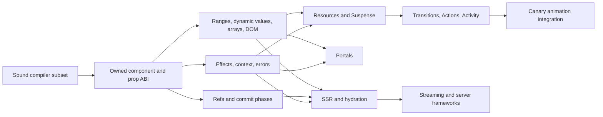

# React feature roadmap

Updated: 2026-08-22
Decision state: Proposed

## Product position

Vidact should support a production-grade **React-shaped authoring model**, not
promise React renderer equivalence. The defining constraints remain:

- source is JSX and familiar function-component code;
- supported components construct DOM once per mount;
- compiler-emitted updaters patch known DOM parts directly;
- there is no Virtual DOM, React element tree, Fiber renderer, or React runtime
  in production output;
- unsupported React syntax and APIs fail at compile time with migration
  guidance.

React 19.2's modern surface spans hooks, built-in components, DOM client/server
APIs, Actions, and resource APIs. The official reference itself separates these
categories, and React's server/framework features have different prerequisites
from ordinary client components. Vidact should therefore inventory every
surface but only implement features that fit its ownership and updater model.
See the official [React API overview](https://react.dev/reference/react),
[built-in hooks](https://react.dev/reference/react/hooks),
[built-in components](https://react.dev/reference/react/components), and
[React DOM APIs](https://react.dev/reference/react-dom).

## Compatibility levels

| Level | Meaning | Examples |
|---|---|---|
| **Core** | Required to fulfill the existing 1.0 production plan | component props, owned children, refs, effects, context, complete arrays, DOM correctness, SSR/hydration |
| **React-shaped** | Same authoring API and observable intent, implemented with Vidact ownership/updaters | `useReducer`, `useMemo`, `useCallback`, `useId`, `memo`, `lazy` |
| **Adapted** | Useful feature with documented timing or scheduling differences | error boundaries, `StrictMode`, `Profiler`, transition APIs |
| **Framework** | Belongs in a later server/router integration, not the client core | Actions, streaming SSR, prerender/resume, Server Components |
| **Diagnosed** | Conflicts with the no-element-tree identity or is legacy | class components, `Children`, `cloneElement`, arbitrary React elements |
| **Track upstream** | Canary/experimental; do not stabilize Vidact around it yet | `<ViewTransition>`, experimental server/resource APIs |

## Dependency order

This ordering is load-bearing. `useImperativeHandle` is not just a small hook:
it needs component refs, stable instances, dependency invalidation, layout
commit timing, and cleanup. Suspense is not just promise catching: it needs
async-owned work, fallback/content ranges, resource identity, error propagation,
cancellation, and scheduler integration.

## Phase 0 — Make the current subset sound

**Goal:** no accepted program silently falls outside the updater model.

Current baseline: span-keyed named-function components (including several per
module), lexical React `useState` imports (including aliases and namespaces),
direct props/state/derived declarations, returns, JSX binding sites, and keyed
maps are classified from OXC AST and semantic symbols. The first versioned
compatibility manifest and source-located fallback diagnostics exist. Typed
React Compiler CFG terminals now reach Vidact's stable IR, and multiple render
returns reject at an exact terminal span without nested-callback or source-text
false positives. DOM-range lowering of that graph, other narrow feature-site
spans, arrow/default lowering, and composed source maps remain.

Build:

- OXC AST/semantic classification for components, lexical React imports, hook
  calls, props, declarations, returns, JSX sites, spreads, and list pipelines.
- Extend span-keyed lowering from named function declarations to supported arrow
  and export forms without mixing facts.
- Lower the captured typed return/branch graph into an owned-range render IR
  before codegen.
- Stable, source-located diagnostics with accepted/rejected/different fixtures.
- Original-TSX source maps, compiler/runtime protocol versions, and transform
  order validation.
- Negative corpora for every P0 case in
  `docs/roadmap/current-support-gap-audit.md`.

Exit criteria:

- Early returns, reactive spreads, generic non-scalar children, unsupported
  hooks, and unsupported list shapes either work or fail with precise spans.
- No compilation decision depends on identifier spelling or source-string
  slicing.
- Arrow, declaration, export, and multi-component classification is correct,
  even if some forms remain intentionally rejected by lowering.

## Phase 1 — Establish the component, prop, owner, and ref ABI

**Goal:** make composition as robust as root state.

Current bridge baseline: direct destructured props have child-local updater
slots and defaults, nested compiled scopes are adopted by parent owners,
`useRef` is available on the construct-once path, and host refs attach/clear
with owner cleanup. Complete prop-store mutation, multi-root component ranges,
ref-as-prop, reducers, and imperative handles remain in this phase.

Build:

- An owned component instance with a stable owner, DOM range, prop store,
  children slot, ref slot, and disposer.
- Reactive prop add/update/delete semantics, defaults, destructuring, rest, and
  spreads without component reinvocation.
- Parent-child ownership independent of physical DOM ancestry.
- Fragment and multi-root component results as ranges.
- `useState` completion: lazy initialization, functional updates, batching,
  stable setters, state reset on keyed remount, and errors after disposal.
- `useReducer` on the same state-slot primitive.
- `useRef` as a stable non-reactive cell.
- Host callback refs and object refs, including attachment after insertion,
  callback-ref cleanup, clearing on removal, and preservation across keyed
  moves.
- React 19-style `ref` as a function-component prop. React documents that
  `forwardRef` is no longer necessary for new React 19 components, so Vidact
  should prefer ref-as-prop and offer `forwardRef` only as a migration shim if
  demanded. See [React 19 ref changes](https://react.dev/blog/2024/12/05/react-19#ref-as-a-prop).
- `useImperativeHandle` after refs and layout commit exist. It customizes the
  value exposed to the parent and re-creates it when dependencies change, as
  specified by the official
  [`useImperativeHandle` reference](https://react.dev/reference/react/useImperativeHandle).

Exit criteria:

- `<Child value={state} />` updates child bindings without rerunning or
  remounting `Child`.
- Removing a conditional or keyed child disposes all descendant scopes exactly
  once.
- A DOM ref and an imperative component handle attach, update, clear, and
  survive keyed movement with documented timing.

## Phase 2 — Complete dynamic values, arrays, and the DOM renderer

**Goal:** fulfill R8-R12 before adding async rendering.

Current bridge baseline: generic compiled bindings own marker-delimited ranges
and normalize scalar, empty, DOM node, recursively nested array, binding, and
owned-block values. Keyed/conditional/binding ranges derive their live parent
from markers after fragment staging. Compiler-carried host context now covers
HTML, SVG, MathML, component boundaries, and SVG `foreignObject`; the runtime
also covers deletion-aware object styles, ARIA/data booleans, capture handlers,
property removal, React-shaped `onChange` timing, and core controlled text,
checkbox, and multiple-select behavior in Chromium. Unkeyed reconciliation,
foreign-value diagnostics, nested list forms, prop-spread deletion, reactive
refs, cross-browser form edge cases, and the complete DOM surface remain.

Build dynamic content:

- A range-aware normalizer for strings, numbers, bigints, empty values, owned
  blocks, fragments, component results, and recursively nested arrays.
- Scalar/empty/block/many transitions with deterministic disposal.
- Keyed lists with string/number keys, nested keyed lists, fragment rows,
  stateful components, focus/selection/ref preservation, and property-based
  operation tests.
- A separate unkeyed indexed reconciler with documented slot identity.
- Ternaries, `&&`, nullish branches, and modeled control flow over owned ranges.
- A deliberate DOM-node escape hatch; reject foreign React elements and
  promises outside resource APIs.

Build DOM correctness:

- Namespace-aware HTML, SVG, MathML, custom elements, and namespaced attributes.
- Generated property/attribute operations plus a correct spread fallback with
  deletion semantics.
- Boolean, enumerated, ARIA, data, URL, class, style object/string/null, CSS
  custom-property, and unsafe-HTML policies.
- Listener replacement/removal, capture, non-bubbling and custom events,
  delegation where profitable, shadow DOM behavior, and owner cleanup.
- Controlled and uncontrolled input, textarea, select, radio, checkbox,
  composition, selection, and form-reset behavior across all supported browsers.
- React 19 function-valued `<form action>` and `formAction` should remain
  diagnosed until the later Actions phase; URL-valued native forms can work
  now. React gives function actions Transition semantics, so treating them as
  ordinary event handlers would be incorrect. See the official
  [`<form>` reference](https://react.dev/reference/react-dom/components/form).

Exit criteria:

- Mixed nested arrays pass normalization, identity, cleanup, and randomized
  reconciliation suites.
- DOM fixtures pass Chromium, Firefox, and WebKit.
- Dynamic spreads, styles, handlers, controlled values, and refs remove stale
  state correctly.

## Phase 3 — Add lifecycle, context, external systems, and failures

**Goal:** make ownership usable for real applications and libraries.

Build hooks and APIs:

- `useEffect` with cleanup-before-rerun and cleanup-on-disposal.
- `useLayoutEffect` in a synchronous post-DOM/pre-paint commit phase.
- `useInsertionEffect` only after defining its stricter pre-layout timing; until
  then diagnose it because CSS-in-JS libraries rely on ordering.
- `useEffectEvent` as a stable non-reactive closure that reads current values
  and is callable only from effects. It is part of React 19.2's hook surface.
- `useMemo` and `useCallback` as compiler-known cached derivations/functions.
  The compiler may erase them when its static updater graph already provides
  equivalent stability, but observable identity promised at prop/effect
  boundaries must remain compatible.
- Custom hooks built from supported primitives under the caller's owner.
- `createContext` and `useContext` over the owner tree, including providers in
  portals and dynamic branches.
- `useSyncExternalStore` with atomic snapshot/subscription behavior and a server
  snapshot hook for hydration.
- `useId` with deterministic root prefixes and server/client parity.
- A Vidact function-component error boundary API plus root error callbacks.
  React's public catch boundary remains class-based, while classes are outside
  Vidact's identity; this should be an explicit compatibility difference, not a
  fake class implementation.

Commit phases should be explicit:

1. compute and validate updater work;
2. perform DOM mutations with a distinct insertion-effect phase before layout;
   refs must still be unavailable to insertion effects, and Vidact must not
   promise whether every relevant DOM mutation precedes that phase;
3. attach/clear ordinary refs and publish imperative handles;
4. run layout effects;
5. schedule passive effects;
6. route errors and dispose abandoned work without corrupting owners.

Exit criteria:

- Effects and custom-hook cleanup are leak-free under update, conditional
  removal, keyed removal, root disposal, and thrown errors.
- Context and external stores update only dependent bindings.
- Error recovery never leaves a half-active owner or stale listener/ref.

## Phase 4 — Add roots, portals, SSR, and hydration

**Goal:** satisfy the existing production plan's server contract before
advanced concurrency.

Build:

- A stable `createRoot`-like Vidact client root with render/mount, unmount,
  protocol checks, and root error options. Exact repeated `root.render(element)`
  semantics are not required because Vidact does not expose a general element
  tree; root prop inputs or an application factory should be the documented
  update surface.
- `createPortal` as an owned range mounted in another DOM container while
  retaining logical owner/context/error ancestry. Native DOM event bubbling is
  not automatically React-tree bubbling, so any difference must be documented
  or implemented through delegated logical propagation. React's portal contract
  is described in the official
  [`createPortal` reference](https://react.dev/reference/react-dom/createPortal).
- Deterministic server codegen from the same semantic IR, safe escaping, and no
  browser globals in server entry points.
- Synchronous whole-root hydration with versioned markers, deterministic IDs,
  existing-node claiming, keyed-range reconstruction, and actionable mismatch
  recovery.
- `hydrateRoot`-like initialization and development diagnostics. React's client
  reference distinguishes client roots from hydration roots; Vidact should do
  the same. See [React DOM client APIs](https://react.dev/reference/react-dom/client).
- `renderToString`/static-string compatibility conveniences after the canonical
  server emitter exists.

Defer streaming, progressive hydration, event replay, and resume semantics to
Phase 7.

Exit criteria:

- Matching server output hydrates without replacing nodes.
- Mismatches stop at a defined recovery boundary and preserve neighboring DOM.
- SSR, hydration, CSP, Trusted Types, injection, compiler/runtime skew, and
  deterministic-ID fixtures pass.

## Phase 5 — Add resources, lazy loading, and Suspense

**Goal:** create the async ownership model before promising transitions.

Build:

- A resource record with stable identity, pending/fulfilled/rejected states,
  cancellation/lifetime integration, and error-boundary propagation.
- `lazy` for code-split component factories with cached module promises.
- `use(resource)` for supported promises and context, with precise rules about
  promise stability and server behavior.
- `<Suspense fallback>` as two owned ranges plus a boundary state machine that
  can retain or replace content, ignore stale resolutions, and dispose abandoned
  work.
- Nested boundary coordination and hydration markers.
- An application/framework resource API; React's own Suspense docs note that
  a Suspense-enabled framework normally owns the promise cache. See the official
  [`<Suspense>` reference](https://react.dev/reference/react/Suspense).

Do not implement Suspense by catching any thrown promise around synchronous DOM
mutation. Without staged ownership and a recovery policy, that approach can
leave partially mounted DOM, refs, and effects.

Exit criteria:

- Nested fallback/reveal/reject/unmount races cannot reveal stale content or
  leak owners.
- Lazy modules and resources deduplicate work and route failures correctly.
- Server/hydration behavior is deterministic for pending and fulfilled
  boundaries.

## Phase 6 — Add scheduling, Actions, retained UI, and developer APIs

**Goal:** provide useful React 19-era interaction semantics without claiming
Fiber equivalence.

Scheduling and async state:

- `startTransition` and `useTransition` after Vidact has priority queues,
  cancellable/stale work, atomic publication, and a definition of urgent versus
  deferred DOM bindings. React defines transitions as non-blocking and
  interruptible; a mere `setTimeout` wrapper is not compatible. See
  [`useTransition`](https://react.dev/reference/react/useTransition).
- `useDeferredValue` on the same scheduler and stale-publication model.
- `useOptimistic` with rollback/rebase when an Action completes or fails.
- `useActionState` with sequential async action queues, pending state, error
  routing, and transition integration.
- DOM `useFormStatus`, function-valued form actions, and form reset/progressive
  enhancement behavior.
- `flushSync` only if asynchronous scheduler work exists; the current runtime is
  already synchronous, so a no-op compatibility wrapper would hide semantic
  differences.

Retained UI:

- `<Activity>` after effects can be disconnected/reconnected while state and DOM
  ownership are retained. React 19.2 defines Activity as hidden/restored UI with
  internal state preservation; it is not equivalent to an `&&` branch that
  disposes descendants.

Developer and optimization APIs:

- `memo` as a compiler hint or prop-boundary invalidation optimization. Because
  Vidact does not rerender whole components for every parent update, its main
  React purpose may already be structurally unnecessary.
- `<Profiler>` and performance tracks using updater, range, effect, and scheduler
  instrumentation rather than React render durations.
- `act` for deterministic draining of Vidact updates/effects in tests.
- `useDebugValue` and `captureOwnerStack` after owner-aware DevTools exist.
- A Vidact development-check component/mode inspired by `StrictMode`, but not
  exact React double-invocation. Exact Strict Mode replay remains outside the
  product identity.
- Compiler directives such as `"use memo"` and `"use no memo"`: either map to
  documented Vidact analysis controls or produce guidance; never silently
  assume React Compiler's memoization runtime is present.

Exit criteria:

- Urgent input stays responsive during deferred work, stale work cannot publish,
  and a transition commits a consistent set of DOM updates.
- Action queues, optimistic rollback, form pending state, and errors compose
  with Suspense and boundaries.
- Developer instrumentation is removable from production bundles.

## Phase 7 — Framework and server ecosystem

**Goal:** build only after the client, owner, async, and hydration protocols are
stable.

Candidates:

- Web-stream and Node-stream server rendering. React 19.2 exposes
  `renderToReadableStream`, `renderToPipeableStream`, `resume`, and
  `resumeToPipeableStream`; see the official
  [server API index](https://react.dev/reference/react-dom/server).
- Static `prerender`/`prerenderToNodeStream` and a Vidact-specific continuation
  protocol. React's static APIs are cataloged at
  [React DOM static APIs](https://react.dev/reference/react-dom/static).
- Partial/progressive hydration and pre-hydration event replay.
- Server Components, `"use client"`/`"use server"`, Server Functions, module
  manifests, transport serialization, and framework routing/data integration.
- `cache` and `cacheSignal` inside the server/resource lifetime model.
- Resource preloading helpers (`preconnect`, `prefetchDNS`, `preload`, `preinit`,
  and module variants), preferably as framework/compiler emissions rather than
  core component state.
- Resource and metadata element hoisting into the document head.
- `<ViewTransition>` only after its React API and browser foundation stabilize.
  The official page currently marks it Canary, so it should remain a tracked
  experiment rather than a Vidact compatibility promise. See
  [`<ViewTransition>`](https://react.dev/reference/react/ViewTransition).
- State-preserving HMR, compiler daemon/native binding, persistent cache,
  DevTools, source-level updater inspection, and a modern compiler playground.

## API inventory and recommendation

### Modern hooks

| API | Recommendation | Earliest phase |
|---|---|---|
| `useState` | **Core; complete current partial implementation** | 1 |
| `useReducer` | **Build** on state slots | 1 |
| `useRef` | **Core** | 1 |
| `useImperativeHandle` | **Build** after ref/commit ABI | 1 |
| `useContext` | **Core** | 3 |
| `useEffect` | **Core** | 3 |
| `useLayoutEffect` | **Core for DOM libraries** | 3 |
| `useInsertionEffect` | **Adapt or diagnose** until timing is exact | 3 |
| `useEffectEvent` | **Build** | 3 |
| `useMemo`, `useCallback` | **Build or compile away with identity parity** | 3 |
| `useId` | **Build with SSR determinism** | 3-4 |
| `useSyncExternalStore` | **Build for library interop** | 3-4 |
| `useTransition`, `useDeferredValue` | **Build after scheduler and Suspense** | 6 |
| `useOptimistic`, `useActionState` | **Framework-aware build** | 6 |
| `useFormStatus` | **DOM/framework build** | 6 |
| `useDebugValue` | **Developer-only adaptation** | 6 |
| `use` | **Resource/context subset** | 5 |
| Custom hooks | **Core for supported primitives** | 3 |

### Components and APIs

| Surface | Recommendation | Earliest phase |
|---|---|---|
| Fragment | **Core; complete range semantics** | 1-2 |
| `createContext` | **Core** | 3 |
| Error boundary | **Vidact function API; document difference** | 3 |
| `createPortal` | **Build with logical ownership** | 4 |
| `lazy`, Suspense | **Build together** | 5 |
| `startTransition` | **Build with scheduler** | 6 |
| Activity | **Build after retained-owner lifecycle** | 6 |
| `memo` | **Compiler adaptation** | 6 |
| StrictMode | **Adapted development checks, not exact replay** | 6 |
| Profiler, `act`, `captureOwnerStack` | **Developer/test APIs** | 6 |
| `cache`, `cacheSignal` | **Server/resource layer** | 7 |
| ViewTransition | **Track Canary; do not promise yet** | 7+ |
| `createRoot`, `hydrateRoot` | **Vidact-shaped root APIs** | 4 |
| `flushSync` | **Only with async scheduler** | 6 |
| Streaming/static/resume APIs | **Framework/server layer** | 7 |
| Resource preloading APIs | **Framework/compiler layer** | 7 |

### Explicitly diagnosed or migration-only

React lists `Children`, `cloneElement`, class `Component`, `createElement`,
`createRef`, `forwardRef`, `isValidElement`, and `PureComponent` as legacy APIs.
Several rely on inspecting or producing React element objects, which conflicts
with Vidact's no-runtime-element-tree design. See the official
[legacy API index](https://react.dev/reference/react/legacy).

Recommended policy:

- **Diagnose:** `Children`, `cloneElement`, `isValidElement`, class components,
  and `PureComponent`.
- **Prefer JSX:** diagnose or statically lower bounded `createElement` calls;
  never expose a general React element object.
- **Prefer `useRef`:** a tiny `createRef` compatibility helper is possible but
  low value.
- **Prefer ref-as-prop:** offer a compile-time `forwardRef` migration shim only
  if adoption data justifies it.
- **Diagnose third-party React components** unless their source is compiled
  against the Vidact subset; do not embed React as a fallback.

## Cross-cutting release gates

Every phase must preserve:

- compiler fixtures plus real-browser behavior for accepted syntax;
- explicit rejected fixtures for unsupported syntax and imports;
- deterministic owner, ref, effect, and range disposal under failures;
- Chromium, Firefox, and WebKit coverage for DOM behavior;
- generated bytes, runtime bytes, and total application bundle budgets;
- compiler cold/incremental performance and cache correctness;
- source maps to original TSX and stable diagnostics;
- clean-package install, types, export conditions, protocol skew, provenance,
  CSP/Trusted Types, and security tests where applicable.

## Recommended next milestone

Do not start with Suspense or `useImperativeHandle` in isolation. Span-keyed
same-module components, direct prop slots, nested ownership, host refs,
`useRef`, and compiled parent-to-child updates are now proven. The next
milestone should finish the remaining soundness and component-range foundation:

1. represent early and conditional returns in typed control-flow/range IR;
2. narrow fallback component diagnostics to the exact unsupported AST site;
3. compose generated maps back to original TSX and version compiler/runtime
   protocol inputs;
4. make every component result an owned range so fragments and multi-root
   components share one ABI;
5. complete prop add/update/delete, rest, destructuring, and spread semantics;
6. extend span-keyed lowering to supported arrow/export forms, then add
   ref-as-prop and the layout phase required by imperative handles.

That milestone makes the declared subset sound before effects or async features
expand the lifecycle surface.
