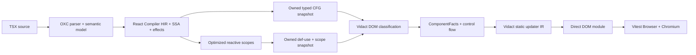

# React Compiler analysis spike

Status: **proven for the bounded corpus; not production-ready**

This spike answers one question: can Vidact reuse the Rust/OXC React Compiler analysis pipeline without adopting its code generator or runtime? Yes. A small fork can capture an owned analyzed CFG plus def-use and optimized-scope snapshots without applying React codegen.

## Decision

Pin the official Oxc repository as a submodule and maintain a deliberately narrow `oxc_react_compiler` patch. The published `0.143.0` crate provides `compile` and `lint`, but its pipeline modules and optimized `ReactiveFunction` are private. Installing it unchanged cannot expose the analysis result Vidact needs. Reimplementing the entire analysis on `oxc_semantic` would discard the hardest and most valuable parts of React Compiler: control-flow lowering, SSA, effects, alias analysis, and reactive dependency inference.

| Option | Access to React analysis | Maintenance | Upstream drift | Spike verdict |
| --- | --- | --- | --- | --- |
| Published dependency | No private pre-codegen IR | Low | Low | Insufficient API |
| Pinned Oxc submodule + patch | Full, with a small local seam | Medium | Explicit patch rebase | Chosen |
| Rewrite on OXC semantic | Only syntax, scopes, and symbols initially | Very high | Independent | Wrong starting point |

The Oxc submodule is pinned to upstream release commit `45a17c25d188bf1b289638483e2bc61adbadd364` for `0.143.0`. The patch series is maintained with `git-go-patch`; ordinary builds apply it with `scripts/prepare-oxc.sh`. Oxc `0.143.0` requires Rust 1.95 or newer, and the workspace toolchain is 1.96.0.

## Architecture proven

The fork adds owned function, CFG block, typed terminal, instruction-kind, scope, dependency, and value records. No arena reference, React HIR node, or OXC AST node crosses the crate boundary. Block, evaluation, local value, and declaration IDs are copied as plain integers with source spans, so Vidact can retain control flow, follow unnamed SSA temporaries, and distinguish shadowed bindings without depending on React Compiler's index types.

The seam has three capture moments. The analyzed HIR CFG is copied after scope dependency propagation and before conversion to React Compiler's codegen-oriented reactive tree. Def-use instructions are copied immediately before `prune_unused_lvalues`, because that optimization deliberately erases source binding lvalues that Vidact still needs to connect `count -> doubled`. Optimized reactive scopes are copied after pruning, merging, stable block IDs, renaming, and hoisted-context pruning. The three owned views are combined into one `FunctionAnalysis` before React codegen.

The final scope capture occurs after these important passes:

- reactive-scope dependency propagation;
- non-escaping, unused, and non-reactive scope pruning;
- invalidation-scope merging;
- lvalue pruning and temporary promotion;
- destructuring declaration extraction;
- stable block IDs and variable renaming;
- hoisted-context pruning.

The owned snapshot is assembled before React Compiler codegen. Vidact neither applies the compiled replacement nor imports the React memo-cache runtime.

## Corpus result

Four browser-oriented TSX shapes lower to the existing `ComponentFacts` contract:

| Fixture | Facts demonstrated |
| --- | --- |
| `Counter` | `useState` source, derived `count -> doubled` edge, text updater |
| `Greeting` | destructured prop, derived message, text and attribute updaters |
| `Todos` | array state and keyed structural updater using `item.id` |
| `AliasCounter` | `count -> direct -> alias -> doubled`, attribute and text updaters |

The tests execute the real OXC parser, OXC semantic builder, and patched React Compiler pipeline. The counter edges are recovered through React Compiler's def-use chain, including unnamed temporaries, rather than lexical identifier matching. Declaration identity prevents a shadowed parameter named `count` from becoming a false state dependency. Owned function spans key each snapshot to its exact OXC function declaration, so several same-module components receive isolated facts. CFG tests prove two exact early-return sites while nested callback returns, expression branches, and source-text lookalikes do not become false component returns. Unsupported component forms fail with a source-located diagnostic rather than falling back to name matching.

The `AliasCounter` fixture also crosses the full executable boundary. A Rust example regenerates the checked-in TypeScript module, and a Rust test requires that file to match current compiler output exactly before the browser suite runs. That module creates one stable button and text node, installs compiler-ordered static updaters, and imports only the small Vidact runtime. Vitest Browser then proves initial rendering, click updates, functional setters, batching, updater order, attribute/text writes, and DOM node identity in Chromium. The test never hand-writes the updater graph.

Bundling that generated module and its runtime imports with esbuild 0.25.5 in browser ESM mode produces 2,066 minified bytes and 1,038 gzip bytes. This is a spike measurement, not a production budget claim: it includes test trace instrumentation, covers one component, and excludes a framework integration layer.

## What React Compiler gives Vidact

React Compiler's reactive scopes answer which values must be recomputed together and which declarations depend on which inputs under JavaScript control-flow and mutation semantics. That is substantially stronger than Vidact 2020's updater discovery, which inferred dependencies from local syntax and generated direct assignment callbacks.

It does **not** answer which exact DOM node property should be updated. React Compiler targets React memoization, so a JSX expression is still a React value-producing operation. Vidact must supply a second, smaller analysis that classifies JSX bindings as text, attributes, properties, branches, effects, or keyed lists.

This is also why React Compiler scopes are not the same thing as signals. They are compile-time dependency and invalidation facts. Vidact can lower them into static updater functions without shipping signal objects, subscriber sets, or a virtual DOM.

## Spike limitations

The Vidact analysis classifier remains intentionally narrow, but it now recognizes its supported shapes through OXC AST nodes and semantic identities after React Compiler has accepted the module:

- named function components;
- destructured props;
- direct `useState` array destructuring;
- simple `const` derived values;
- JSX expression text and attributes;
- direct `collection.map(...)` with a property key.

It handles several named function components per module, hook import aliases and namespaces, straight-line value aliases, and shadowed declarations. Foreign hook-shaped calls fail closed. Multiple returns are recognized from React Compiler's CFG and reject at the first exact return span, but are not yet lowered to DOM ranges. The classifier also does not yet lower arrow/default component forms, computed keys, fragments with mixed update sites, arbitrary destructuring, optional chaining, or source transforms. A newer surgical codegen slice connects the analysis, state rewriting, conditional ranges, and keyed-list runtime for TodoMVC. Browser tests prove stable root identity, preservation of unaffected keyed records, and a surgical parent-to-child update between components declared in one file. This is a vertical proof, not a declaration that arbitrary TSX is supported.

The executable emitter is deliberately narrower still: one numeric state tuple, numeric `const` derivations, one intrinsic root element, expression attributes, one text expression, and an optional inline setter-based click handler. Unlike the analysis classifier, its syntax path is OXC AST-backed. It clones source expressions with semantic IDs, rewrites only references resolved to the state tuple, constructs a fresh output AST, and prints with `oxc_codegen`. String literals are therefore preserved instead of being rejected or textually rewritten. Static attributes, mixed children, arrays, and other unsupported shapes return `UnsupportedSyntax`; they are never approximated with a partial render.

## Production path

Keep the React Compiler fork limited to snapshot capture and keep Vidact's OXC AST/semantic classifier as the DOM-specific boundary. The production adapter should next:

1. expose stable component spans in the owned React Compiler snapshot and classify each component independently;
2. assign stable source IDs for context and external reads in addition to the implemented props, state, and derived values;
3. lower all supported control-flow and structural sites into typed IR variants;
4. reject unkeyed or unstable-key list shapes with precise source diagnostics;
5. snapshot the normalized facts rather than private React HIR;
6. add upstream-version conformance tests before each vendor update;
7. measure compiler binary size, compile latency, generated JavaScript size, and runtime allocation count.

For a production dependency strategy, first propose the owned snapshot API upstream. Until such an API is accepted, the pinned submodule and explicit patch series are the most robust route because the effective fork is small, reviewable, and tested at the exact seam Vidact needs. See [Patched Oxc submodule](../architecture/patched-oxc-submodule.md) for the maintenance contract.
